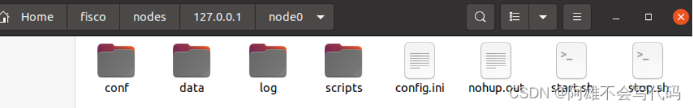
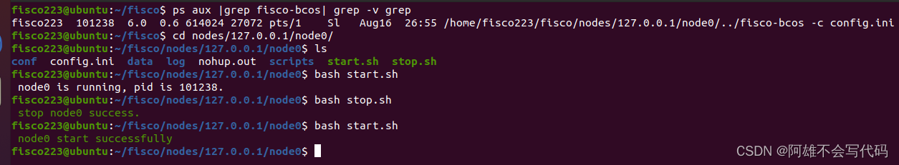
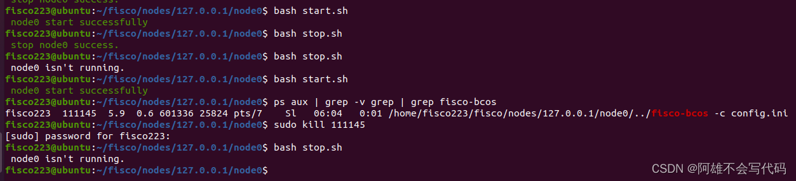

# FISCO-BCOS拆解start_all.sh与start.sh讲解节点如何启动，拆解stop_all.sh与stop.sh讲解节点如何关闭
作者 重庆电子工程职业学院 | 向键雄
## 前言
 不知道大家有没有对FISCO-BCOS中节点启动抱有想法，他到底是怎么启动的一个节点，又是怎么样将整个节点网络启动的呢？相信学过一些区块链技术的朋友们一定会知道，目前主流的一些平台都是会有单独启动节点的步骤所以我们也来讲解一下，那么本篇文章就是拆解脚本进行讲解。
视频链接：[配套视频](https://space.bilibili.com/335373077)
## 正文
### start_all.sh
我们还是一样将脚本拆开来讲，首先先看start_all.sh，可以发现里面的篇幅非常的少。

```

#!/bin/bash
SHELL_FOLDER=$(cd $(dirname $0);pwd)

LOG_ERROR() {
    content=${1}
    echo -e "\033[31m[ERROR] ${content}\033[0m"
}

LOG_INFO() {
    content=${1}
    echo -e "\033[32m[INFO] ${content}\033[0m"
}

dirs=($(ls -l ${SHELL_FOLDER} | awk '/^d/ {print $NF}'))
for directory in ${dirs[*]}
do
    if [[ -f "${SHELL_FOLDER}/${directory}/config.ini" && -f "${SHELL_FOLDER}/${directory}/start.sh" ]];then
        echo "try to start ${directory}"
        bash ${SHELL_FOLDER}/${directory}/start.sh &
    fi
done
wait 
```

 
首先脚本先将现在的工作目录输入进变量，之后定义了两个反馈信息，一个是报错，一个是日志。他现在在做的是将现在目录的文件夹赋给dirs然后通过for进行循环，找到两个文件，找到之后就开始启动了，怎么启动呢？就是调用当前文件目录下的start.sh~~~~~~

哈哈哈哈哈哈，没想到吧，调用半天还是要去调用start.sh,那么现在我们开始讲解start.sh



### start.sh
再讲start.sh之前我们还是要简单地看一下他的目录他的目录是在某一个节点之下，也就是nodeX目录下的文件中

```

 #!/bin/bash
SHELL_FOLDER=$(cd $(dirname $0);pwd)
 
LOG_ERROR() {
    content=${1}
    echo -e "\033[31m[ERROR] ${content}\033[0m"
}
 
LOG_INFO() {
    content=${1}
    echo -e "\033[32m[INFO] ${content}\033[0m"
}
 
fisco_bcos=${SHELL_FOLDER}/../fisco-bcos
cd ${SHELL_FOLDER}
node=$(basename ${SHELL_FOLDER})
node_pid=$(ps aux|grep ${fisco_bcos}|grep -v grep|awk '{print $2}')
if [ -n "${node_pid}" ];then
    echo " ${node} is running, pid is $node_pid."
    exit 0
else
    nohup ${fisco_bcos} -c config.ini >>nohup.out 2>&1 &
    sleep 1.5
fi
try_times=4
i=0
while [ $i -lt ${try_times} ]
do
    node_pid=$(ps aux|grep ${fisco_bcos}|grep -v grep|awk '{print $2}')
    success_flag=$(tail -n20  nohup.out | grep running)
    if [[ -n "${node_pid}" && -n "${success_flag}" ]];then
        echo -e "\033[32m ${node} start successfully\033[0m"
        exit 0
    fi
    sleep 0.5
    ((i=i+1))
done
echo -e "\033[31m  Exceed waiting time. Please try again to start ${node} \033[0m"
tail -n20  nohup.out
exit 1 
```

我们还是从第一行开始看前几段和start_all.sh一样都是将现在的工作目录赋给变量，之后再设置了两个日志反馈信息，之后就不太一样了之后就是找到我们的fisco-bcos二进制文件将他赋给变量这个画重点等会要考，好之后就是到我们上面指定的工作文件夹进去之后呢就是搜寻我们的nodepid，使用命令ps aux |grep fisco-bcos| grep -v grep去找我们的进程

 如果找到了就回复节点正在运行中，所以我们将节点停止过后，再次运行就可以走通这个条件判断，继续往下看下来就可以如何运行我们的节点命令了./fisco-bcos -c config.ini 之后就是再次的检查我们的进程有没有被启动，如果启动了就反馈successfully~~~~



 节点启动到这里就完成了
### stop_all.sh
我们继续讲解节点停止用到的stop_all.sh，全文内容基本与上面差不多，唯一变得就是怎么关闭节点进程，所以我们stop_all.sh就不怎么讲了，流程与start_all.sh一致

```

#!/bin/bash
SHELL_FOLDER=$(cd $(dirname $0);pwd)
 
LOG_ERROR() {
    content=${1}
    echo -e "\033[31m[ERROR] ${content}\033[0m"
}
 
LOG_INFO() {
    content=${1}
    echo -e "\033[32m[INFO] ${content}\033[0m"
}
 
dirs=($(ls -l ${SHELL_FOLDER} | awk '/^d/ {print $NF}'))
for directory in ${dirs[*]}
do
    if [[ -d "${SHELL_FOLDER}/${directory}" && -f "${SHELL_FOLDER}/${directory}/stop.sh" ]];then
        echo "try to stop ${directory}"
        bash ${SHELL_FOLDER}/${directory}/stop.sh &
    fi
done
Wait
```


### stop.sh
上文中有讲stop_all.sh工作原理基本与start_all.sh一致，所以stop.sh中有哪里不一样呢大家往下看

```

 #!/bin/bash
SHELL_FOLDER=$(cd $(dirname $0);pwd)
 
LOG_ERROR() {
    content=${1}
    echo -e "\033[31m[ERROR] ${content}\033[0m"
}
 
LOG_INFO() {
    content=${1}
    echo -e "\033[32m[INFO] ${content}\033[0m"
}
 
fisco_bcos=${SHELL_FOLDER}/../fisco-bcos
node=$(basename ${SHELL_FOLDER})
node_pid=$(ps aux|grep ${fisco_bcos}|grep -v grep|awk '{print $2}')
try_times=20
i=0
if [ -z ${node_pid} ];then
    echo " ${node} isn't running."
    exit 0
fi
[ -n "${node_pid}" ] && kill ${node_pid} > /dev/null
while [ $i -lt ${try_times} ]
do
    sleep 0.6
    node_pid=$(ps aux|grep ${fisco_bcos}|grep -v grep|awk '{print $2}')
    if [ -z ${node_pid} ];then
        echo -e "\033[32m stop ${node} success.\033[0m"
        exit 0
    fi
    ((i=i+1))
done
echo "  Exceed maximum number of retries. Please try again to stop ${node}"
exit 1
```


流程基本一致哈，就是停止的时候不一样从上往下看，都是把路径赋给变量，然后两个日志信息，再就是查看进程有没有运行，如果没有运行的话就会显示isn't running,如果在运行的话就会继续往下走这里就开始不一样了，我们启动节点的时候使用的是二进制程序来启动，停止的时候就是使用kill命令来“杀死”进程，之后在进行查询看有没有真的“杀死”，之后就结束了。



 

# 本教程主要讲解了，节点启动过程与结束过程，帮助大家不使用脚本时如何启动与关闭和大家在写自运行脚本时如何书写命令等内容，FISCO-BCOS的节点启动暂停脚本就分析到这里了
