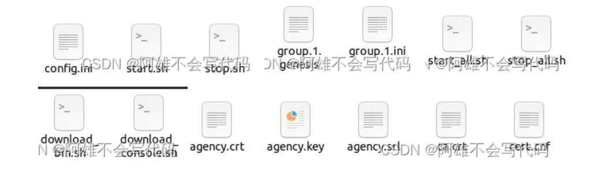

# task61 FISCO-BCOS自定义任务 证书走读config.ini,group.id.genesis,group.id.ini
作者 重庆电子工程职业学院 | 向键雄
## 前言
FISCO-BCOS是联盟链，一说到联盟链就少不了证书的存在，无论是节点证书还是加密证书都有着重要的作用，这一节我们就简单的讲一下FISCO-BCOS中的证书
配套视频：[哔哩哔哩冲冲冲](https://space.bilibili.com/335373077?spm_id_from=333.1007.0.0)

## 证书
首先我们现将所有的文件列出来看一下我们的FISCO-BCOS起链完成后nodes中有多少配置文件。




### 介绍证书

- config.ini：主配置文件，主要配置RPC、P2P、SSL证书、账本配置文件路径、兼容性等信息。

- start.sh\stop.sh：单节点启动\单节点关闭

- group.X.gensis：群组配置文件，群组内所有节点一致，节点启动后，不可手动更改该配置。主要包括群组共识算法、存储类型、最大gas限制等配置项。

- group.X.ini：群组可变配置文件，包括交易池大小等，配置后重启节点生效。

- start_all.sh\stop_all.sh：启动所有节点\关闭所有节点

- download_bin.sh：下载FISCO-BCOS二进制程序

- download_console.sh：下载区块链控制台

- .crt文件：按照X.509 v3证书标准的数字安全证书

- .key文件：注册加密文件

- .cnf文件：系统的配置文件


### 讲解
- config.ini
- grouop.1.genesis
- group.1ini
 这三个配置文件是在建链中会使用的文件，所以会比较详细的讲解

## config.ini

```
[rpc]
    channel_listen_ip=0.0.0.0
    channel_listen_port=20200
    jsonrpc_listen_ip=127.0.0.1
    jsonrpc_listen_port=8545
    disable_dynamic_group=false
```
配置RPC端口 
- channel_listen_ip: Channel监听IP，为方便节点和SDK跨机器部署，默认设置为0.0.0.0；

- jsonrpc_listen_ip：RPC监听IP，安全考虑，默认设置为127.0.0.1，若有外网访问需求，请监听节点外网IP或0.0.0.0；

- channel_listen_port: Channel端口，对应到JAVA SDK配置中的channel_listen_port；

- jsonrpc_listen_port: JSON-RPC端口。


```

[p2p]
    listen_ip=0.0.0.0
    listen_port=30300
    ; nodes to connect
    node.0=127.0.0.1:30300
```
当前FISCO-BCOS必须要配置P2P网络配置

- listen_ip：P2P监听IP，默认设置为0.0.0.0。

- listen_port：节点P2P监听端口。

- node.*: 节点需连接的所有节点IP:Port或DomainName:Port。该选项支持域名，但建议需要使用的用户手动编译源码。

- enable_compress：开启网络压缩的配置选项，配置为true，表明开启网络压缩功能，配置为false，表明关闭网络压缩功能。

```

[certificate_blacklist]
    ; crl.0 should be nodeid, nodeid's length is 128
    ;crl.0=

[certificate_whitelist]
    ; cal.0 should be nodeid, nodeid's length is 128
    ;cal.0=
```
黑名单与白名单配置

- certificate_blacklist：黑名单配置
- certificate_whitelist：白名单配置

```
[group]
    group_data_path=data/
    group_config_path=conf/

```

配置群组内的配置 

- group_data_path: 群组数据存储路径。

- group_config_path: 群组配置文件路径。

```

[network_security]
    ; directory the certificates located in
    data_path=conf/
    ; the node private key file
    key=node.key
    ; the node certificate file
    cert=node.crt
    ; the ca certificate file
    ca_cert=ca.crt
```
配置SSL连接的证书信息

- data_path：证书和私钥文件所在目录。

- key: 节点私钥相对于data_path的路径。

- cert: 证书node.crt相对于data_path的路径。

- ca_cert: ca证书文件路径。

- ca_path: ca证书文件夹，多ca时需要。

- check_cert_issuer：设置SDK是否只能连本机构节点，默认为开启（check_cert_issuer=true）。


```

[storage_security]
    enable=false
    key_manager_ip=
    key_manager_port=
    cipher_data_key=
```
落盘加密

- enable： 是否开启落盘加密，默认不开启；

- key_manager_ip：Key Manager服务的部署IP；

- key_manager_port：Key Manager服务的监听端口；

- cipher_data_key: 节点数据加密密钥的密文，cipher_data_key的产生


```

[chain]
    id=1
    ; use SM crypto or not, should nerver be changed
    sm_crypto=false
    sm_crypto_channel=false
    rsa_crypto_channel=true
```

配置节点的链属性。此配置项建链时工具会自动生成，用户不需修改。
- id：链ID，默认为1；

- sm_crypto：true表示节点使用国密模式，false表示节点使用非国密模式，默认为false；

- sm_crypto_channel：此选项用于配置是否使用国密SSL与SDK连接，默认为false。


```
[compatibility]
    ; supported_version should nerver be changed
    supported_version=2.9.0
```
配置节点的兼容性
- supported_version：当前节点运行的版本

```
[log]
    enable=true
    log_path=./log
    ; enable/disable the statistics function
    enable_statistic=false
    ; network statistics interval, unit is second, default is 60s
    stat_flush_interval=60
    ; info debug trace
    level=info
    ; MB
    max_log_file_size=200
    flush=true
 ```
统计日志配置
- nable: 启用/禁用日志，设置为true表示启用日志；设置为false表示禁用日志，默认设置为true，性能测试可将该选项设置为false，降低打印日志对测试结果的影响

- log_path:日志文件路径。

- level: 日志级别，当前主要包括trace、debug、info、warning、error五种日志级别，设置某种日志级别后，日志文件中会输大于等于该级别的日志，日志级别从大到小排序error > warning > info > debug > trace。

- max_log_file_size：每个日志文件最大容量，计量单位为MB，默认为200MB。

- flush：boostlog默认开启日志自动刷新，若需提升系统性能，建议将该值设置为false。


```

[flow_control]
    ; restrict QPS of the node
    ;limit_req=1000
    ; restrict the outgoing bandwidth of the node
    ; Mb, can be a decimal
    ; when the outgoing bandwidth exceeds the limit, the block synchronization operation will not proceed
    ;outgoing_bandwidth_limit=2
```
- limit_req：用于限制SDK每秒到节点的最大请求数目，当每秒到节点的请求超过配置项的值时，请求会被拒绝，SDK请求速率限制默认关闭，若要开启该功能，需要将limit_req配置项前面的;去掉

### config.ini讲解到此结束


### group.X.gengsis
群组系统配置主要包括群组ID、共识、存储和gas相关的配置。

```
[consensus]
    ; consensus algorithm now support PBFT(consensus_type=pbft), Raft(consensus_type=raft)
    ; rpbft(consensus_type=rpbft)
    consensus_type=pbft
    ; the max number of transactions of a block
    max_trans_num=1000
    ; in seconds, block consensus timeout, at least 3s
    consensus_timeout=3
    ; rpbft related configuration
    ; the working sealers num of each consensus epoch
    epoch_sealer_num=1
    ; the number of generated blocks each epoch
    epoch_block_num=1000
    ; the node id of consensusers
    node.0=faa5f3ef8e0761064d9dde923ee8e8027b5fa25f45d12c54b044eade1a16782ec72191a4c1a145f958ccd4e9927f03f27e5dd0406eee4a4d93bb7fd63c546367
```
- consensus_type：共识算法类型，目前支持PBFT，Raft和rPBft，默认使用PBFT共识算法；

- max_trans_num：一个区块可打包的最大交易数，默认是1000，链初始化后，可通过控制台动态调整该参数；

- consensus_timeout：PBFT共识过程中，每个区块执行的超时时间，默认为3s，单位为秒，可通过控制台动态调整该参数；

- node.idx：共识节点列表，配置了参与共识节点的Node ID，节点的Node ID可通过${data_path}/node.nodeid文件获取(其中${data_path}可通过主配置config.ini的[network_security].data_path配置项获取)


rPBFT相关配置
- epoch_sealer_num：一个共识周期内选择参与共识的节点数目，默认是所有共识节点总数，链初始化后可通过控制台动态调整该参数；

- epoch_block_num：一个共识周期出块数目，默认为1000，可通过控制台动态调整该参数；

```
[state]
    type=storage
```
存储区块链状态信息
- type：state类型，目前支持storage state和MPT state，默认为storage state，storage state将交易执行结果存储在系统表中，效率较高，MPT state将交易执行结果存储在MPT树中，效率较低，但包含完整的历史信息。

```
[tx]
    ; transaction gas limit
    gas_limit=300000000
```
FISCO BCOS兼容以太坊虚拟机(EVM)，为了防止针对EVM的DOS攻击，EVM在执行交易时，引入了gas概念，用来度量智能合约执行过程中消耗的计算和存储资源，包括交易最大gas限制和区块最大gas限制，若交易或区块执行消耗的gas超过限制(gas limit)，则丢弃交易或区块。FISCO BCOS是联盟链，简化了gas设计，仅保留交易最大gas限制，区块最大gas通过共识配置的

- gas_limit：配置交易最大gas限制，默认是300000000，链初始化完毕后，可通过控制台指令动态调整gas限制。

```
[evm]
    enable_free_storage=false
```
- evm.enable_free_storage设置为true：开启Free Storage Gas模式

- evm.enable_free_storage设置为false：关闭Free Storage Gas模式

### group.X.gensis讲解到此结束
### group.X.ini
可变配置主要包括交易池大小、PBFT共识消息转发的TTL、PBFT共识打包时间设置、PBFT交易打包动态调整设置、并行交易设置等。

```
[consensus]
    ; the ttl for broadcasting pbft message
    ttl=2
    ; min block generation time(ms)
    min_block_generation_time=500
    enable_dynamic_block_size=true
    enable_ttl_optimization=true
    enable_prepare_with_txsHash=true
    ; The following is the relevant configuration of rpbft
    ; set true to enable broadcast prepare request by tree
    broadcast_prepare_by_tree=true
    ; percent of nodes that broadcast prepare status to, must be between 25 and 100
    prepare_status_broadcast_percent=33
    ; max wait time before request missed transactions, ms, must be between 5ms and 1000ms
    max_request_missedTxs_waitTime=100
    ; maximum wait time before requesting a prepare, ms, must be between 10ms and 1000ms
    max_request_prepare_waitTime=100
```

- ttl：PBFT共识算法为了保证共识过程最大网络容错性，每个共识节点收到有效的共识消息后，会向其他节点广播该消息，在网络较好的环境下，共识消息转发机制会造成额外的网络带宽浪费，因此在群组可变配置项中引入了ttl来控制消息最大转发次数，消息最大转发次数为ttl-1
- min_block_generation_time ：默认为500ms共识节点最长打包时间为1000ms，若超过1000ms新区块中打包到的交易数仍为0，共识模块会进入出空块逻辑，空块并不落盘；不可超过出空块时间1000ms，若设置值超过1000ms，系统默认min_block_generation_time为500ms
- enable_dynamic_block_size：考虑到CPU负载和网络延迟对系统处理能力的影响，PBFT提供了动态调整一个区块内可打包最大交易数的算法，该算法会根据历史交易处理情况动态调整区块内可打包的最大交易数，默认开启
- enable_ttl_optimization配置为true\false：打开PBFT消息转发优化策略\关闭PBFT消息转发优化策略
- max_trans_num:区块内可打包的最大交易数
- enable_prepare_with_txsHash配置为true\false：打开Prepare包结构优化，Prepare消息包内区块仅包含交易哈希列表\关闭Prepare包结构优化，Prepare消息包内区块包含全量的交易
- broadcast_prepare_by_tree：Prepare包树状广播策略开启/关闭开关，设置为true，开启Prepare包树状广播策略；设置为false，关闭Prepare包树状广播策略，默认为true

- prepare_status_broadcast_percent：Prepare状态包随机广播的节点占共识节点总数的百分比，取值在25到100之间，默认为33

- max_request_prepare_waitTime：节点Prepare缓存缺失时，等待父节点发送Prepare包的最长时延，默认为100ms，超过这个时延后，节点会向其他拥有该Prepare包的节点请求

- max_request_missedTxs_waitTime：节点Prepare包内交易缺失后，等待父节点或其他非leader节点同步Prepare包状态的最长时延，默认为100ms，若在等待时延窗口内同步到父节点或非leader节点Prepare包状态，则会随机选取一个节点请求缺失交易；若等待超时，直接向leader请求缺失交易。

```
[storage]
    ; storage db type, rocksdb / mysql / scalable, rocksdb is recommended
    type=rocksdb
    ; set true to turn on binary log
    binary_log=false
    ; scroll_threshold=scroll_threshold_multiple*1000, only for scalable
    scroll_threshold_multiple=2
    ; set fasle to disable CachedStorage
    cached_storage=true
    ; max cache memeory, MB
    max_capacity=32
    max_forward_block=10
    ; only for external, deprecated in v2.3.0
    max_retry=60
    topic=DB
    ; only for mysql
    db_ip=127.0.0.1
    db_port=3306
    db_username=
    db_passwd=
    db_name=
```
公共配置项
- type：存储的DB类型，支持RocksDB、MySQL和Scalable，不区分大小写。DB类型为RocksDB时，区块链系统所有数据存储于RocksDB本地数据库中；type为MySQL时，节点根据配置访问MySQL数据库；type为Scalable时，需要设置binary_log=true，此时状态数据和区块数据分别存储在不同的RocksDB实例中，存储区块数据的RocksDB实例根据配置项scroll_threshold_multiple*1000切换实例，实例以存储的起始区块高度命名。

- binary_log：当设置为true时打开binary_log，此时关闭RocksDB的WAL。

- cached_storage：控制是否使用缓存，默认true。

- max_capacity：配置允许节点用于内存缓存的空间大小。

- max_forward_block：配置允许节点用于内存区块的大小，当节点出的区块超出该数值时，节点停止共识等待区块写入数据库。


数据库相关配置项

scroll_threshold_multiple：当type为Scalable时，此配置项用于配置区块数据库的切换阈值，按scroll_threshold_multiple*1000。默认为2，区块数据按每2000块存储在不同的RocksDB实例中。

- db_ip：当type为MySQL时，需要配置该字段，表示MySQL的IP地址。

- db_port：当type为MySQL时，需要配置该字段，表示MySQL的端口号。

- db_username：当type为MySQL时，需要配置该字段，表示MySQL的用户名。

- db_passwd：当type为MySQL时，需要配置该字段，表示MySQL用户对应的密码。

- db_name：当type为MySQL时，需要配置该字段，表示MySQL中使用的数据库名。

- init_connections：当type为MySQL时，可选配置该字段，表示与MySQL建立的初始连接数，默认15。使用默认值即可。

- max_connections：当type为MySQL时，可选配置该字段，表示与MySQL建立的最大连接数，默认20。使用默认值即可。

```
[tx_pool]
    limit=150000
    ; transaction pool memory size limit, MB
    memory_limit=512
    ; number of threads responsible for transaction notification,
    ; default is 2, not recommended for more than 8
    notify_worker_num=2
    ; transaction expiration time, in seconds
    ; default is 10 minute(600s)
    txs_expiration_time=600
```
交易池容量配置


- [tx_pool].notify_worker_num：配置项来配置异步推送线程数目：
- [tx_pool].limit: 限制交易池内可以容纳的最大交易数目，默认为150000，超过该限制后，客户端发到节点的交易会被拒绝。

- [tx_pool].memory_limit: 交易池内交易占用的内存大小限制，默认为512MB，超过该限制后，客户端发到节点的交易会被拒绝。

- [tx_pool].notify_worker_num：配置项来配置异步推送线程数目：
- [tx_pool].notify_worker_num：异步推送线程数目，默认为2，建议该值不超过8

- [tx_pool].txs_expiration_time: 交易过期时间，默认为10分钟，要求该值不小于共识超时时间

```
[sync]
    ; max memory size used for block sync, must >= 32MB
    max_block_sync_memory_size=512
    idle_wait_ms=200
    ; send block status by tree-topology, only supported when use pbft
    sync_block_by_tree=true
    ; send transaction by tree-topology, only supported when use pbft
    ; recommend to use when deploy many consensus nodes
    send_txs_by_tree=true
    ; must between 1000 to 3000
    ; only enabled when sync_by_tree is true
    gossip_interval_ms=1000
    gossip_peers_number=3
    ; max number of nodes that broadcast txs status to, recommended less than 5
    txs_max_gossip_peers_num=5
```
区块同步优化配置，增强区块链系统在网络带宽受限情况下的可扩展性

- max_block_sync_memory_size：最大块同步内存大小。
- idle_wait_ms：空闲等待毫秒。
- sync_block_by_tree配置为true\false：打开区块同步优化策略\关闭区块同步优化策略。
- send_txs_by_tree：设置为true\false，打开交易树状广播策略\关闭交易树状广播优化策略。
- gossip_interval_ms：gossip协议同步区块状态周期，默认为1000ms。

- gossip_peers_number：节点每次同步区块状态时，随机选取的邻居节点数目，默认为3。

- txs_max_gossip_peers_num：配置交易状态最多转发节点数目，默认为5。为保障交易到达每个节点的同时，尽量降低交易状态转发引入的流量开销，不建议将将 txs_max_gossip_peers_num 设置太小或太大，直接使用默认配置即可。

```
[flow_control]
    ; restrict QPS of the group
    ;limit_req=1000
    ; restrict the outgoing bandwidth of the group
    ; Mb, can be a decimal
    ; when the outgoing bandwidth exceeds the limit, the block synchronization operation will not proceed
    ;outgoing_bandwidth_limit=2
```
群组级别的SDK请求速率限制以及流量限制

- limit_req：用于限制SDK每秒到群组的最大请求数目，当每秒到节点的请求超过配置项的值时，请求会被拒绝，SDK到群组请求速率限制默认关闭，若要开启该功能，需要将limit_req配置项前面的;去掉
- outgoing_bandwidth_limit：群组出带宽限制，单位为Mbit/s，当群组出带宽超过该值时，会暂缓发送区块，但不会限制区块共识和交易广播的流量，该配置项默认关闭，若要打开流量限制功能，请将outgoing_bandwidth_limit配置项前面的;去掉。

```
[sdk_allowlist]
    ; When sdk_allowlist is empty, all SDKs can connect to this node
    ; when sdk_allowlist is not empty, only the SDK in the allowlist can connect to this node
    ; public_key.0 should be nodeid, nodeid's length is 128
    ;public_key.0=
```
群组级的SDK白名单访问控制机制，实现sdk到群组的访问控制，默认关闭

- public_key.0：配置允许与该群组进行通信的SDK公钥公钥列表。
有哪里不懂的欢迎留言，创作不易麻烦留下点赞和关注谢谢啦！

## 本篇文章主要讲解的是三个配置文件，在日常开发中，基本使用的就是文件中的配置，那么我们在FISCO-BCOS的深度钻研时，开始会涉及到底层以及文件的修改，所以本文就是来做一些扫盲工作，文章发布于CSDN，点击下方跳转个人主页 
[这里是我的个人主页](https://blog.csdn.net/qq_57309855?type=blog)
​
