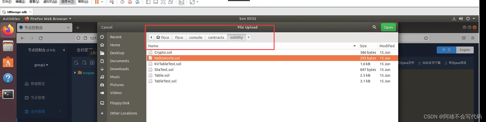

# 从0开始go-sdk控制台搭建与合约编译与开发
作者 重庆电子工程职业学院 | 向键雄
## 前言
随着FISCO-BCOS的发展，多种语言的SDK也应运而生，学会多语言SDK开发，其一增加自己的代码功底，其二是增加自己对FISCO-BCOS的理解
环境：Ubuntu18

##正文
​
###  1.启动节点
原理直接去看我的文章，这里只写命令，[文章链接](https://blog.csdn.net/qq_57309855/article/details/126180787?spm=1001.2014.3001.5501)
#### 起链
` bash build_chain.sh -l 127.0.0.1:4 -p 30300,20200,8545 `

#### 起节点 
` bash nodes/127.0.0.1/start_all.sh `

### 2.配置控制台
不懂原理看文章，[文章链接](https://blog.csdn.net/qq_57309855/article/details/126180787?spm=1001.2014.3001.5501)

#### 把下载控制台的脚本移到工作目录中去

` cp -rf nodes/127.0.0.1/download_console.sh ../../ `

可以选择自己下 
```
cd ~/fisco && curl -LO https://github.com/FISCO-BCOS/console/releases/download/v2.9.1/download_console.sh && bash download_console.sh
```

#### 拷贝文件
```
cp -n console/conf/config-example.toml console/conf/config.toml

cp -r nodes/127.0.0.1/sdk/* console/conf/
```

#### 启动控制台
```
cd ~/fisco/console && bash start.sh
``````
### 3.配置go环境
创建工作目录
` mkdir goWorkDir ` 

go语言如果没有配置的话去看，[文章链接](https://blog.csdn.net/qq_57309855/article/details/126415494?spm=1001.2014.3001.5502)，版本要求（>=15）
下载go-sdk源码 
```
git clone https://github.com/FISCO-BCOS/go-sdk.git
# 若因为网络问题导致长时间无法执行上面的命令，请尝试以下命令：
git clone https://gitee.com/FISCO-BCOS/go-sdk.git
```

#### 配置mod
因为go版本大于15，在15之后就会使用mod来管理 
` go mod tidy `

#### 拷贝证书
把nodes/ip下的sdk中所有的拷贝到go-sdk文件中，可以单独拷贝ca.crt、sdk.crt 和 sdk.key
`cp -rf ../nodes/127.0.0.1//sdk/* ./ `

在拷贝一份到gosdkdemo文件中
` cp -rf nodes/127.0.0.1/sdk/ ./goWorkDir/gosdkdemo/ `

#### 修改配置文件
将配置文件中的文件改成sdk目录


 
### 4.构建go控制台
` go build cmd/console.go `

去测试一下是否成功，这里的命令会单独出一个文章，[文章链接](https://blog.csdn.net/qq_57309855/article/details/126453983?spm=1001.2014.3001.5502)
```
 ./console getBlockByHash 0x1bd58fcf564d2d123975eaaf391e56f0807c1c29b3d5a3256d1ce3d33da728fe true
```

​ 
### 5. 编译生成abigen工具
//这个工具是用来后期做项目时用的
` go build ./cmd/abigen/ `

创建工程目录并移动abigen至工程目录
```
[root@localhost go-sdk]# cd ..                  #返回上一级目录
[root@localhost fisco]# mkdir gosdkdemo    #创建工程目录
[root@localhost fisco]# cd gosdkdemo       #进入工程目录
[root@localhost gosdkdemo]# mkdir tools         #创建目录，存放ABI工具及相关文件
[root@localhost gosdkdemo]# cp ../go-sdk/abigen ../gosdkdemo/tools/  #拷贝上一步生成的abigen到此目录中
```

### 6.下载console
这个console和fisco的console不一样，不要放在一个文件夹否则会报错
` git clone https://github.com/FISCO-BCOS/console.git `

进入文件生成config.toml中的pem私钥配置
```
fisco@ubuntu:~/fisco/goWorkDir$ cd console/

fisco@ubuntu:~/fisco/goWorkDir/console$ cd tools/

fisco@ubuntu:~/fisco/goWorkDir/console/tools$ ls
console.sh  contract2java.sh  download_console.sh  get_account.sh  get_gm_account.sh  start.sh


fisco@ubuntu:~/fisco/goWorkDir/console/tools$ bash get_account.sh 
[INFO] Account Address   : 0x2456235953c13e19f81085bf64b98b34c51f665d
[INFO] Private Key (pem) : accounts/0x2456235953c13e19f81085bf64b98b34c51f665d.pem
[INFO] Public  Key (pem) : accounts/0x2456235953c13e19f81085bf64b98b34c51f665d.pem.pub
fisco@ubuntu:~/fisco/goWorkDir/console/tools$ 
```
会生成一个account文件里面装着私钥公钥等证书
​
 
将这个拷贝至gosdkdemo文件中
` cp -rf accounts/ ../../gosdkdemo/ `

再将config.toml文件拷贝到文件中
` cp -rf config.toml ../gosdkdemo/ `

这里是我的目录结构

​

### 7.修改config.toml文件
将上面生成的私钥文件配置到文件中

​
### 8.生成abi文件与bin文件
这里我们使用fisco中的实例文件hellworld.sol先把他导入webase中，如果没有配置webase去看我的另一篇文章，[文章链接](https://blog.csdn.net/qq_57309855/article/details/126453496?spm=1001.2014.3001.5501)

 目录路径
` /console/contracts/solidity `

 上传至webase中编译生成abi，将这个abi复制

​
 在tools文件夹中创建一个hello.abi复制进去


 创建一个hello.bin将bin也复制进去

 ### 9.生成go文件
` ./abigen -abi hello.abi -bin hello.bin -type hello -pkg main -out ../hello.go `

 #### 在上一级目录中就有我们的go文件生成了，到这里go-sdk开发流程就结束了

## 本篇文章主要是向大家讲解go-sdk开发过程，在过程中需要注意文件位置，文件参数等，为之后go-sdk开发扫盲