# 区块中的数据结构与区块解析
作者 重庆电子工程职业学院 | 向键雄 胡子妍 李信 

## 前言

在开始之前，讲一下为什么要选择这个题目来做本次的pr，因为在交流群中有看到很多人问区块结构，虽然自己很清楚，官方也给出了许多文章讲解，但是却没有一篇整体来论的文章，所以就有感而发写了这个文章
对于这个文章来说，我属于将官方以及各路大神的文章，总结了一下并且加上了自己所理解的东西，将他做成了这篇文章，难度还是偏低一点。

## 准备

### 一、准备合约

我们先生成一个区块这里我们使用的是官方给的转账合约Asset.sol，并在控制台的contract文件夹中也创建一个sol文件

<font size=3>

```
pragma solidity ^0.4.21;

contract Asset {
    address public issuer;
    mapping (address => uint) public balances;

    event Sent(address from, address to, uint amount);

    constructor() {
        issuer = msg.sender;
    }

    function issue(address receiver, uint amount) public {
        if (msg.sender != issuer) return;
        balances[receiver] += amount;
    }

    function send(address receiver, uint amount) public {
        if (balances[msg.sender] < amount) return;
        balances[msg.sender] -= amount;
        balances[receiver] += amount;
        emit Sent(msg.sender, receiver, amount);
    }
    
}

```

</font>

</br>

### 二、准备用户

准备三个用户用作转账, 接受者：AcceptedUsers 发送者：sendUsers 合约部署者：user 

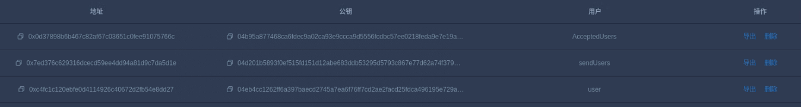

</br>

### 三、生成交易

使用webase中间件一条龙：保存——>编译——>部署——>合约调用

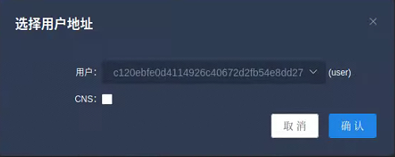 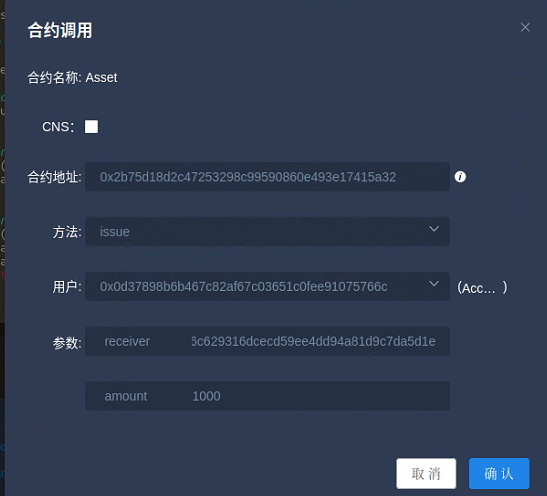 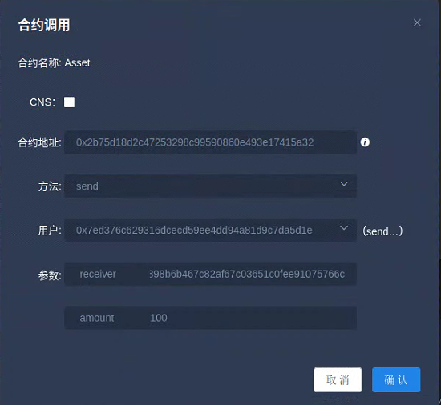


</br>

这里就生成了三个区块，分别是4,5,6（我原来有三个区块）

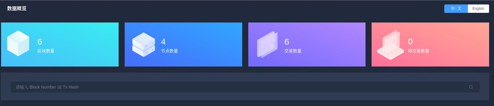

</br>

## 正文

## 查看区块内容


这里我们可以使用控制台来查看也可以使用控制台
webase就在首页输入区块高度
在控制台就使用 getBlockByNumber 4 ture
- 签名列表标志：默认为false，即：区块头信息中不显示区块签名列表信息，设置为true，则显示区块签名列表。

<font size=3>

```
[group:1]> getBlockByNumber 4 true

{
    transactions=[
        {
            blockHash='0xd128ae6b413918940e7cd2b38259018bb08db40fe4ea7d4297f69b000c312205',
            blockNumber='0x4',
            from='0xc4fc1c120ebfe0d4114926c40672d2fb54e8dd27',
            gas='0x419ce0',
            hash='0x5b5c18905fa46b611ff6171912ce5032208430fd07a3cd914ba28b4b7c58698d',
            input='0x608060405234801561001057600080fd5b50336000806101000a81548173ffffffffffffffffffffffffffffffffffffffff021916908373ffffffffffffffffffffffffffffffffffffffff16021790555061044f806100606000396000f300608060405260043610610062576000357c0100000000000000000000000000000000000000000000000000000000900463ffffffff1680631d1438481461006757806327e235e3146100be578063867904b414610115578063d0679d3414610162575b600080fd5b34801561007357600080fd5b5061007c6101af565b604051808273ffffffffffffffffffffffffffffffffffffffff1673ffffffffffffffffffffffffffffffffffffffff16815260200191505060405180910390f35b3480156100ca57600080fd5b506100ff600480360381019080803573ffffffffffffffffffffffffffffffffffffffff1690602001909291905050506101d4565b6040518082815260200191505060405180910390f35b34801561012157600080fd5b50610160600480360381019080803573ffffffffffffffffffffffffffffffffffffffff169060200190929190803590602001909291905050506101ec565b005b34801561016e57600080fd5b506101ad600480360381019080803573ffffffffffffffffffffffffffffffffffffffff16906020019092919080359060200190929190505050610299565b005b6000809054906101000a900473ffffffffffffffffffffffffffffffffffffffff1681565b60016020528060005260406000206000915090505481565b6000809054906101000a900473ffffffffffffffffffffffffffffffffffffffff1673ffffffffffffffffffffffffffffffffffffffff163373ffffffffffffffffffffffffffffffffffffffff1614151561024757610295565b80600160008473ffffffffffffffffffffffffffffffffffffffff1673ffffffffffffffffffffffffffffffffffffffff168152602001908152602001600020600082825401925050819055505b5050565b80600160003373ffffffffffffffffffffffffffffffffffffffff1673ffffffffffffffffffffffffffffffffffffffff1681526020019081526020016000205410156102e55761041f565b80600160003373ffffffffffffffffffffffffffffffffffffffff1673ffffffffffffffffffffffffffffffffffffffff1681526020019081526020016000206000828254039250508190555080600160008473ffffffffffffffffffffffffffffffffffffffff1673ffffffffffffffffffffffffffffffffffffffff168152602001908152602001600020600082825401925050819055507f3990db2d31862302a685e8086b5755072a6e2b5b780af1ee81ece35ee3cd3345338383604051808473ffffffffffffffffffffffffffffffffffffffff1673ffffffffffffffffffffffffffffffffffffffff1681526020018373ffffffffffffffffffffffffffffffffffffffff1673ffffffffffffffffffffffffffffffffffffffff168152602001828152602001935050505060405180910390a15b50505600a165627a7a72305820ad3195c2edfde5b580bcbb7c106d4ad43b966b64ed679592eb41c977bb213d4b0029',
            nonce='0x2c5fbb967bf17c898148d0f1133468a680ee2701afe0e367f6e026375ad5d61',
            to='0x0000000000000000000000000000000000000000',
            transactionIndex='0x0',
            value='0x0',
            gasPrice='0x51f4d5c00',
            blockLimit='0x1f7',
            chainId='0x1',
            groupId='0x1',
            extraData='0x',
            signature={
                r='0x823e64f1fd378cb6e3770585283c41078df4599ebf6f3c6968d1afc7e06fb570',
                s='0x52f484600e47a8b16ac575c68940cfa760f5303670dec5bf23287fe2621d83ea',
                v='0x1',
                signature='0x823e64f1fd378cb6e3770585283c41078df4599ebf6f3c6968d1afc7e06fb57052f484600e47a8b16ac575c68940cfa760f5303670dec5bf23287fe2621d83ea01'
            }
        }
    ],
    number='0x4',
    hash='0xd128ae6b413918940e7cd2b38259018bb08db40fe4ea7d4297f69b000c312205',
    parentHash='0x2a1b6b567173f6c33377b4498b5f6785eb9295025e081d8bdad26ba52e78fc47',
    logsBloom='0x00000000000000000000000000000000000000000000000000000000000000000000000000000000000000000000000000000000000000000000000000000000000000000000000000000000000000000000000000000000000000000000000000000000000000000000000000000000000000000000000000000000000000000000000000000000000000000000000000000000000000000000000000000000000000000000000000000000000000000000000000000000000000000000000000000000000000000000000000000000000000000000000000000000000000000000000000000000000000000000000000000000000000000000000000000000',
    transactionsRoot='0xbab53b506dc4291fce840852c211915026b1b69bf5719a89c3a936d81be936e1',
    receiptsRoot='0x1fea7cfe407dc10026963708bf30d5a5c0008d8711eca639121a99443bb3df20',
    dbHash='0x4f32e266965f7da9cb3cf45dafe412ebeaa8f140a70fb5861a7d03c129ce6c68',
    stateRoot='0x4f32e266965f7da9cb3cf45dafe412ebeaa8f140a70fb5861a7d03c129ce6c68',
    sealer='0x1',
    sealerList=[
        4a9cd76565e9e8b279be2cd248c2b655891eb4a38f17d376bfbd1227eacf14907f0bc003fa07a1b075acb887ecfa37185d0b6ff490ba17c33907968ea8e6c74f,
        80dcdbde72b514a5eec9ffdd0d9a897d4fa82368979de54cea3583ba19e9941575075067bdd935b54cc640e2832625fb51d22b3949837adcc1f34b73358853c7,
        88aa4b34c040427326ed05cc7266cfb330ccd83cb2b5d0b6c70b824448ae992a910ff1dea3f8218771770e113ac8c9002223a8968b9577eabc5bf55ccd29cbdc,
        daf29d144c3733d01cc6b2267310299abe3ee3f0eb46ceb69deda5e18adeeeff06a28e409b22adf000dedf380646a1f3494637cea121f4999a6b94a9d303434d
    ],
    extraData=[
        
    ],
    gasLimit='0x0',
    gasUsed='0x0',
    timestamp='0x1831d5a7a4a',
    signatureList=[
        {
            index='0x3',
            signature='0xe0ffd806474ca0935e553a358aea6ee439eaeebfbb744318b13636f6bb223dde0f32cd431d4f48b64d7dcb6b34448efa1625e1b7de86ca39b13c6991fe24cd7500'
        },
        {
            index='0x1',
            signature='0xd6568e2df9af0b138e213c96dfa6ea6ce4bb101141d26a70a1dc02e94534d3575b0a0f044a7caf6fa4b0cdde60ad39255282979c8d356ff2988ce017312414eb00'
        },
        {
            index='0x2',
            signature='0xec7aefcc2988c3ee4417efb3e630468a11252d4d519e06a6832016aae534386a06fcd326e7d2072a287e810fa2015c77419d76a11da355614ae8b3624d4dc9c000'
        }
    ]
}
```
</font>

</br>

## 获取交易回执

<font>


```

[group:1]> getTransactionReceipt 0x3aa703e7ffba6db27caaeb90f89c0fa30062139317676d1165dfb9d33479e991
TransactionReceipt{
    transactionHash='0x3aa703e7ffba6db27caaeb90f89c0fa30062139317676d1165dfb9d33479e991',
    transactionIndex='0x0',
    root='0x0000000000000000000000000000000000000000000000000000000000000000',
    blockNumber='0x6',
    blockHash='0x08848b9cd7bc1c6250eb828be05edfc3e6b27aef9e51177ce2d183211d09e33c',
    from='0x7ed376c629316dcecd59ee4dd94a81d9c7da5d1e',
    to='0x2b75d18d2c47253298c99590860e493e17415a32',
    gasUsed='0x5bc2',
    remainGas='0x0',
    contractAddress='0x0000000000000000000000000000000000000000',
    logs=[
        
    ],
    logsBloom='0x00000000000000000000000000000000000000000000000000000000000000000000000000000000000000000000000000000000000000000000000000000000000000000000000000000000000000000000000000000000000000000000000000000000000000000000000000000000000000000000000000000000000000000000000000000000000000000000000000000000000000000000000000000000000000000000000000000000000000000000000000000000000000000000000000000000000000000000000000000000000000000000000000000000000000000000000000000000000000000000000000000000000000000000000000000000',
    status='0x0',
    statusMsg='None',
    input='0xd0679d340000000000000000000000000d37898b6b467c82af67c03651c0fee91075766c0000000000000000000000000000000000000000000000000000000000000064',
    output='0x',
    txProof=null,
    receiptProof=null,
    message='null'
}


```

</font>


## 解析区块内容

我们先解析一下字段名称，我就偷个懒直接把文档里的复制过来了

| name|	type	| description |	RLP  index  RC1	| RLP index RC2|
| ----|----------|-------------|-----------------|--------------------|
| type	| enum	| 交易类型，表明该交易是创建合约还是调用合约交易，初始为空合约	| -	| - |
|nonce	|u256	| 消息发送方提供的随机数，用于唯一标识交易	| 0	| 0| 
|value	|u256	|转账数额，目前去币化的FISCO BCOS不使用该字段	| 5	| 5|
|receiveAddress	|h160	|交易接收方地址，type为创建合约时该地址为0x0	| 4	| 4|
|gasPrice	|u256	|本次交易的gas的单价，FISCO BCOS中为固定值300000000	| 1	| 1|
|gas	|u256	|本次交易允许最多消耗的gas数量，FISCO BCOS可配置该值	| 2	| 2|
|data	|vector< byte >	|与交易相关的数据，或者是创建合约时的初始化参数	| 6	| 6|
|chainId	|u256	|记录本次交易所属的链信息/业务信息	| -	| 7|
|groupId	|u256	|记录本次交易所属的群组	| -| 	8|
|extraData	|vector< byte >	|预留字段，记录交易信息，内部使用“#”分割信息	| -	| 9|
|vrs	|SignatureStruct	|交易发送方对交易7字段RLP编码后的哈希值签名生成的数据	| 7,8,9	| 10,11,12|
|hashWith	|h256	|交易结构所有字段（含签名信息）RLP编码后的哈希值	| -	| -|
|sender	|h160	|交易发送方地址，基于vrs生成	 |-	| -|
|blockLimit	|u256	|交易生命周期，该交易最晚被处理的块高，FISCO BCOS新增字段|	3	| 3|
|importTime	|u256	|交易进入交易池的unix时间戳，FISCO BCOS新增字段	|-	| -|
|rpcCallback	|function	|交易出块后RPC回调，FISCO BCOS新增字段|


交易中最重要的三个字段就是input、output和logs，刚好在群里有个群友有问到，它们如何解析这里我们简单总结一下 
[参考文献](https://fisco-bcos-documentation.readthedocs.io/zh_CN/latest/docs/articles/4_tools/45_othertools/contract_analysis_tool_guide.html)

### 什么是input字段

input字段就是咱们的方法名，方法的签名，方法签名部分和调用该方法传入的参数，将编码到交易和交易回执的input字段（十六进制字符串）。

### 什么是output字段
output字段就是咱们的返回值：通常就是方法的返回值，一般就是将这部分内容编码到output字段中（十六进制字符串）。

### 什么是logs字段 

logs字段就是定义的event事件，这个event事件与emit搭配使用

## 如何解析字段

### 思考：什么条件下会生成一个区块？

我们可以思考一下，什么东西构成了一个区块？
往上翻我们部署了合约生成了一个区块，发送了一个交易构成了一个区块，那么怎么样会生成一个区块呢？
我们可以通过[官方文档中社区贡献者的文章](https://fisco-bcos-documentation.readthedocs.io/zh_CN/latest/docs/articles/1_conception/on_and_off_the_blockchain.html)了解到，区块链分为链上数据与链下数据，那么这里就存在一个定义就是，如果修改了链上数据那么就会生成一个新的区块以用来记录。大家可以去阅读一下里面的内容。

### 回到正题


合约方法的输入，输出以及event log均编码到了交易和交易回执对应的input、output和logs字段。这个不就是构成一个交易的基本组成部分吗？

这里我们推荐两个方法

### 法一：使用区块链浏览器进行交易解析 [链接](https://fisco-bcos-documentation.readthedocs.io/zh_CN/latest/docs/browser/browser.html)

大家可以跟着去搭建一下，之后我们就可以解析到交易
这里有几个东西需要大家注意一下，就是在搭建浏览器之前需要配置端口和一些信息，记得去新建一下哦,这里是我的配置

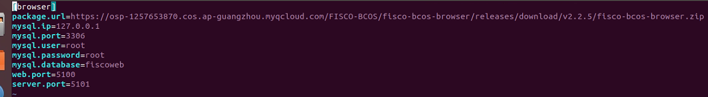 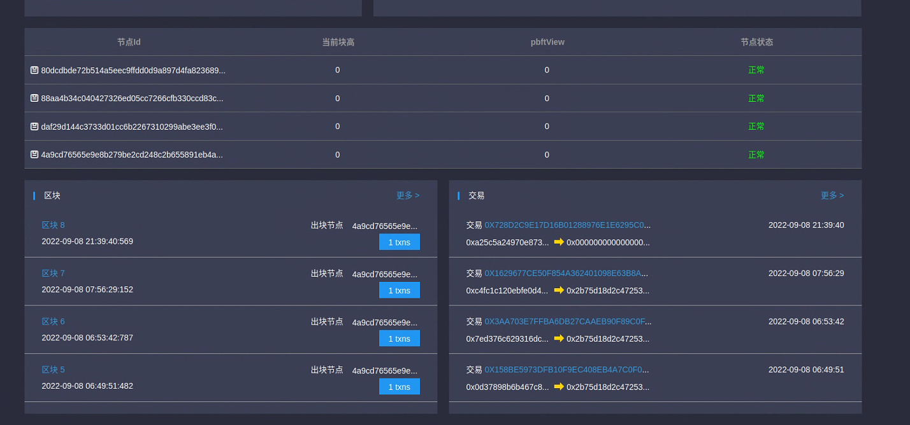

点开想要解码的区块——>点击哈希——>找到input——>点击解码就可以查看到了

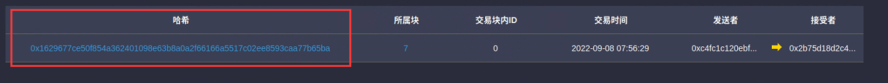 

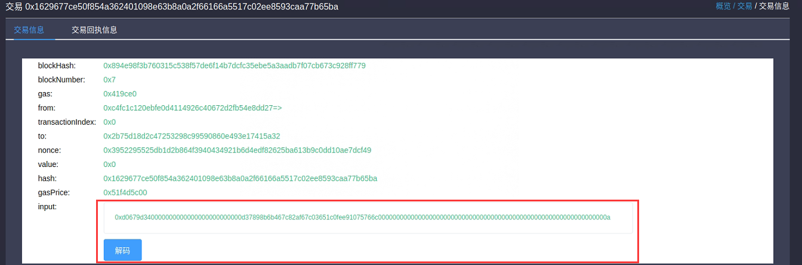 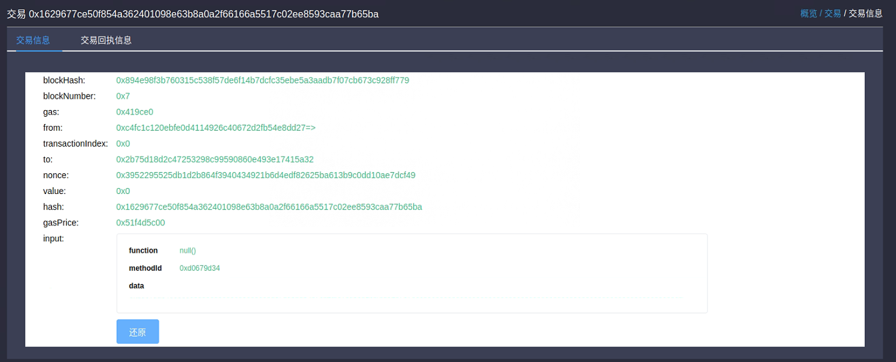

### 法二：使用控制台调用TableTest.sol进行交易解析

使用call功能
先部署合约 

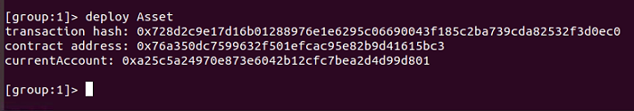


<font> 

```
call TableTest.sol 0xd653139b9abffc3fe07573e7bacdfd35210b5576 insert "fruit" 1 "apple"
transaction hash:0x6393c74681f14ca3972575188c2d2c60d7f3fb08623315dbf6820fc9dcc119c1
---------------------------------------------------------------------------------------------
transaction status: 0x0
description: transaction executed successfully
---------------------------------------------------------------------------------------------

Output
function: insert(string,int256,string)
return type: (int256)
return value: (1)
---------------------------------------------------------------------------------------------
Event logs
event signature: InsertResult(int256) index: 0
event value: (1)
---------------------------------------------------------------------------------------------

# 调用TableTest的select接口查询记录
[group:1]> call TableTest.sol 0xd653139b9abffc3fe07573e7bacdfd35210b5576 select "fruit"
[[fruit], [1], [apple]]

```

</font>

## 法三：使用解析工具，我也直接搬过来了

交易解析是web3sdk 2.0.4及以上版本提供的功能。其使用非常简单，三步曲如下：

step 1: 引入web3sdk 2.0.5依赖
Gradle 项目:

compile (‘org.fisco-bcos:web3sdk:2.0.5’)

Maven 项目:

org.fisco-bcos

web3sdk

2.0.5

step 2: 创建交易解析对象TransactionDecoder
使用TransactionDecoderFactory工厂类创建交易解析对象TransactionDecoder，提供两种方式：

TransactionDecoder buildTransactionDecoder(String abi, String bin)，传入的参数分别是合约的abi和bin字符串（bin字符串暂不使用，可以直接传入空字符串）。

TransactionDecoder buildTransactionDecoder(String contractName)，传入合约名称。需要在应用的根目录下创建solidity目录，将交易相关的合约放在solidity目录，通过指定合约名获取交易解析对象。

注意：创建交易解析对象前，请确定解析该交易对应的合约（即该交易是由调用该合约产生的），可以直接提供solidity合约或者用户自行编译，然后传入合约的abi，两种方式均可创建交易解析对象。

step 3: 调用交易解析对象进行解析任务
TransactionDecoder对input，output和logs的解析结果均分别提供返回java对象和json字符串（java对象的json字符串形式）的方法。

java对象方便服务端处理数据，json字符串方便客户端处理数据。

交易解析对象的方法列表如下：
|  |   |
|---|----|
解析input	|InputAndOutputResult decodeInputReturnObject(String input)|
| |String decodeInputReturnJson(String input)|
解析output	|InputAndOutputResult decodeOutputReturnObject(String input, String output)
| |String decodeOutputReturnJson(String input, String output)
解析logs	|Map>> decodeEventReturnObject(List logList)
| |String decodeEventReturnJson(List logList)

## 扩展内容

### 一个区块如何包含多个交易

考虑到PBFT模块打包太快会导致某些区块中仅打包1到2个很少的交易，浪费存储空间，FISCO BCOS v2.0.0-rc2在群组可变配置group.group_id.ini的[consensus]下引入min_block_generation_time配置项来控制PBFT共识打包的最短时间，即：共识节点打包时间超过min_block_generation_time且打包的交易数大于0才会开始共识流程，处理打包生成的新区块。

- min_block_generation_time 默认为500ms
- 共识节点最长打包时间为1000ms，若超过1000ms新区块中打包到的交易数仍为0，共识模块会进入出空块逻辑，空块并不落盘；
- min_block_generation_time 不可超过出空块时间1000ms，若设置值超过1000ms，系统默认min_block_generation_time为500ms

<font>

```

; the ttl for broadcasting pbft message
[consensus]
ttl=2

```

</font>

### 什么是cns部署

FISCO BCOS原有的调用智能合约流程为：

编写合约；

编译合约得到合约接口abi描述；

部署合约得到合约地址address；

封装合约的abi和地址，通过SDK实现对合约的调用。

CNS通过提供链上合约名称与合约地址映射关系的记录及相应的查询功能，方便业务方通过记忆简单的合约名称来实现对链上合约的调用。为方便业务方调用合约，SDK封装了CNS方式调用合约的接口，接口内部实现了合约地址的查找，业务方对此无感知。

运行deployByCNS，采用部署合约。用CNS部署的合约，可用合约名直接调用。

参数：
- 合约名称：部署的合约名称。

- 合约版本：部署的合约版本。

### 如何查看一个合约的abi和日志信息

在控制台使用
- listAbi 合约名
- getDployLog 合约名

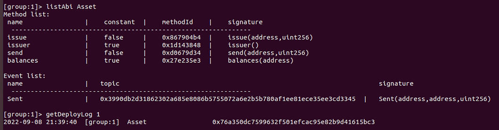


## 总结，整篇文章，我将以前看过的总结了一遍，然后加上了我自己的理解，整个结构是想到哪里写到哪里，所以如果有哪里有问题，希望大家指出。
