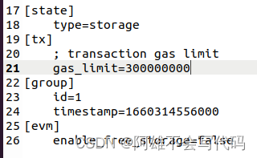

​# 如何修改FISCO-BCOS内的EVM的gas值，让区块链预防DOS攻击，讲解EVM与区块链虚拟机到底是什么，如何修改区块链存储方式，使区块链存储在MPT树内而不是系统内部

作者 重庆电子工程职业学院 | 向键雄
## 前言
对于以太坊大家可能都有所耳闻或了解，对于以太坊的底层EVM相信也不是很陌生，FISCO-BCOS中也有着EVM的存在，有着EVM就代表着一定会有gas进行结算，所以我们就可以根据gas去做一些文章出来，起到预防某些攻击的作用。

有一定了解的同学可以选择浏览正文。

## EVM
为了照顾一些新同学，我们还是选择在这里讲解一下EVM是什么以及工作原理，有一定了解的同学可以选择浏览正文。

那么我们开始介绍，提到EVM，大家可能经常会听到一些类似的词汇，比如JVM，VM等词语，这些都是虚拟机的意思，而EVM就是以太坊的虚拟机（不明白虚拟机是什么的同学可以去看看下一段），诶，这时就有同学有疑问了，他要虚拟机干什么，我们的以太坊代表着区块链进入了2.0的时代，那么这个2.0就是智能合约与区块链结合，让区块链脱离了数字货币的局限。那么要运行编程语言等程序，就要涉及到稳定性的问题，我们来讲一下一个以太坊进行交易会发生什么事情。

当以太坊链上发生转账交易的时候，以太坊虚拟机（EVM）会进行以下一系列工作：

- 调取转账的数值，分析合约的指令。
- 计算Gas的消耗（手续费）, 确保发出转账的地址有足够的Gas费。
- 执行合约，实现转账到对应的地址。
- 那么有EVM的存在以太坊就变得非常的完整，他的完整有以下几个优势：

**便于测试**：为了保证各种“智能合约”的顺利执行，我们需要给它们创建一个安全的运行环境，以太坊虚拟机就是一个代码的运行环境。

正如我们上文所说，在虚拟机里的各种操作不会影响主机一样，任何想要在以太坊虚拟机创建智能合约的开发者可以在虚拟机上测试各种应用而不占用主链资源也不受其他区块链的影响。

**增加安全性**：以太坊上承载着具有强大功能的各种应用，其逻辑也就更加复杂，开发者也越容易出现各种漏洞。而以太坊虚拟机是一个完全独立的沙盒，合约代码可对外完全隔离并在 EVM 内部运行。

不仅可以防止因为不法分子或者程序员的编程错误而影响整个主链，还可以防止运行智能合约的物理设备遭受攻击。

**保障稳定性**：由于以太坊虚拟机部署在以太坊网络的每个节点，整个以太坊网络的数据由众多节点共同维护和更新，这保持了整个区块链数据的一致性，这同样也使以太坊有极高的故障容错性，保证零停机。

## 虚拟机
有一定了解的同学可以选择浏览正文。

计算机专业的同学对“虚拟机”应该并不陌生，“虚拟机”是指通过软件模拟的具有完整硬件系统功能的、运行在一个完全隔离环境中的完整计算机系统。

通俗点讲，虚拟机就是我们通过软件模拟出了跟我们个人电脑一模一样的虚拟机器，它拥有跟实际物理电脑同样的软硬件资源。进入虚拟系统之后，我们日常的所有操作都可以在这个全新且独立的虚拟系统里面进行，可以独立安装运行软件，保存数据等等。这样一来，我们大可在虚拟机中尽情的折腾，各种病毒和攻击都不怕，大不了重装一下虚拟机，并不会对真正的系统产生任何影响。

对于一些JVM等虚拟机，他们的作用可就没有那么简单了，JVM是java的虚拟机，为什么会有他的存在呢？就是因为java诞生于九十年代，那个时候就已经有各种类型的操作系统存在了，到现在替大家也可以看到，苹果系统有苹果系统的软件，Windows有Windows系统的软件，Android（linux）有Android的软件，因为底层编码不同导致他们互不相同。所以java在准备成为流行语言的时候就遇到了一个问题，那就是怎么才能做到在每个操作系统中都能够使用运行，最开始的时候java也和他们一样针对每一个操作系统都写一份相应的代码出来，但是这样会使代码迭代更新的成本大大增大，所以java经历了一次倒闭性的改革，破天荒的使用了内置虚拟机，这样就使得无论你的底层编码如何，我只需要运行我的虚拟机就可以了，我让我的java程序运行在我的JVM当中。大大减少了维护成本，这也使得java语言到现在还经久不衰。

## 正文
FISCO BCOS兼容以太坊虚拟机(EVM)，为了防止针对EVM的DOS攻击，EVM在执行交易时，EVM在执行交易时，引入了gas概念，用来度量智能合约执行过程中消耗的计算和存储资源，包括交易最大gas限制和区块最大gas限制，若交易或区块执行消耗的gas超过限制(gas limit)，则丢弃交易或区块。

### 修改gas值
FISCO-BCOS设置在group.id.genesis中

```
[tx]
    ; transaction gas limit
    gas_limit=300000000
```
- gas_limit：配置交易最大gas限制，默认是300000000，链初始化完毕后，可通过控制台指令动态调整gas限制。

为了预防dos攻击我们可以将gas值设小一点，一般区块链都有着性能最大值，超过这个值区块链就会瘫痪，在正常使用的时候我们的gas值消耗最大不会超过50000，所以如果要投入运用的话，我们可以将gas_limit修改为50000.

我们也可以通过提升CPU和内存在Gas消耗中的占比使得gas消耗更加合理，这里是FISCO-BCOS的Gas衡量模式，默认为关闭。

``` 

[evm]
    enable_free_storage=false
```

- evm.enable_free_storage设置为true：开启Free Storage Gas模式

- evm.enable_free_storage设置为false：关闭Free Storage Gas模式

下面分别介绍非FreeStorage模式和FreeStorage模式下，EVM虚拟机和Precompiled合约Gas衡量标准：
#### EVM虚拟机Gas衡量标准

| Gas	         |说明	                      |EVMSchedule模式下Gas消耗   |FreeStorageEVMSchedule模式下Gas消耗|
-----------------|----------------------------|---------------------------|---------------------------------|
| CreateGas	     |创建合约的Gas消耗            |32000	                  |16000|
| sloadGas	     |从存储读取32字节数据消耗的Gas |200	                   |1200|
| sstoreSetGas   |添加32字节数据到存储的Gas消耗	|20000	                   |1200|
| sstoreResetGas |	更新32字节存储数据的Gas消耗	|5000	                   |1200|


修改存储方式
FISCO-BCOS有着两种存储方式一种是存储在本地系统表中，另外一种是存储在MPT树中两种存储方式有着一些的区别

- 存储在本地系统表：效率高，保存不完整，缺少事件流程顺序
- 存储在MPT树中：效率较低，包含完整的历史信息
 FISCO-BCOS中设置在group.id.genesis中

```
[state]
    type=storage
```
- type：state类型，目前支持storage state和MPT state，默认为storage state



## 到这里文章就结束啦，本文主要是用于介绍文件内配置的使用与面向初学者的概念介绍，大佬快止住要破口大骂的怒火

​