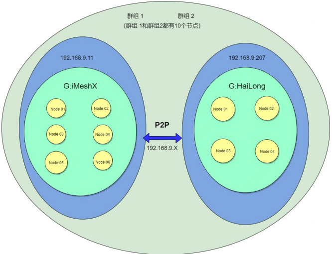

## 起源  
&emsp;&emsp;FISCO BCOS 强大的功能，简便的操作，丰富的SDK，吸引了众多区块链开发者和爱好者的加入，壮大了 FISCO BCOS 的社区。然而，美中不足的是，企业级部署时，繁琐复杂的操作带来了很高的失败率，提高了部署成本；同时，也没有现成的工具对后期的运维维护进行有效的支撑。社区开发者有感此痛点，自发发起成立FISCO BCOS自动化工具研发兴趣小组，致力于研发FISCO BCOS自动化部署与运维工具，提高部署速度，降低部署门槛，推动 FISCO BCOS 的普及。

## 小组简介
&emsp;&emsp;组内讨论制定研发目标，并划分为短期、中期、长期研发任务，组员根据自身安排自行领取各个研发任务。组内氛围活泼，小组成员可畅所欲言，组内成员还会不定期输出各自的心得体会，供大家交流提升。同时，兴趣小组和 FISCO BCOS 开发团队保持紧密的互动，包括 FISCO BCOS 首席架构师、FISCO BCOS 核心开发者，跟踪 FISCO BCOS 最新研发进展，进而及时开展相应的研发任务。  
&emsp;&emsp;在这里，收获的不仅是技术上的提升，更能遇到了一群志同道合的伙伴。  
&emsp;&emsp;一个人能走得很快,但是一群人才能走得更远。  

##### 成员组成

| **姓名** | **所属单位**             |  **擅长技能**                                           |
| -------- | ------------------------ | ------------------------------------------------------ |
| 李海滨 ( 组长 )   | 上海新致软件股份有限公司 | 自动化部署、监控、Linux 安全防范，高可用集群架构设  。 |
| 余昌鸿            | 虎彩印艺股份有限公司     | java/go/solidity                                       |
| 李杰              | 上海新致软件股份有限公司 | 服务器运维，项目实施。                                 |
| 李龙              | 西安缦星链盟研发中心     | 设计、运维、应用测试                                   |

## 组员输出
#####  1. 搭建企业级联盟链实操指导
- 组网架构 ( 2 群组 20 个节点 )  
  

- [操作指导](https://fisco-bcos-documentation.readthedocs.io/zh_CN/latest/docs/articles/7_practice/ansible_FISCO-BCOS_Webase-deploy.html)

##### 2. 自动化部署工具代码讲解视频 ( 整理输出中 )

## 当前项目进展

|项目名称               |项目进展                                                     |下一步计划            |
| ---------------------- | ------------------------------------------------------------ | --------------------- |
|  FISCO BCOS 版本适配   | 基于FISCO BCOS2.6版本已上线开源  ：https://github.com/newtouch-cloud/ansible-for-fisco-bcos/tree/v2.6.2 | 适配FISCO BCOS2.7版本 |
|    WeCross 自动部署    |                                           解决方案制定输出                                              |WeCross自动部署代码研发|

## 项目成果
##### 1. 支持多机构多群组部署。2 群组 3 机构 6 节点，可以在 30 秒内 （除下载时间）生成配置
&emsp;&emsp;封装企业部署命令，进行简单的文件配置，执行节点生成命令，即可自动生成相应机构节点  

##### 2. 支持机构节点扩容。在现在已生成机构节点的基础上，仅改变配置文件，就可生成扩展节点
&emsp;&emsp;联盟链上链运行后，会存在扩容机构节点的需求。本工具支持在已有节点的基础上，修改原始配置文件中结构节点的数量，即可生成新机构节点

##### 3. 自动部署联盟链 Docker 节点

## 未来规划
- 联盟链新增机构自动部署
- 落盘加密节点自动部署
- 分布式存储支持
- WeBase 自动部署
- WeID 自动部署

## 欢迎更多开发者加入小组

- **加入方式**

联系组长李海滨（17621398319或haibin.li@newtouch.com）申请加入小组。

- **要求**

必备项：

1. 有很强的自学能力。
2. 相对充足的空余时间。
3. 能熟练使用 Linux，了解 Linux 各发行版之间的区别。

加分项：

1. 已使用过 Ansible。
2. 具有英文文档阅读能力。
3. 习惯在 GitHub、StackOverFlow 等网站查找解决方法。

