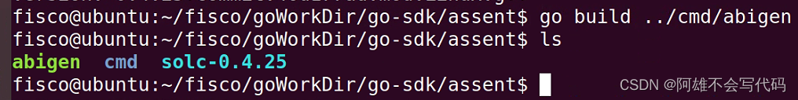

## 前言
在区块链开发中，go语言有着不小的分量，无论是合约代码还是后端开发都会用到go语言，本教程简单讲述FISCO-BCOS通过go-sdk，进行简单接口调用。

## 正文
#### 创建工作目录
` mkdir -p asset/cmd `

cmd 用来装后期的go文件


#### 准备合约
创建合约
vim asset.sol
```
pragma solidity ^0.4.21;

contract Asset {
    address public issuer;
    mapping (address => uint) public balances;

    event Sent(address from, address to, uint amount);

    constructor() {
        issuer = msg.sender;
    }

    function issue(address receiver, uint amount) public {
        if (msg.sender != issuer) return;
        balances[receiver] += amount;
    }

    function send(address receiver, uint amount) public {
        if (balances[msg.sender] < amount) return;
        balances[msg.sender] -= amount;
        balances[receiver] += amount;
        emit Sent(msg.sender, receiver, amount);
    }
    
}

```
#### 下载与生成脚本
` bash ../tools/download_solc.sh `

abi、bin文件生成文件


` go build ../cmd/abigen `

文件转译脚本



#### 生成abi与bin
现在两个文件都到齐了我们就开始文件的转译这里我们有两种方式
方式一：使用solc.sh脚本进行转译

` ./solc-0.4.25 --bin --abi -o ./ ./asset.sol `


方式二：使用webase-front中间件转译

#### 文件转换
现在我们将.sol文件转换为.go文件

`./abigen --bin ./Asset.bin  --abi ./Asset.abi --pkg asset --type Asset --out asset.go`


附上用法
```
COMMANDS:
   help                               Shows a list of commands or help for one command
   
GLOBAL OPTIONS:
   --abi value                        Path to the Ethereum contract ABI json to bind, - for STDIN
   --bin value                        Path to the Ethereum contract bytecode (generate deploy method)
   --type value                       Struct name for the binding (default = package name)
   --combined-json value              Path to the combined-json file generated by compiler
   --sol value                        Path to the Ethereum contract Solidity source to build and bind
   --solc value                       Solidity compiler to use if source builds are requested (default: "solc")
   --vy value                         Path to the Ethereum contract Vyper source to build and bind
   --vyper value                      Vyper compiler to use if source builds are requested (default: "vyper")
   --exc value                        Comma separated types to exclude from binding
   --pkg value                        Package name to generate the binding into
   --out value                        Output file for the generated binding (default = stdout)
   --lang value                       Destination language for the bindings (go, java, objc) (default: "go")
   --alias value                      Comma separated aliases for function and event renaming, e.g. foo=bar
   --smcrypto value                   If use sm crypto (true, false) (default: "false")
   --help, -h                         show help
   --version, -v                      print the version

```
#### 构造主函数
构建主函数，在cmd文件内构造一个main.go

` cd cmd && vim main.go `


```
package main

import (
	"fmt"
	"log"

	"github.com/FISCO-BCOS/go-sdk/asset"
	"github.com/FISCO-BCOS/go-sdk/client"
	"github.com/FISCO-BCOS/go-sdk/conf"
)

func main() {
	configs, err := conf.ParseConfigFile("config.toml")
	if err != nil {
		log.Fatal(err)
	}
	config := &configs[0]

	client, err := client.Dial(config)
	if err != nil {
		log.Fatal(err)
	}
	address, tx, instance, err := asset.DeployAsset(client.GetTransactOpts(), client) // deploy contract
	if err != nil {
		log.Fatal(err)
	}
	fmt.Println("contract address: ", address.Hex()) // the address should be saved
	fmt.Println("transaction hash: ", tx.Hash().Hex())
	_ = instance
}

```

##### 该指令在go-sdk目录中执行
go run asset/cmd/main.go
构建成功

创建文件asset-send.go
```
package main

import (
	"fmt"
	"log"
	"math/big"

	"github.com/FISCO-BCOS/go-sdk/asset"
	"github.com/FISCO-BCOS/go-sdk/client"
	"github.com/FISCO-BCOS/go-sdk/conf"
	"github.com/ethereum/go-ethereum/common"
)

func main() {
	configs, err := conf.ParseConfigFile("config.toml")
	if err != nil {
		log.Fatal(err)
	}
	config := &configs[0]
	client, err := client.Dial(config)
	if err != nil {
		log.Fatal(err)
	}

	contractAddress := common.HexToAddress("0x904ed579402eD8BBb80ee7F0eb02e8226d78a70f")
	instance, err := asset.NewAsset(contractAddress, client)
	if err != nil {
		log.Fatal(err)
	}

	arg0 := common.HexToAddress("0x40e771ca7793dae25812fa21276a73ff2ce9c8fc")
	assetSession := &asset.AssetSession{Contract: instance, CallOpts: *client.GetCallOpts(), TransactOpts: *client.GetTransactOpts()}
	value1 := big.NewInt(1000)
	tx, receipt, err := assetSession.Issue(arg0, value1)
	if err != nil {
		log.Fatal(err)
	}

	value, err := assetSession.Balances(arg0)
	if err != nil {
		log.Fatal(err)
	}
	fmt.Println("value :", value)
	value2 := big.NewInt(1000)
	tx1, receipt, err := assetSession.Send(arg0, value2)
	if err != nil {
		log.Fatal(err)
	}
	fmt.Println("balance:", value2)
	fmt.Printf("tx sent: %s\n", tx.Hash().Hex())
	fmt.Printf("tx sent: %s\n", tx1.Hash().Hex())
	fmt.Printf("transaction hash of receipt: %s\n", receipt.GetTransactionHash())
}


```
#### 调用转账
运行一遍增加一次金额

##### 该指令在go-sdk目录中执行

#### 到这里就结束啦！本教程主要是教大家如何去使用go-sdk转译sol文件以及go文件中的接口调用，如果对本教程有疑问的话欢迎提问