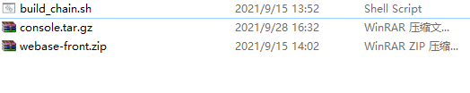
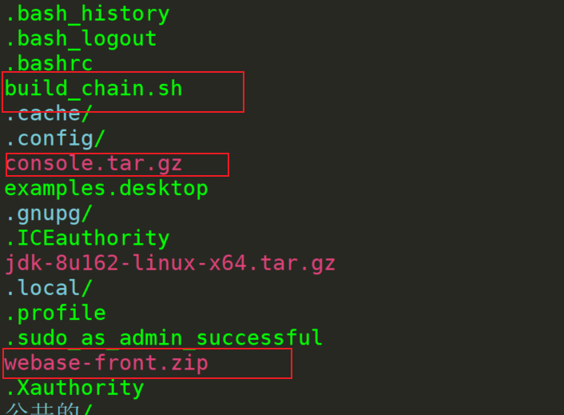
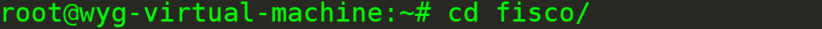
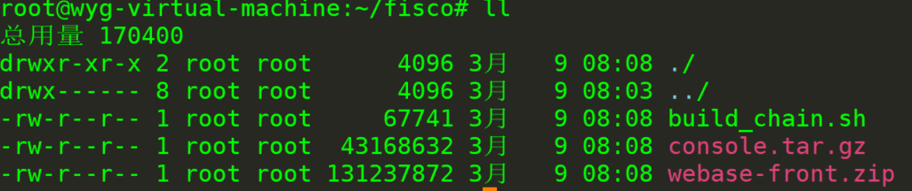
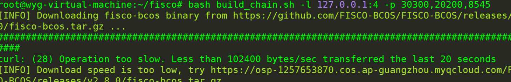
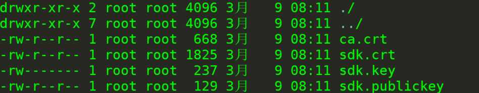
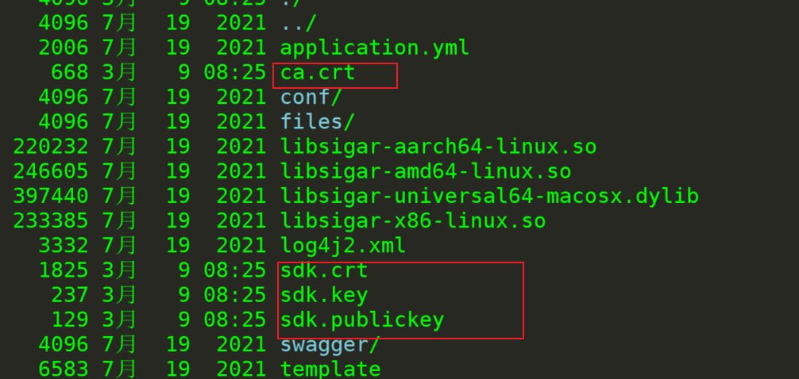
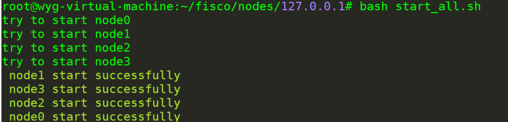
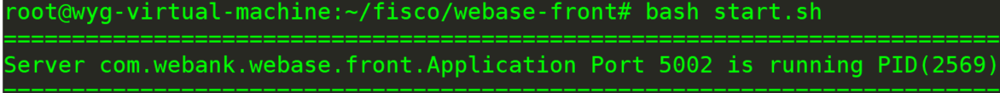
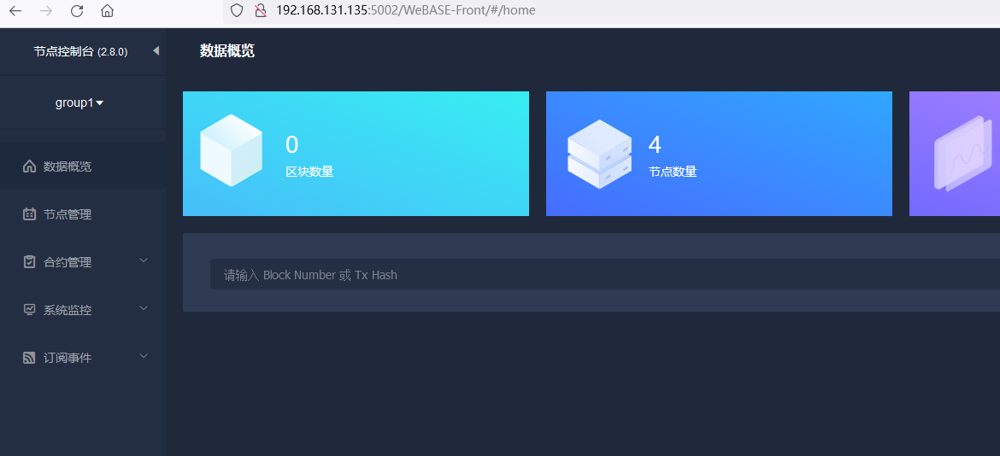

# FISCO BCOS（十）——— FISCO BCOS的离线安装

1、需要在github上下载如下压缩包和脚本



2、将压缩包和脚本上传至终端，随便放哪



3、创建目录

```
mkdir fisco
```



4、将脚本和压缩包拷贝到当前目录

```

root@wyg-virtual-machine:/home/wyg# cp -r console.tar.gz build_chain.sh webase-front.zip /root/fisco/
```




5、搭建单群组4节点联盟链

```
root@wyg-virtual-machine:~/fisco# bash build_chain.sh -l 127.0.0.1:4 -p 30300,20200,8545
```



6、解压webase-front.zip

```
root@wyg-virtual-machine:~/fisco# unzip webase-front.zip
```

7、将证书拷贝至~/fisco/webase-front/conf

```
root@wyg-virtual-machine:~/fisco/webase-front/conf# cp ../../../fisco/nodes/127.0.0.1/sdk/* ./
```





8、启动节点

```
root@wyg-virtual-machine:~/fisco/nodes/127.0.0.1# bash start_all.sh
```



9、打开端口

```
root@wyg-virtual-machine:~/fisco/webase-front# bash start.sh
```



10、访问WeBASE-Front1

