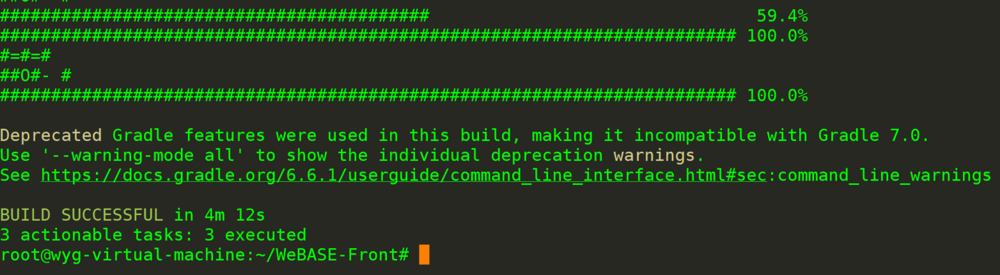
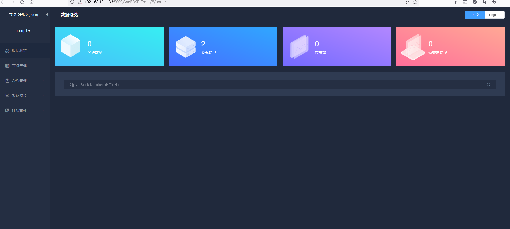

FISCO BCOS（九）——— WeBase的节点前置服务

1. 前提条件

| 依赖软件   | 支持版本         |      |
| ---------- | ---------------- | ---- |
| Java       | Oracle JDK 8至14 |      |
| FISCO-BCOS | v2.0.0及以上版本 |      |

2、 拉取代码

```
git clone https://github.com/WeBankBlockchain/WeBASE-Front.git

# 若因网络问题导致长时间下载失败，可尝试以下命令
git clone https://gitee.com/WeBank/WeBASE-Front.git
```

3、进入目录

```
cd WeBASE-Front
```

4、编译代码

```
chmod +x ./gradlew && ./gradlew build -x test
```



5、修改配置

```
切换目录
cd dist

根据配置模板生成一份实际配置conf。初次部署可直接拷贝。
cp -r conf_template conf

进入conf目录
cd conf
```

6、 将节点所在目录`nodes/${ip}/sdk`下的所有文件拷贝到当前`conf`目录

```
cp ../../../webase-deploy/nodes/127.0.0.1/sdk/* ./
```

7、切换致/webase-deploy/nodes/127.0.0.1/

```
bash start.sh
```

8、访问控制台

```
http://{deployIP}:{frontPort}/WeBASE-Front
示例：http://localhost:5002/WeBASE-Front
```



