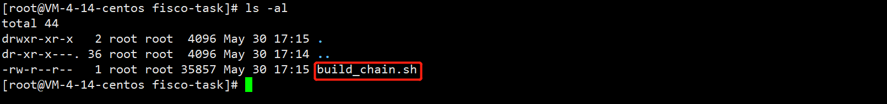
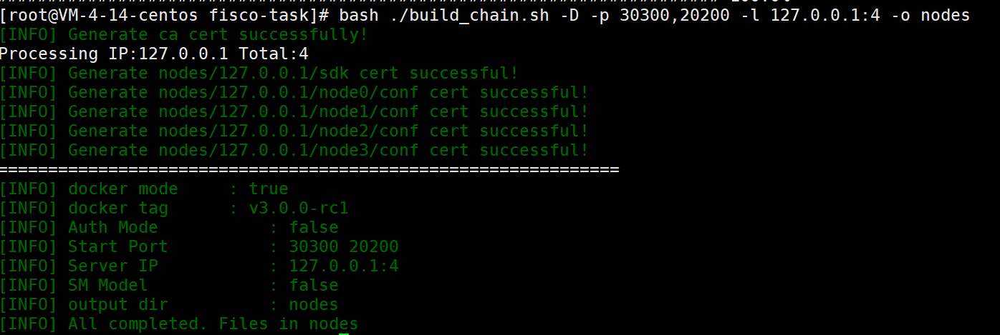
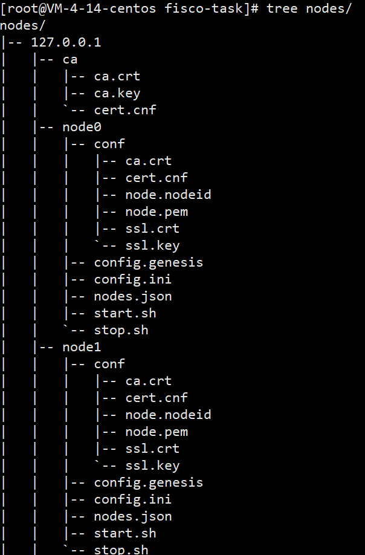
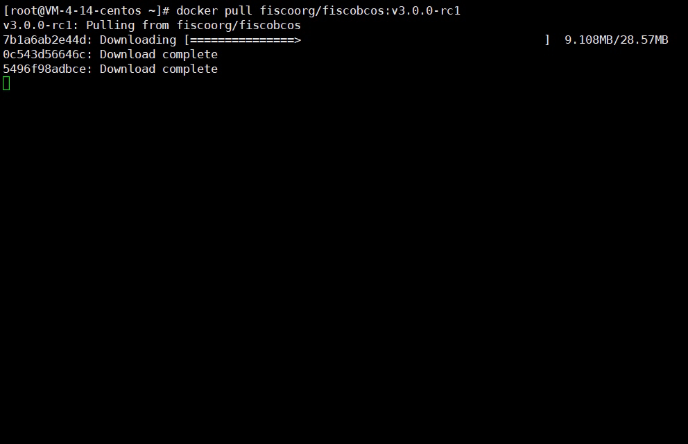
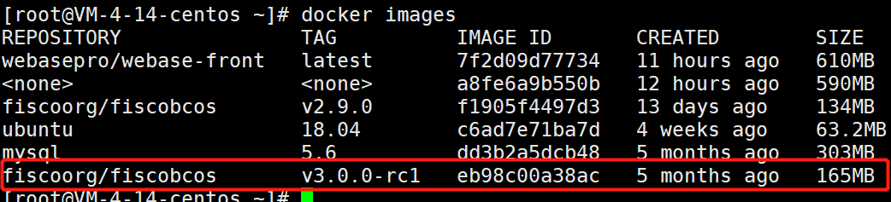
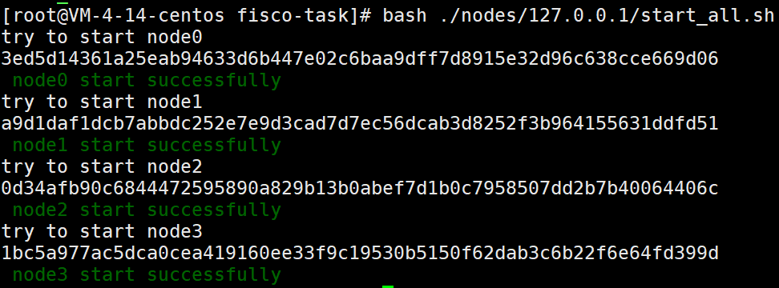
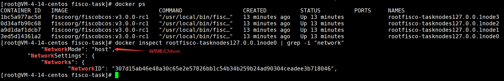

## Fisco BCOS教程|Docker Host模式部署BCOS区块链

>作者：liwh1227
>
>github：https://github.com/liwh1227

### 1. 背景

本文档针对[air版本BCOS链](https://fisco-bcos-doc.readthedocs.io/zh_CN/latest/docs/tutorial/air/build_chain.html)的docker部署过程进行实操和问题总结，主要是通过`build_chain`完成区块链网络的部署。

### 2. 搭建区块链

**备注：** 为了避免权限问题导致环境依赖安装失败，以下操作均在root用户权限下进行。

#### 2.1 安装依赖

安装curl、openssl、openssl-devel及wget

```bash
yum install -y curl openssl openssl-devel wget
```

#### 2.2 创建操作目录，下载build_chain.sh脚本

创建目录：

```bash
cd /root && mkdir -p fisco-task && cd fisco-task
```

利用curl工具下载`build_chain.sh`工具：

```bash
curl -#LO https://osp-1257653870.cos.ap-guangzhou.myqcloud.com/FISCO-BCOS/FISCO-BCOS/releases/v3.0.0-rc1/build_chain.sh
```



#### 2.3 搭建4节点非国密链

**备注：** 以下过程均在脚本所在的`fisco-task`目录下进行，搭建前对要部署链的节点进行规划，确保区块链节点所使用的端口没有被占用。

执行`build_chain.sh`脚本，启动区块链：

```bash
bash ./build_chain.sh -D -p 30300,20200 -l 127.0.0.1:4 -o nodes
```



命令执行成功后，在nodes目录下会产生启动网络所需要的相关文件，包括脚本、配置及证书等文件，如下图所示：



为了加速网络部署速度，提前拉取镜像：

```bash
docker pull fiscoorg/fiscobcos:v3.0.0-rc1
```



查看镜像：

```bash
docker images
```



启动节点：

```bash
bash ./nodes/127.0.0.1/start_all.sh
```



至此4节点网络部署成功。

#### 2.4 验证

通过docker命令查看所部署区块链节点的网络模式:

```bash
# docker ps 查看运行中的容器
docker ps
# inspect 后面参数为容器名称
docker inspect rootfisco-tasknodes127.0.0.1node0 | grep -i "network"
```



同样，可以查看其他3个节点的网络模式。

### 3. 参考

1. build_chain.sh工具说明： https://fisco-bcos-documentation.readthedocs.io/zh_CN/latest/docs/manual/build_chain.html
2. 网络搭建基础要求：https://fisco-bcos-documentation.readthedocs.io/zh_CN/latest/docs/blockchain_dev/env.html
3. 使用docker容器部署区块链：https://fisco-bcos-documentation.readthedocs.io/zh_CN/latest/docs/tutorial/docker.html
