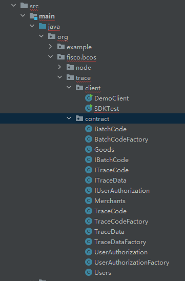
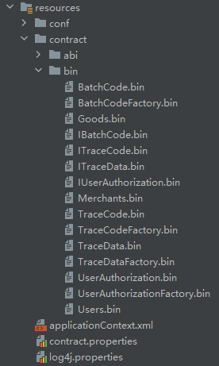
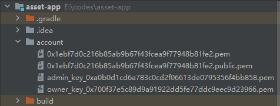

## Fiscobcos发起交易方法1--智能合约生成Java类调用

#### 环境： solidity 0.8.0， fisco节点 V3.2,  java SDK V3.2, WeBASE V3.0.2


#### 1 智能合约编译成java类
编写一套溯源智能合约，在Remix上通过验证。搬移到console/contracts/trace进行编译生成java文件。
contract2java.sh solidity -h  查看用法
-s 指定编译目录或源文件，
-o 指定输出目录
-p 指定包路径
编译好的java类中自带abi、bin参数， 因此不再需要单独的abi、bin文件。

```
root@tom:/fiscoV3.2/console/contracts/trace# ls
BatchCodeFactory.sol  IBatchCode.sol  IUserAuthorization.sol  TraceCode.sol         UserAuthorizationFactory.sol
BatchCode.sol         ITraceCode.sol  Merchants.sol           TraceDataFactory.sol  UserAuthorization.sol
Goods.sol             ITraceData.sol  TraceCodeFactory.sol    TraceData.sol         Users.sol
root@tom:/fiscoV3.2/console/contracts/trace#cd ../..
root@tom:/fiscoV3.2/console# bash contract2java.sh solidity -s contracts/trace/  -o ./sdk  -p org.fisco.bcos.trace.contract*** Compile solidity Users.sol***
INFO: Compile for solidity Users.sol success.
*** Convert solidity to java  for Users.sol success ***


*** Compile solidity Merchants.sol***
INFO: Compile for solidity Merchants.sol success.
*** Convert solidity to java  for Merchants.sol success ***


*** Compile solidity Goods.sol***
INFO: Compile for solidity Goods.sol success.
*** Convert solidity to java  for Goods.sol success ***


*** Compile solidity BatchCodeFactory.sol***
INFO: Compile for solidity BatchCodeFactory.sol success.
*** Convert solidity to java  for BatchCodeFactory.sol success ***


*** Compile solidity UserAuthorizationFactory.sol***
INFO: Compile for solidity UserAuthorizationFactory.sol success.
*** Convert solidity to java  for UserAuthorizationFactory.sol success ***


*** Compile solidity ITraceCode.sol***
INFO: Compile for solidity ITraceCode.sol success.
*** Convert solidity to java  for ITraceCode.sol success ***


*** Compile solidity TraceDataFactory.sol***
INFO: Compile for solidity TraceDataFactory.sol success.
*** Convert solidity to java  for TraceDataFactory.sol success ***


*** Compile solidity ITraceData.sol***
INFO: Compile for solidity ITraceData.sol success.
*** Convert solidity to java  for ITraceData.sol success ***


*** Compile solidity TraceCodeFactory.sol***
INFO: Compile for solidity TraceCodeFactory.sol success.
*** Convert solidity to java  for TraceCodeFactory.sol success ***


*** Compile solidity IBatchCode.sol***
INFO: Compile for solidity IBatchCode.sol success.
*** Convert solidity to java  for IBatchCode.sol success ***


*** Compile solidity TraceData.sol***
INFO: Compile for solidity TraceData.sol success.
*** Convert solidity to java  for TraceData.sol success ***


*** Compile solidity BatchCode.sol***
INFO: Compile for solidity BatchCode.sol success.
*** Convert solidity to java  for BatchCode.sol success ***


*** Compile solidity UserAuthorization.sol***
INFO: Compile for solidity UserAuthorization.sol success.
*** Convert solidity to java  for UserAuthorization.sol success ***


*** Compile solidity TraceCode.sol***
INFO: Compile for solidity TraceCode.sol success.
*** Convert solidity to java  for TraceCode.sol success ***


*** Compile solidity IUserAuthorization.sol***
INFO: Compile for solidity IUserAuthorization.sol success.
*** Convert solidity to java  for IUserAuthorization.sol success ***


root@tom:/fiscoV3.2/console#
root@tom:/fiscoV3.2/console# cd sdk
root@tom:/fiscoV3.2/console/sdk# ls
org

#java类文件
root@tom:/fiscoV3.2/console/sdk# cd org/fisco/bcos/trace/contract/
root@tom:/fiscoV3.2/console/sdk/org/fisco/bcos/trace/contract# ls
BatchCodeFactory.java  IBatchCode.java  IUserAuthorization.java  TraceCode.java         UserAuthorizationFactory.java
BatchCode.java         ITraceCode.java  Merchants.java           TraceDataFactory.java  UserAuthorization.java
Goods.java             ITraceData.java  TraceCodeFactory.java    TraceData.java         Users.java
root@tom:/fiscoV3.2/console/sdk/org/fisco/bcos/trace/contract#

#生成的abi、bin文件
root@tom:/fiscoV3.2/console/contracts/sdk/abi# ls
Asset.abi             Crypto.abi            HelloWorld.abi          KVTableTest.abi  TableTest.abi         UserAuthorization.abi
BatchCode.abi         DelegateCallTest.abi  IBatchCode.abi          Merchants.abi    TraceCode.abi         UserAuthorizationFactory.abi
BatchCodeFactory.abi  EntryWrapper.abi      ITraceCode.abi          ShaTest.abi      TraceCodeFactory.abi  Users.abi
Cast.abi              EventSubDemo.abi      ITraceData.abi          sm               TraceData.abi
CastTest.abi          Goods.abi             IUserAuthorization.abi  Table.abi        TraceDataFactory.abi

/fiscoV3.2/console/contracts/sdk/bin#

```


#### 2 java类安装使用
在java工程中创建好工作目录， 分别拷贝到对应目录。
src/main/java/org/fisco/bcos/trace/contract
resources/contract/abi    --可省略
resources/contract/bin    --可省略

 


#### 3 对于接口文件中的结构体类型修正
在智能合约接口类中定义了一个结构体，通过合约继承方式在合约中使用。这种写法编译出的java文件需要修正一下：
IBatchCode.sol
```
// SPDX-License-Identifier: MIT

pragma solidity ^0.8.0;

interface IBatchCode {
    struct BatchCodeData {
        string batchCode;    //批次码
        int   status;       //current status, default=0
    }
    function addOne(string memory batchCode, int status) external;    
    function getLength() external view returns(uint);
    function getAll() external view returns(BatchCodeData[] memory);
    function getOne(uint index) external view returns(BatchCodeData memory);
    function getData(uint page, uint rows) external view returns(BatchCodeData[] memory); 
}
```
编译出来的是BatchCode.java文件，内部结构体定义如下，需要我们手动删除下面的黄色划线内容“IBatchCode."。
同时，IBatchCode.java文件无需使用，我们不用import。
```
public static class IBatchCode.BatchCodeData extends DynamicStruct {
    public String batchCode;
    public BigInteger status;

    public IBatchCode.BatchCodeData(Utf8String batchCode, Int256 status) {
        super(batchCode,status);
        this.batchCode = batchCode.getValue();
        this.status = status.getValue();
    }
    public IBatchCode.BatchCodeData(String batchCode, BigInteger status) {
        super(new Utf8String(batchCode),new Int256(status));
        this.batchCode = batchCode;
        this.status = status;
    }
}
```
#### 4 加载用户私钥
发起交易需要指定用户私钥，可以从webase-web平台--“私钥管理”导出用户私钥pem文件，再添加到代码工程account目录中：

加载用户私钥文件：
```
public void loadUserAccount(String filePath){
    // 通过client获取CryptoSuite对象
    CryptoSuite cryptoSuite = client.getCryptoSuite();
    // 加载pem账户文件
    cryptoSuite.loadAccount("pem", filePath, null);
    cryptoKeyPair = cryptoSuite.getCryptoKeyPair();
    // 获取账户地址
    String accountAddress = cryptoKeyPair.getAddress();
    System.out.println("accountAddress is "+accountAddress);
}
```
#### 5 构造合约类对象
可以使用deploy或者load函数初始化合约对象，两者使用场景不同，前者适用于初次部署合约，后者在合约已经部署并且已知合约地址时使用。
```
// 部署合约
Asset asset = Asset.deploy(client, cryptoKeyPair);
// 加载合约地址
Asset asset = Asset.load(contractAddress, client, cryptoKeyPair);
```

#### 6 发起合约交易，读取收据
```
//用owner添加管理员地址
public void addAdmin() throws Exception {
    loadUserAccount("account/owner_key_0x700f37e5c89d9a91922dd5fe77ddc9eec9d23966.pem");
    contractAddress = "0x4c02c975a36137d3d4b68484aadbce89414d73a0";
    BatchCodeFactory batchCodeFactory = BatchCodeFactory.load(contractAddress, client, cryptoKeyPair);
    TransactionReceipt receipt = batchCodeFactory.addAdmin("0xa0b0d1cd6a783c0cd2f06613de0795356f4bb858");
    System.out.println("Receipt = "+ receipt);
}
```
#### 7 读取合约数据
通过合约对象读取数据，是对节点发起的查询动作，不会在链上产生一笔交易。
```
//读取批次码合约地址
public String getBatchCode(String goodsId) throws Exception {
    //client加载owner私钥
    loadUserAccount("account/admin_key_0xa0b0d1cd6a783c0cd2f06613de0795356f4bb858.pem");
    contractAddress = "0x4c02c975a36137d3d4b68484aadbce89414d73a0";


    BatchCodeFactory batchCodeFactory = BatchCodeFactory.load(contractAddress, client, cryptoKeyPair);
    String batchCode = batchCodeFactory.getBatchCode(goodsId);
    System.out.println("batchCode = "+ batchCode);
    return batchCode;
}
```
#### 8 填写各种入参类型
  一般的输入参数int， uint都被转换成BigInter类型。
bool、string都支持。

#### 9 返回结构体类型
这个版本是测试成功的，可以接收到完整的结构体对象
```
//读取结构体
public IBatchCode.BatchCodeData getOne(String goodsId, int index) throws Exception {
    //client加载owner私钥
    loadUserAccount("account/admin_key_0xa0b0d1cd6a783c0cd2f06613de0795356f4bb858.pem");
    contractAddress = "0x4c02c975a36137d3d4b68484aadbce89414d73a0";


    BatchCodeFactory batchCodeFactory = BatchCodeFactory.load(contractAddress, client, cryptoKeyPair);
    IBatchCode.BatchCodeData ret = batchCodeFactory.getOne(goodsId, BigInteger.valueOf(index));
    System.out.println("ret = "+ JSON.toJSONString(ret));
    return null;
}
```

```
struct BatchCodeData {
        string batchCode;    //批次码
        uint   status;       //current status, default=0
}
```

```
ret = {"batchCode":"2023001","componentType":"org.fisco.bcos.sdk.v3.codec.datatypes.Type","componentTypes":[{"typeAsString":"string","value":"2023001"},{"bitSize":256,"typeAsString":"int256","value":0}],"fixed":false,"status":0,"typeAsString":"(string,int256)","value":[{"$ref":"$.componentTypes[0]"},{"$ref":"$.componentTypes[1]"}]}
```
#### 10 异步调用
查询数据类函数：
在java类代码中都是使用executeCallWithSingleValueReturn，这是执行call调用并返回结果，是一个同步调用方法，立即得到返回结果。
```
public IBatchCode.BatchCodeData getOne(String goodsId, BigInteger index) throws
        ContractException {
    final Function function = new Function(FUNC_GETONE,
            Arrays.<Type>asList(new Utf8String(goodsId),
            new Uint256(index)),
            Arrays.<TypeReference<?>>asList(new TypeReference<IBatchCode.BatchCodeData>() {}));
    return executeCallWithSingleValueReturn(function, IBatchCode.BatchCodeData.class);
}
```

**发起异步交易**
流程：首先发起交易，得到交易hash。然后通过回调函数对象等待链上交易返回值。 
参考文章：https://fisco-bcos-doc.readthedocs.io/zh_CN/latest/docs/sdk/java_sdk/assemble_transaction.html  
4.1 定义回调类
```
#回调对象类标准写法：
class TransactionCallbackMock extends TransactionCallback {
    private TransactionReceipt transactionReceipt;
    private ReentrantLock reentrantLock = new ReentrantLock();
    private Condition condition;

    public TransactionCallbackMock() {
        condition = reentrantLock.newCondition();
    }

    public TransactionReceipt getResult() {
        try {
            reentrantLock.lock();
            while (transactionReceipt == null) {
                condition.awaitUninterruptibly();
            }
            return transactionReceipt;
        } finally {
            reentrantLock.unlock();
        }
    }

    @Override
    public void onResponse(TransactionReceipt transactionReceipt) {
        try {
            reentrantLock.lock();
            this.transactionReceipt = transactionReceipt;
            condition.signal();
        } finally {
            reentrantLock.unlock();
        }
    }
}
```

**发起异步调用：**
```
public void addOneBatchCodeAsync(String goodsId, String batchCode, int status) throws Exception {

    //client加载owner私钥
    loadUserAccount("account/admin_key_0xa0b0d1cd6a783c0cd2f06613de0795356f4bb858.pem");
    contractAddress = "0x4c02c975a36137d3d4b68484aadbce89414d73a0";

    BatchCodeFactory batchCodeFactory = BatchCodeFactory.load(contractAddress, client, cryptoKeyPair);

    TransactionCallbackMock callbackMock = new TransactionCallbackMock();
    String  ret = batchCodeFactory.addOneBatchCode(goodsId, batchCode, BigInteger.valueOf(status), callbackMock);
    System.out.println("ret = "+ ret);

    Thread.sleep(2000);

    // 异步等待获取回执
    TransactionReceipt receipt = callbackMock.getResult();
    System.out.println("receipt = "+ receipt);
}
```
上面代码中的ret 就是交易hash，等待一段时间或者在其他线程中就可以读取交易回执。


