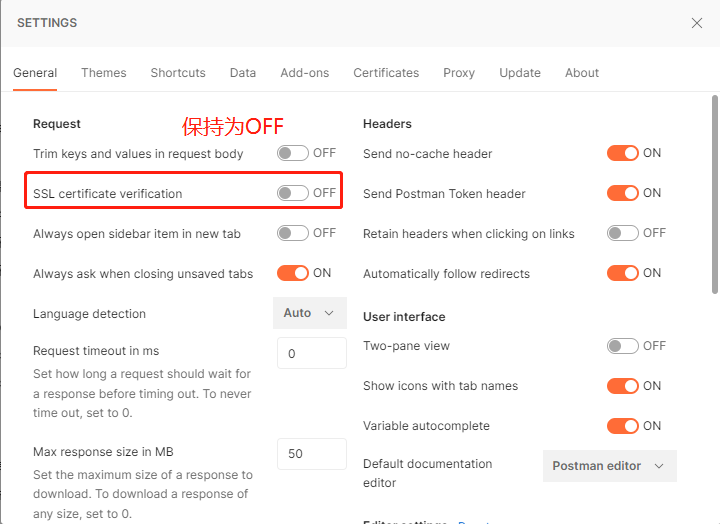
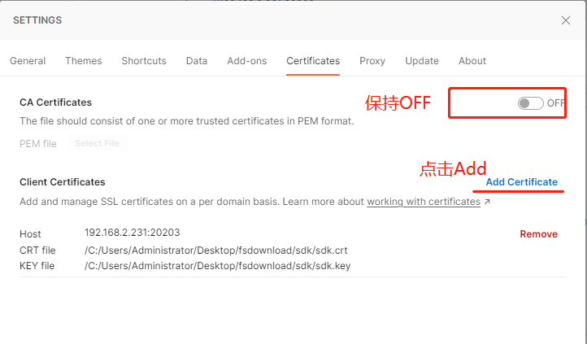
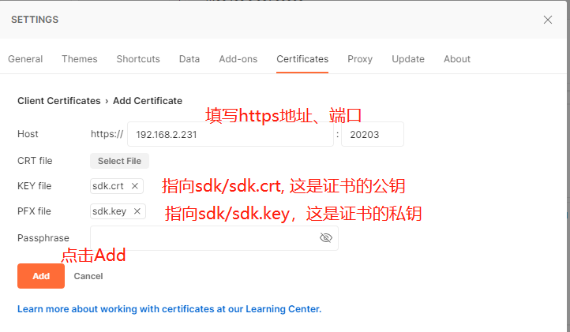
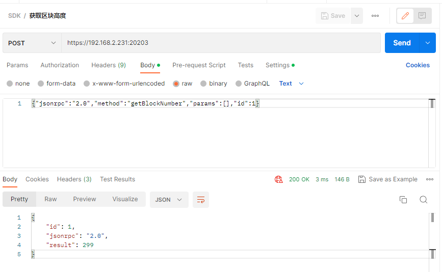

## Fiscobcos发起交易方法2--节点RPC接口调用

环境： solidity 0.8.0， fisco节点 V3.2,  java SDK V3.2, WeBASE V3.0.2
JavaSDK文档--接口说明，
https://fisco-bcos-doc.readthedocs.io/zh_CN/latest/docs/sdk/java_sdk/rpc_api.html

Fisco链的节点支持RPC接口，我们可以直接向指定节点发起RPC调用，完成交易。

#### 1 关闭节点的ssl认证
默认情况下，用curl发送命令给节点node0，一直无应答。
```
root@tom:/fiscoV3.2/nodes/127.0.0.1# curl  -X POST --data '{"jsonrpc":"2.0","method":"getBlockNumber","params":[],"id":1}' http://127.0.0.1:20201
curl: (52) Empty reply from server
root@tom:/fiscoV3.2/nodes/127.0.0.1#
```

论坛解答原因： 调用节点的rpc接口一般需要ssl连接。如果使用curl命令，不用ssl，就要关闭节点的配置参数：
```
vi /nodes/127.0.0.1/node1/config.ini
[rpc]
    listen_ip=0.0.0.0
    listen_port=20200
    thread_count=4
    ; ssl or sm ssl
    sm_ssl=false
    ; ssl connection switch, if disable the ssl connection, default: false
    disable_ssl=true
```
注意打开disable_ssl=true。默认是;注释掉了
修改配置文件后重新启动节点，然后测试curl命令，应答成功：
```
root@tom:/fiscoV3.2/nodes/127.0.0.1# curl  -X POST --data '{"jsonrpc":"2.0","method":"getBlockNumber","params":[],"id":1}' http://127.0.0.1:20201
应答：
{
        "id" : 1,
        "jsonrpc" : "2.0",
        "result" : 29
}root@tom:/fiscoV3.2/nodes/127.0.0.1#
```
####【特别注意】 节点配置文件这样修改后可以直接调用rpc命令，但是导致 webase-web页面访问失败，原因是该页面访问需要ssl认证。嗨，鱼与熊掌不可得兼！

#### 2 curl启动ssl认证
 这一步我尝试了命令， 都没有响应。不知道该怎么实现ssl登录。搞了2天，终于在 技术论坛章鱼哥的支持下成功实现了。

```
root@tom:/fiscoV3.2/nodes/127.0.0.1/node2# curl --capath ./conf -X POST --data '{"jsonrpc":"2.0","method":"getBlockNumber","params":[],"id":1}' http://127.0.0.1:20202
curl: (52) Empty reply from server
 
root@tom:/fiscoV3.2/nodes/127.0.0.1/node2# curl --cacert ./conf/ca.crt -X POST --data '{"jsonrpc":"2.0","method":"getBlockNumber","params":[],"id":1}' http://127.0.0.1:20202
curl: (52) Empty reply from server
root@tom:/fiscoV3.2/nodes/127.0.0.1/node2# curl --cacert ./conf/ssl.crt -X POST --data '{"jsonrpc":"2.0","method":"getBlockNumber","params":[],"id":1}' http://127.0.0.1:20202
curl: (52) Empty reply from server
root@tom:/fiscoV3.2/nodes/127.0.0.1/node2#

```
上述写法都不对，正确写法如下：
```
root@tom:/fiscoV3.2/nodes/127.0.0.1# curl --cert ./sdk/sdk.crt --key ./sdk/sdk.key -X POST --data '{"jsonrpc":"2.0","method":"getBlockNumber","params":[],"id":1}' https://127.0.0.1:20203 -k
{
        "id" : 1,
        "jsonrpc" : "2.0",
        "result" : 297
}root@tom:/fiscoV3.2/nodes/127.0.0.1#
```
证书说明：
部署链时自动创建了sdk证书，用于应用程序访问节点。证书目录是nodes/127.0.0.1/sdk/，curl连接节点也要指定证书和私钥。参数如下：
--cert ./sdk/sdk.crt    这是证书的公钥
--key ./sdk/sdk.key   这是证书的私钥
在访问https连接时必须要添加-k参数，否则返回错误：
```
root@tom:/fiscoV3.2/nodes/127.0.0.1# curl --cert ./sdk/sdk.crt --key ./sdk/sdk.key -X POST --data '{"jsonrpc":"2.0","method":"getBlockNumber","params":[],"id":1}' https://127.0.0.1:20203
curl: (60) SSL: certificate subject name 'FISCO-BCOS' does not match target host name '127.0.0.1'
More details here: https://curl.se/docs/sslcerts.html

curl failed to verify the legitimacy of the server and therefore could not
establish a secure connection to it. To learn more about this situation and
how to fix it, please visit the web page mentioned above.
root@tom:/fiscoV3.2/nodes/127.0.0.1#
```
#### 3 Postman中启动SSL证书
打开 postman，进入系统设置 settings，

（1）在 general 中关闭 ssl 检查，



（2）再进入 certificates 进行配置




（3）试验命令，连接node3节点查询区块高度成功。



#### 4 合约操作发起交易 
这些操作就没有一一实验了，试验下最常见的几个命令。
发起交易流程：
准备交易数据，获得未签名的数据
指定私钥，获得签名后的交易数据
调用RPC接口，发送签名后的交易数据

获取未签名数据的秘诀:
调用 /trans/convertRawTxStr/withSign 接口时, 
如果传入了 signUserId 非空，则返回的交易体编码值是通过signUserId对应私钥签名后的交易体编码值。
如果传入的 signUserId 为空，则返回的是未签名的交易体编码值，开发者也可以通过JAVA-SDK用私钥对该值签名。
（1）获得签名后的交易数据
```
Post  http://192.168.2.231:5002/WeBASE-Front/trans/convertRawTxStr/local
Body：
{
    "groupId":"group0",
    "user":"0xa0b0d1cd6a783c0cd2f06613de0795356f4bb858",
    "contractName":"HelloWorld",
    "contractPath":"/",
    "version":"",
    "funcName":"set",
    "funcParam":["apple"],
    "contractAddress":"0x86886c3b49bdce8284e51f340e72f1761e6fb22f",
    "contractAbi":[{"constant":false,"inputs":[{"name":"n","type":"string"}],"name":"set","outputs":[],"payable":false,"stateMutability":"nonpayable","type":"function","funcId":0}],
    "useAes":false,
    "useCns":false,
    "cnsName":""
}

应答：  签名后的交易数据
0x1a1c2606636861696e30360667726f75703041031e562831353736353236303331393738393139333534353130363537393532393432303839373937303234662a3078383638383663336234396264636538323834653531663334306537326631373631653666623232667d0000644ed3885e000000000000000000000000000000000000000000000000000000000000002000000000000000000000000000000000000000000000000000000000000000056170706c650000000000000000000000000000000000000000000000000000000b2d000020f5512897101ab3141396dbbbe6199df00907285cdc9e93c6c8a4b29df84d75b73d000041daebe629fc4010327294b24fd4f85b9a879049cab5cb0bbac4cdcaec398355873f20e3496175e678f43d6afd7503eca9a3d4f75b8db3420fef8201d4f13df261005001
```


（2）发送交易
现在使用RPC接口，直接向node3节点（rpc监听端口是20203）发送签名后的交易。
参数表中的id只是一个序号，应答时回返回该id，用于请求与应答一一对应。实际中可以递增id。
```
Post  https://192.168.2.231:20203
Body:
{"jsonrpc":"2.0","method":"sendTransaction","params":["group0","","0x1a1c2606636861696e30360667726f75703041031e562831353736353236303331393738393139333534353130363537393532393432303839373937303234662a3078383638383663336234396264636538323834653531663334306537326631373631653666623232667d0000644ed3885e000000000000000000000000000000000000000000000000000000000000002000000000000000000000000000000000000000000000000000000000000000056170706c650000000000000000000000000000000000000000000000000000000b2d000020f5512897101ab3141396dbbbe6199df00907285cdc9e93c6c8a4b29df84d75b73d000041daebe629fc4010327294b24fd4f85b9a879049cab5cb0bbac4cdcaec398355873f20e3496175e678f43d6afd7503eca9a3d4f75b8db3420fef8201d4f13df261005001",true],"id":1}

应答：
{
    "id": 1,
    "jsonrpc": "2.0",
    "result": {
        "blockNumber": 300,
        "checksumContractAddress": "",
        "contractAddress": "",
        "extraData": "",
        "from": "0xa0b0d1cd6a783c0cd2f06613de0795356f4bb858",
        "gasUsed": "12864",
        "hash": "0xe723970e01ccacf3dfe16de569ea62c7a7493aeec5f3424ac299559951f18f6c",
        "logEntries": [],
        "message": "",
        "output": "0x",
        "status": 0,
        "to": "0x86886c3b49bdce8284e51f340e72f1761e6fb22f",
        "transactionHash": "0xf5512897101ab3141396dbbbe6199df00907285cdc9e93c6c8a4b29df84d75b7",
        "version": 0
    }
}
```

#### 5 合约操作-发起无参数Call调用
向节点发送请求，调用合约常量接口。
* transaction: 合约调用信息，包含合约地址、函数接口编码值、参数
以已经部署的HelloWorld为例，读取get()函数， 这个函数无参数，比较简单。
（1）先获得get方法的编码值
```
Post http://192.168.2.231:5002/WeBASE-Front/trans/encodeFunction
Body:
{
    "groupId":"group0",
    "signUserId":"",
    "contractName":"HelloWorld",
    "contractPath":"/",
    "version":"",
    "funcName":"get",
    "funcParam":[],
    "contractAddress":"0x86886c3b49bdce8284e51f340e72f1761e6fb22f",
    "contractAbi":[{"constant":false,"inputs":[{"name":"n","type":"string"}],"name":"set","outputs":[],"payable":false,"stateMutability":"nonpayable","type":"function"},{"constant":true,"inputs":[],"name":"get","outputs":[{"name":"","type":"string"}],"payable":false,"stateMutability":"view","type":"function"},{"inputs":[],"payable":false,"stateMutability":"nonpayable","type":"constructor"}],
    "useAes":false,
    "useCns":false,
    "cnsName":""
}
应答：
6d4ce63c
```

（2）发起call调用
```
Post https://192.168.2.231:20203
Body:
{"jsonrpc":"2.0","method":"call","params":["group0","","0x86886c3b49bdce8284e51f340e72f1761e6fb22f","0x6d4ce63c"],"id":1}

应答：
{
    "id": 1,
    "jsonrpc": "2.0",
    "result": {
        "blockNumber": 301,
        "output": "0x000000000000000000000000000000000000000000000000000000000000002000000000000000000000000000000000000000000000000000000000000000056170706c65000000000000000000000000000000000000000000000000000000",
        "status": 0
    }
}
```


#### 6 合约操作-发起有参数Call调用
向节点发送请求，调用合约常量接口。
* transaction: 合约调用信息，包含合约地址、函数接口编码值、参数
以已经部署的BatchCodeFactory为例，读取getBatchCode("apple")函数， 这个函数有一个字符串参数。
（1）先获得get方法的编码值， 应答数据格式：函数签名+调用参数。
```
Post http://192.168.2.231:5002/WeBASE-Front/trans/encodeFunction
Body:
{
    "groupId":"group0",
    "signUserId":"",
    "contractName":"BatchCodeFactory",
    "contractPath":"/",
    "version":"",    
    "funcName":"getBatchCode",
    "funcParam":["apple"],
    "contractAddress":"0x69ef4c5eca7bc099c2e8a8336c97af765d60dbf1",
    "contractAbi":[{"inputs":[],"stateMutability":"nonpayable","type":"constructor"},{"anonymous":false,"inputs":[{"indexed":false,"internalType":"address","name":"addr","type":"address"},{"indexed":false,"internalType":"string","name":"goodsId","type":"string"},{"indexed":false,"internalType":"contract BatchCode","name":"batchCode","type":"address"}],"name":"createBatchCodeContract","type":"event"},{"inputs":[{"internalType":"string","name":"","type":"string"}],"name":"_batchCode","outputs":[{"internalType":"contract BatchCode","name":"","type":"address"}],"stateMutability":"view","type":"function"},{"inputs":[{"internalType":"address","name":"admin","type":"address"}],"name":"addAdmin","outputs":[],"stateMutability":"nonpayable","type":"function"},{"inputs":[{"internalType":"string","name":"goodsId","type":"string"},{"internalType":"string","name":"batchCode","type":"string"},{"internalType":"int8","name":"status","type":"int8"}],"name":"addOneBatchCode","outputs":[],"stateMutability":"nonpayable","type":"function"},{"inputs":[{"internalType":"string","name":"goodsId","type":"string"}],"name":"createBatchCode","outputs":[],"stateMutability":"nonpayable","type":"function"},{"inputs":[{"internalType":"string","name":"goodsId","type":"string"}],"name":"getAll","outputs":[{"components":[{"internalType":"string","name":"batchCode","type":"string"},{"internalType":"int8","name":"status","type":"int8"}],"internalType":"struct IBatchCode.BatchCodeData[]","name":"","type":"tuple[]"}],"stateMutability":"view","type":"function"},{"inputs":[{"internalType":"string","name":"goodsId","type":"string"}],"name":"getBatchCode","outputs":[{"internalType":"contract BatchCode","name":"","type":"address"}],"stateMutability":"view","type":"function"},{"inputs":[{"internalType":"string","name":"goodsId","type":"string"},{"internalType":"uint256","name":"page","type":"uint256"},{"internalType":"uint256","name":"rows","type":"uint256"}],"name":"getData","outputs":[{"components":[{"internalType":"string","name":"batchCode","type":"string"},{"internalType":"int8","name":"status","type":"int8"}],"internalType":"struct IBatchCode.BatchCodeData[]","name":"","type":"tuple[]"}],"stateMutability":"view","type":"function"},{"inputs":[{"internalType":"string","name":"goodsId","type":"string"}],"name":"getLengh","outputs":[{"internalType":"uint256","name":"","type":"uint256"}],"stateMutability":"view","type":"function"},{"inputs":[{"internalType":"string","name":"goodsId","type":"string"},{"internalType":"uint256","name":"index","type":"uint256"}],"name":"getOne","outputs":[{"components":[{"internalType":"string","name":"batchCode","type":"string"},{"internalType":"int8","name":"status","type":"int8"}],"internalType":"struct IBatchCode.BatchCodeData","name":"","type":"tuple"}],"stateMutability":"view","type":"function"},{"inputs":[{"internalType":"string","name":"goodsId","type":"string"},{"internalType":"string","name":"batchCode","type":"string"}],"name":"isExist","outputs":[{"internalType":"bool","name":"","type":"bool"}],"stateMutability":"view","type":"function"}],
    "useAes":false,
    "useCns":false,
    "cnsName":""
}
应答：
5a496148000000000000000000000000000000000000000000000000000000000000002000000000000000000000000000000000000000000000000000000000000000056170706c65000000000000000000000000000000000000000000000000000000
```

（2）发起call调用，得到返回数据
```
Post https://192.168.2.231:20203
Body:
{"jsonrpc":"2.0","method":"call","params":["group0","","0x69ef4c5eca7bc099c2e8a8336c97af765d60dbf1","5a496148000000000000000000000000000000000000000000000000000000000000002000000000000000000000000000000000000000000000000000000000000000056170706c65000000000000000000000000000000000000000000000000000000"],"id":1}

应答：
{
    "id": 1,
    "jsonrpc": "2.0",
    "result": {
        "blockNumber": 301,
        "output": "0x0000000000000000000000009db4c4b1b4f152a83e1a4a7192fda69ff3eb795f",
        "status": 0
    }
}
```
