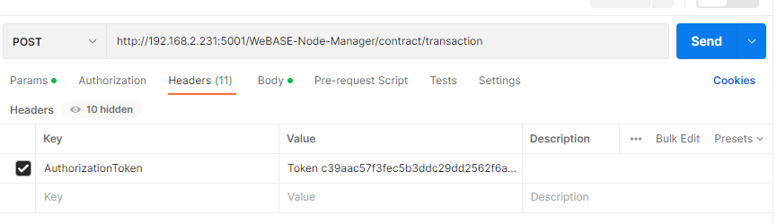
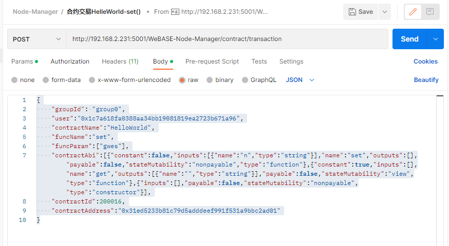

## Fiscobcos发起交易方法3--节点管理服务接口调用

节点管理服务：WeBASE Node-Manager，端口号5001，
接口文档：https://webasedoc.readthedocs.io/zh_CN/latest/docs/WeBASE-Node-Manager/interface.html
调用这些接口必须先登录，登录要经过用户名、密码、图片验证码检验，才能得到一个认证token，以后的每条命令必须携带这个认证token才能成功。
登录过程请看笔记：  节点管理服务登录接口使用说明  
登录成功后返回的认证token： "token": "c39aac57f3fec5b3ddc29dd2562f6a32a0a5234c9fbbf42c6b87dbb69e075ea5"

本文只试验了几条命令，目的是研究清楚调用时请求参数填写方法。
已经通过webase-web 合约IDE部署好了HelloWorld合约、UserAuthorizationFactory。

#### 1 发起合约交易， 改写HelloWorld合约参数
Post   http://192.168.2.231:5001/WeBASE-Node-Manager/contract/transaction
请求Body内容使用json格式文本
```
{
    "groupId": "group0",
    "user":"0x1c7a618fa0388aa34bb19081819ea2723b671a96",
    "contractName":"HelloWorld",
    "funcName":"set",
    "funcParam":["gwes"],
    "contractAbi":[{"constant":false,"inputs":[{"name":"n","type":"string"}],"name":"set","outputs":[],"payable":false,"stateMutability":"nonpayable","type":"function"},{"constant":true,"inputs":[],"name":"get","outputs":[{"name":"","type":"string"}],"payable":false,"stateMutability":"view","type":"function"},{"inputs":[],"payable":false,"stateMutability":"nonpayable","type":"constructor"}],
    "contractId":200016,
    "contractAddress":"0x31ed5233b81c79d5adddeef991f531a9bbc2ad01"
}
```
 

成功应答：
```
{
    "code": 0,
    "message": "success",
    "data": {
        "version": 0,
        "contractAddress": "",
        "checksumContractAddress": "",
        "gasUsed": "12864",
        "status": 0,
        "blockNumber": 144,
        "output": "0x",
        "transactionHash": "0xea1491c7fff52394a3be2024e845df5b78b32043b4c4724c32cb77ff9c12a107",
        "logEntries": [],
        "input": "0x4ed3885e000000000000000000000000000000000000000000000000000000000000002000000000000000000000000000000000000000000000000000000000000000046777657300000000000000000000000000000000000000000000000000000000",
        "from": "0x1c7a618fa0388aa34bb19081819ea2723b671a96",
        "to": "0x31ed5233b81c79d5adddeef991f531a9bbc2ad01",
        "transactionProof": null,
        "receiptProof": null,
        "txProof": null,
        "txReceiptProof": null,
        "extraData": "",
        "message": "Success",
        "statusOK": true,
        "hash": "0x27cde4a5e8950fa5ce2ae7c5450aa0a3b32c10f2eeca37340af23129db85761e"
    },
    "attachment": null
}
```
#### 2 调用工厂合约，创建用户授权合约
Post   http://192.168.2.231:5001/WeBASE-Node-Manager/contract/transaction
请求Body内容使用json格式文本
```
{
    "groupId": "group0",
    "user":"0xa0b0d1cd6a783c0cd2f06613de0795356f4bb858",
    "contractName":"UserAuthorizationFactory",
    "funcName":"createUserAuthorization",
    "funcParam":["apple", "0xa0b0d1cd6a783c0cd2f06613de0795356f4bb858"],
    "contractAbi":[{"inputs":[],"stateMutability":"nonpayable","type":"constructor"},{"anonymous":false,"inputs":[{"indexed":false,"internalType":"address","name":"addr","type":"address"},{"indexed":false,"internalType":"string","name":"goodsId","type":"string"},{"indexed":false,"internalType":"address","name":"userAddr","type":"address"},{"indexed":false,"internalType":"contract UserAuthorization","name":"userAuth","type":"address"}],"name":"createUserAuthContract","type":"event"},{"inputs":[{"internalType":"string","name":"","type":"string"},{"internalType":"address","name":"","type":"address"}],"name":"_userAuth","outputs":[{"internalType":"contract UserAuthorization","name":"","type":"address"}],"stateMutability":"view","type":"function"},{"inputs":[{"internalType":"address","name":"admin","type":"address"}],"name":"addAdmin","outputs":[],"stateMutability":"nonpayable","type":"function"},{"inputs":[{"internalType":"string","name":"goodsId","type":"string"},{"internalType":"address","name":"userAddr","type":"address"},{"internalType":"string","name":"phase","type":"string"},{"internalType":"string","name":"step","type":"string"},{"internalType":"bool","name":"enable","type":"bool"}],"name":"addOneUserAuthorization","outputs":[],"stateMutability":"nonpayable","type":"function"},{"inputs":[{"internalType":"string","name":"goodsId","type":"string"},{"internalType":"address","name":"userAddr","type":"address"}],"name":"createUserAuthorization","outputs":[],"stateMutability":"nonpayable","type":"function"},{"inputs":[{"internalType":"string","name":"goodsId","type":"string"},{"internalType":"address","name":"userAddr","type":"address"}],"name":"getAll","outputs":[{"components":[{"internalType":"string","name":"phase","type":"string"},{"internalType":"string","name":"step","type":"string"},{"internalType":"bool","name":"enable","type":"bool"}],"internalType":"struct IUserAuthorization.AuthData[]","name":"","type":"tuple[]"}],"stateMutability":"view","type":"function"},{"inputs":[{"internalType":"string","name":"goodsId","type":"string"},{"internalType":"address","name":"userAddr","type":"address"},{"internalType":"uint256","name":"page","type":"uint256"},{"internalType":"uint256","name":"rows","type":"uint256"}],"name":"getData","outputs":[{"components":[{"internalType":"string","name":"phase","type":"string"},{"internalType":"string","name":"step","type":"string"},{"internalType":"bool","name":"enable","type":"bool"}],"internalType":"struct IUserAuthorization.AuthData[]","name":"","type":"tuple[]"}],"stateMutability":"view","type":"function"},{"inputs":[{"internalType":"string","name":"goodsId","type":"string"},{"internalType":"address","name":"userAddr","type":"address"}],"name":"getLength","outputs":[{"internalType":"uint256","name":"","type":"uint256"}],"stateMutability":"view","type":"function"},{"inputs":[{"internalType":"string","name":"goodsId","type":"string"},{"internalType":"address","name":"userAddr","type":"address"},{"internalType":"uint256","name":"index","type":"uint256"}],"name":"getOne","outputs":[{"components":[{"internalType":"string","name":"phase","type":"string"},{"internalType":"string","name":"step","type":"string"},{"internalType":"bool","name":"enable","type":"bool"}],"internalType":"struct IUserAuthorization.AuthData","name":"","type":"tuple"}],"stateMutability":"view","type":"function"},{"inputs":[{"internalType":"string","name":"goodsId","type":"string"},{"internalType":"address","name":"userAddr","type":"address"}],"name":"getUserAuthorization","outputs":[{"internalType":"contract UserAuthorization","name":"","type":"address"}],"stateMutability":"view","type":"function"},{"inputs":[{"internalType":"string","name":"goodsId","type":"string"},{"internalType":"address","name":"userAddr","type":"address"},{"internalType":"string","name":"phase","type":"string"},{"internalType":"string","name":"step","type":"string"}],"name":"isAuth","outputs":[{"internalType":"bool","name":"","type":"bool"}],"stateMutability":"view","type":"function"},{"inputs":[{"internalType":"string","name":"goodsId","type":"string"},{"internalType":"address","name":"userAddr","type":"address"},{"internalType":"string","name":"phase","type":"string"},{"internalType":"string","name":"step","type":"string"},{"internalType":"bool","name":"enable","type":"bool"}],"name":"setEnable","outputs":[{"internalType":"bool","name":"","type":"bool"}],"stateMutability":"nonpayable","type":"function"}],
    "contractId":200014,
    "contractAddress":"0x6849f21d1e455e9f0712b1e99fa4fcd23758e8f1"
}
```
应答成功：
```
{
    "code": 0,
    "message": "success",
    "data": {
        "version": 0,
        "contractAddress": "",
        "checksumContractAddress": "",
        "gasUsed": "212808",
        "status": 0,
        "blockNumber": 146,
        "output": "0x",
        "transactionHash": "0x1aee84213f79d248364fdc46ae679bfd75f149bf7ca6a3a356a3ad661eff881f",
        "logEntries": [
            {
                "blockNumber": null,
                "address": "6849f21d1e455e9f0712b1e99fa4fcd23758e8f1",
                "topics": [
                    "0x03b9f246c94041ffa51bb187f9dbb224690a033d125054ccbcb1c17ef6c9b68b"
                ],
                "data": "0x000000000000000000000000a0b0d1cd6a783c0cd2f06613de0795356f4bb8580000000000000000000000000000000000000000000000000000000000000080000000000000000000000000a0b0d1cd6a783c0cd2f06613de0795356f4bb858000000000000000000000000dce94efcd1f4ea31eb4f53a2ab470f75b162979400000000000000000000000000000000000000000000000000000000000000056170706c65000000000000000000000000000000000000000000000000000000"
            }
        ],
        "input": "0xd5af56a20000000000000000000000000000000000000000000000000000000000000040000000000000000000000000a0b0d1cd6a783c0cd2f06613de0795356f4bb85800000000000000000000000000000000000000000000000000000000000000056170706c65000000000000000000000000000000000000000000000000000000",
        "from": "0xa0b0d1cd6a783c0cd2f06613de0795356f4bb858",
        "to": "0x6849f21d1e455e9f0712b1e99fa4fcd23758e8f1",
        "transactionProof": null,
        "receiptProof": null,
        "txProof": null,
        "txReceiptProof": null,
        "extraData": "",
        "message": "Success",
        "statusOK": true,
        "hash": "0xc3b050f8595be3944dd2ca718a6451315abfe336765ee60c5bb5926c4ba54d03"
    },
    "attachment": null
}
```
#### 3 读取用户授权合约地址
Post   http://192.168.2.231:5001/WeBASE-Node-Manager/contract/transaction
请求Body内容使用json格式文本：
```
{
    "groupId": "group0",
    "user":"",
    "contractName":"UserAuthorizationFactory",
    "funcName":"getUserAuthorization",
    "funcParam":["apple", "0xa0b0d1cd6a783c0cd2f06613de0795356f4bb858"],
    "contractAbi":[{"inputs":[],"stateMutability":"nonpayable","type":"constructor"},{"anonymous":false,"inputs":[{"indexed":false,"internalType":"address","name":"addr","type":"address"},{"indexed":false,"internalType":"string","name":"goodsId","type":"string"},{"indexed":false,"internalType":"address","name":"userAddr","type":"address"},{"indexed":false,"internalType":"contract UserAuthorization","name":"userAuth","type":"address"}],"name":"createUserAuthContract","type":"event"},{"inputs":[{"internalType":"string","name":"","type":"string"},{"internalType":"address","name":"","type":"address"}],"name":"_userAuth","outputs":[{"internalType":"contract UserAuthorization","name":"","type":"address"}],"stateMutability":"view","type":"function"},{"inputs":[{"internalType":"address","name":"admin","type":"address"}],"name":"addAdmin","outputs":[],"stateMutability":"nonpayable","type":"function"},{"inputs":[{"internalType":"string","name":"goodsId","type":"string"},{"internalType":"address","name":"userAddr","type":"address"},{"internalType":"string","name":"phase","type":"string"},{"internalType":"string","name":"step","type":"string"},{"internalType":"bool","name":"enable","type":"bool"}],"name":"addOneUserAuthorization","outputs":[],"stateMutability":"nonpayable","type":"function"},{"inputs":[{"internalType":"string","name":"goodsId","type":"string"},{"internalType":"address","name":"userAddr","type":"address"}],"name":"createUserAuthorization","outputs":[],"stateMutability":"nonpayable","type":"function"},{"inputs":[{"internalType":"string","name":"goodsId","type":"string"},{"internalType":"address","name":"userAddr","type":"address"}],"name":"getAll","outputs":[{"components":[{"internalType":"string","name":"phase","type":"string"},{"internalType":"string","name":"step","type":"string"},{"internalType":"bool","name":"enable","type":"bool"}],"internalType":"struct IUserAuthorization.AuthData[]","name":"","type":"tuple[]"}],"stateMutability":"view","type":"function"},{"inputs":[{"internalType":"string","name":"goodsId","type":"string"},{"internalType":"address","name":"userAddr","type":"address"},{"internalType":"uint256","name":"page","type":"uint256"},{"internalType":"uint256","name":"rows","type":"uint256"}],"name":"getData","outputs":[{"components":[{"internalType":"string","name":"phase","type":"string"},{"internalType":"string","name":"step","type":"string"},{"internalType":"bool","name":"enable","type":"bool"}],"internalType":"struct IUserAuthorization.AuthData[]","name":"","type":"tuple[]"}],"stateMutability":"view","type":"function"},{"inputs":[{"internalType":"string","name":"goodsId","type":"string"},{"internalType":"address","name":"userAddr","type":"address"}],"name":"getLength","outputs":[{"internalType":"uint256","name":"","type":"uint256"}],"stateMutability":"view","type":"function"},{"inputs":[{"internalType":"string","name":"goodsId","type":"string"},{"internalType":"address","name":"userAddr","type":"address"},{"internalType":"uint256","name":"index","type":"uint256"}],"name":"getOne","outputs":[{"components":[{"internalType":"string","name":"phase","type":"string"},{"internalType":"string","name":"step","type":"string"},{"internalType":"bool","name":"enable","type":"bool"}],"internalType":"struct IUserAuthorization.AuthData","name":"","type":"tuple"}],"stateMutability":"view","type":"function"},{"inputs":[{"internalType":"string","name":"goodsId","type":"string"},{"internalType":"address","name":"userAddr","type":"address"}],"name":"getUserAuthorization","outputs":[{"internalType":"contract UserAuthorization","name":"","type":"address"}],"stateMutability":"view","type":"function"},{"inputs":[{"internalType":"string","name":"goodsId","type":"string"},{"internalType":"address","name":"userAddr","type":"address"},{"internalType":"string","name":"phase","type":"string"},{"internalType":"string","name":"step","type":"string"}],"name":"isAuth","outputs":[{"internalType":"bool","name":"","type":"bool"}],"stateMutability":"view","type":"function"},{"inputs":[{"internalType":"string","name":"goodsId","type":"string"},{"internalType":"address","name":"userAddr","type":"address"},{"internalType":"string","name":"phase","type":"string"},{"internalType":"string","name":"step","type":"string"},{"internalType":"bool","name":"enable","type":"bool"}],"name":"setEnable","outputs":[{"internalType":"bool","name":"","type":"bool"}],"stateMutability":"nonpayable","type":"function"}],
    "contractId":200014,
    "contractAddress":"0x6849f21d1e455e9f0712b1e99fa4fcd23758e8f1",
    "isWasm": false,
    "useCns": false
}
```

应答：
```
{
    "code": 0,
    "message": "success",
    "data": [
        "0xdce94efcd1f4ea31eb4f53a2ab470f75b1629794"
    ],
    "attachment": null
}
```
这种是查询数据，在链上不留下交易记录。


