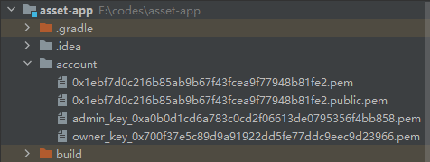

## Fiscobcos发起交易方法5--JavaSDK API调用

**环境： solidity 0.8.0， fisco节点 V3.2,  java SDK V3.2, WeBASE V3.0.2**

本文记录针对SDK api函数的学习研究，目的是搞清楚用法和核心函数写法。
已知的bug是 SDKV3.2版本 api不支持返回 结构体数据， 需要升级到将来的V3.3版本才解决。


#### 1 智能合约编译成java类
编写一套溯源智能合约，在Remix上通过验证。搬移到console/contracts/trace进行编译生成java文件。
```
contract2java.sh solidity -h   查看用法
-s 指定编译目录或源文件，
-o 指定输出目录
-p 指定包路径
```
使用SDK api函数发起交易需要指定合约地址、abi、bincode，因此需要在项目工程中添加合约编译后的abi、bin文件。
```
root@tom:/fiscoV3.2/console/contracts/trace# ls
BatchCodeFactory.sol  IBatchCode.sol  IUserAuthorization.sol  TraceCode.sol         UserAuthorizationFactory.sol
BatchCode.sol         ITraceCode.sol  Merchants.sol           TraceDataFactory.sol  UserAuthorization.sol
Goods.sol             ITraceData.sol  TraceCodeFactory.sol    TraceData.sol         Users.sol
root@tom:/fiscoV3.2/console/contracts/trace#cd ../..
root@tom:/fiscoV3.2/console# bash contract2java.sh solidity -s contracts/trace/  -o ./sdk  -p org.fisco.bcos.trace.contract*** Compile solidity Users.sol***
INFO: Compile for solidity Users.sol success.
*** Convert solidity to java  for Users.sol success ***


*** Compile solidity Merchants.sol***
INFO: Compile for solidity Merchants.sol success.
*** Convert solidity to java  for Merchants.sol success ***


*** Compile solidity Goods.sol***
INFO: Compile for solidity Goods.sol success.
*** Convert solidity to java  for Goods.sol success ***


*** Compile solidity BatchCodeFactory.sol***
INFO: Compile for solidity BatchCodeFactory.sol success.
*** Convert solidity to java  for BatchCodeFactory.sol success ***


*** Compile solidity UserAuthorizationFactory.sol***
INFO: Compile for solidity UserAuthorizationFactory.sol success.
*** Convert solidity to java  for UserAuthorizationFactory.sol success ***


*** Compile solidity ITraceCode.sol***
INFO: Compile for solidity ITraceCode.sol success.
*** Convert solidity to java  for ITraceCode.sol success ***


*** Compile solidity TraceDataFactory.sol***
INFO: Compile for solidity TraceDataFactory.sol success.
*** Convert solidity to java  for TraceDataFactory.sol success ***


*** Compile solidity ITraceData.sol***
INFO: Compile for solidity ITraceData.sol success.
*** Convert solidity to java  for ITraceData.sol success ***


*** Compile solidity TraceCodeFactory.sol***
INFO: Compile for solidity TraceCodeFactory.sol success.
*** Convert solidity to java  for TraceCodeFactory.sol success ***


*** Compile solidity IBatchCode.sol***
INFO: Compile for solidity IBatchCode.sol success.
*** Convert solidity to java  for IBatchCode.sol success ***


*** Compile solidity TraceData.sol***
INFO: Compile for solidity TraceData.sol success.
*** Convert solidity to java  for TraceData.sol success ***


*** Compile solidity BatchCode.sol***
INFO: Compile for solidity BatchCode.sol success.
*** Convert solidity to java  for BatchCode.sol success ***


*** Compile solidity UserAuthorization.sol***
INFO: Compile for solidity UserAuthorization.sol success.
*** Convert solidity to java  for UserAuthorization.sol success ***


*** Compile solidity TraceCode.sol***
INFO: Compile for solidity TraceCode.sol success.
*** Convert solidity to java  for TraceCode.sol success ***


*** Compile solidity IUserAuthorization.sol***
INFO: Compile for solidity IUserAuthorization.sol success.
*** Convert solidity to java  for IUserAuthorization.sol success ***


root@tom:/fiscoV3.2/console#
root@tom:/fiscoV3.2/console# cd sdk
root@tom:/fiscoV3.2/console/sdk# ls
org

#java类文件
root@tom:/fiscoV3.2/console/sdk# cd org/fisco/bcos/trace/contract/
root@tom:/fiscoV3.2/console/sdk/org/fisco/bcos/trace/contract# ls
BatchCodeFactory.java  IBatchCode.java  IUserAuthorization.java  TraceCode.java         UserAuthorizationFactory.java
BatchCode.java         ITraceCode.java  Merchants.java           TraceDataFactory.java  UserAuthorization.java
Goods.java             ITraceData.java  TraceCodeFactory.java    TraceData.java         Users.java
root@tom:/fiscoV3.2/console/sdk/org/fisco/bcos/trace/contract#

#生成的abi、bin文件
root@tom:/fiscoV3.2/console/contracts/sdk/abi# ls
Asset.abi             Crypto.abi            HelloWorld.abi          KVTableTest.abi  TableTest.abi         UserAuthorization.abi
BatchCode.abi         DelegateCallTest.abi  IBatchCode.abi          Merchants.abi    TraceCode.abi         UserAuthorizationFactory.abi
BatchCodeFactory.abi  EntryWrapper.abi      ITraceCode.abi          ShaTest.abi      TraceCodeFactory.abi  Users.abi
Cast.abi              EventSubDemo.abi      ITraceData.abi          sm               TraceData.abi
CastTest.abi          Goods.abi             IUserAuthorization.abi  Table.abi        TraceDataFactory.abi

/fiscoV3.2/console/contracts/sdk/bin#
```

#### 2  abi、bin安装使用
在java工程中创建好工作目录， 分别拷贝到对应目录。
```
src/main/java/org/fisco/bcos/trace/contract      --java类文件拷贝到此处
src/main/resources/contract/abi    --abi文件拷贝到此处
src/main/resources/contract/bin    --bin文件拷贝到此处
```
 

#### 3 加载用户私钥
发起交易需要指定用户私钥，可以从webase-web平台--“私钥管理”导出用户私钥pem文件，再添加到代码工程account目录中：

加载用户私钥文件：
```
public void loadUserAccount(String filePath){
    // 通过client获取CryptoSuite对象
    CryptoSuite cryptoSuite = client.getCryptoSuite();
    // 加载pem账户文件
    cryptoSuite.loadAccount("pem", filePath, null);
    cryptoKeyPair = cryptoSuite.getCryptoKeyPair();
    // 获取账户地址
    String accountAddress = cryptoKeyPair.getAddress();
    System.out.println("accountAddress is "+accountAddress);
}
```
#### 4 部署合约
通过创建和使用AssembleTransactionProcessor对象来完成合约相关的部署、调用和查询等操作， 并获得TransactionResponse的结果。
```
public void deployByContract() throws Exception {
    //client加载owner私钥
    loadUserAccount("account/owner_key_0x700f37e5c89d9a91922dd5fe77ddc9eec9d23966.pem");

    //准备部署合约，指定abi和bin
    transactionProcessor = TransactionProcessorFactory.createAssembleTransactionProcessor(
            client, cryptoKeyPair,"src/main/resources/contract/abi/", "src/main/resources/contract/bin/");

    // 部署BatchCodeFactory合约。第一个参数为合约名称，第二个参数为合约构造函数的列表，是List<Object>类型。
    // 这里指定合约名称，会自动查找匹配的abi/bin文件
    response = transactionProcessor.deployByContractLoader("BatchCodeFactory", new ArrayList<>());
    receipt =  response.getTransactionReceipt();
    System.out.println("Receipt = "+ receipt);
    contractAddress = response.getContractAddress();
    System.out.println("contractAddress = "+ contractAddress);
}
```

#### 5 发起合约交易，读取收据
```
public void addAdmin() throws Exception {
    //用owner添加管理员地址

    // 创建调用交易函数的参数，此处为传入一个参数
    List<Object> params = new ArrayList<>();
    params.add("0xa0b0d1cd6a783c0cd2f06613de0795356f4bb858");

    // 调用BatchCodeFactory合约，合约地址为contractAddress， 调用函数名为『addAdmin』，函数参数类型为params
    response = transactionProcessor.sendTransactionAndGetResponseByContractLoader(
            "BatchCodeFactory", contractAddress, "addAdmin", params);
    receipt =  response.getTransactionReceipt();
    System.out.println("Receipt = "+ receipt);
}
```

#### 6 读取合约数据
查询合约直接通过调用链上的节点查询函数即可返回结果，无需共识，不会在链上产生一笔交易，因此所有的查询交易都是同步方式通讯的。
（1）查询合约使用了sendCallByContractLoader函数来查询合约，返回结果是callResponse.getResults()。
```
     //读取批次码合约地址
    public String getBatchCode(String goodsId) throws Exception {
        //client加载owner私钥
        loadUserAccount("account/admin_key_0xa0b0d1cd6a783c0cd2f06613de0795356f4bb858.pem");
        contractAddress = "0x2af5b404d5c6c72a3cc2981e9a85f79347c2b1f9";


        //准备合约处理器，查询操作只需要abi文件，用于声明接口函数原型
        transactionProcessor =
                TransactionProcessorFactory.createAssembleTransactionProcessor(client, cryptoKeyPair,
                        "src/main/resources/contract/abi/", "");

        List<Object> params = new ArrayList<>();
        params.add(goodsId);

        CallResponse callResponse = transactionProcessor.sendCallByContractLoader(
            "BatchCodeFactory", contractAddress, "getBatchCode", params);
        System.out.println("callResponse = "+ callResponse);

        System.out.println("message = "+ callResponse.getReturnMessage());
        System.out.println("results = "+ callResponse.getResults());
        System.out.println("values = "+ callResponse.getValues());
        System.out.println("returnObject = "+ callResponse.getReturnObject());
        System.out.println("returnABIObject = "+ callResponse.getReturnABIObject());

        return null;
    }
```
应答：
```
callResponse = org.fisco.bcos.sdk.v3.transaction.model.dto.CallResponse@27f1bbe0
message = Success
results = [0x13d992ebc92035fe2771b0b65c156d5a58d11c22]
values = null
returnObject = null
returnABIObject = null
```

（2）如果使用了sendTransactionAndGetResponseByContractLoader发起调用，经过验证会触发交易。
```
     //读取批次码合约地址
    public String getBatchCode(String goodsId) throws Exception {
        //client加载owner私钥
        loadUserAccount("account/admin_key_0xa0b0d1cd6a783c0cd2f06613de0795356f4bb858.pem");
        contractAddress = "0x2af5b404d5c6c72a3cc2981e9a85f79347c2b1f9";


        //准备合约处理器，查询操作只需要abi文件，用于声明接口函数原型
        transactionProcessor =
                TransactionProcessorFactory.createAssembleTransactionProcessor(client, cryptoKeyPair,
                        "src/main/resources/contract/abi/", "");


        List<Object> params = new ArrayList<>();
        params.add(goodsId);
        //仍然可以这样发起调用
        response = transactionProcessor.sendTransactionAndGetResponseByContractLoader(
                "BatchCodeFactory", contractAddress, "getBatchCode", params);


        System.out.println("message = "+ response.getReturnMessage());
        System.out.println("results = "+ response.getResults());
        System.out.println("values = "+ response.getValues());
        System.out.println("returnObject = "+ response.getReturnObject());
        System.out.println("returnABIObject = "+ response.getReturnABIObject());
        receipt =  response.getTransactionReceipt();
        System.out.println("Receipt = "+ receipt);

        return null;
    }
```

应答：
```
message = Success
results = [0x1236fe8d2983bf403907ba7be03f698521da41a9]
values = null
returnObject = null
returnABIObject = null
Receipt = TransactionReceipt{transactionHash='0xc6941f6f978822406245ed300905ca8763d7cb37367f76ffe8bc0d62434def16', version='0', blockNumber='175', from='0xa0b0d1cd6a783c0cd2f06613de0795356f4bb858', to='0x1056fb0fbe6c3254250772d9b3a3cf3df049af49', gasUsed='3186', contractAddress=', checksumContractAddress='', logs=[], status='0', extraData='', input='null', output='0x0000000000000000000000001236fe8d2983bf403907ba7be03f698521da41a9', txProof=null, txReceiptProof=null}
```

在链上查看这笔交易：

#### 7 返回各种类型数据
读取函数返回数据，结果callResponse.getResults()是一个list列表，里面元素就是我们需要的返回数据，不过是以对象类型而存在。
（1）：合约函数返回值是bool类型，实际返回结果是Boolean对象。
（2）：合约函数返回值是uint类型，实际返回结果是BigInteger对象。
         BigInteger dd = (BigInteger)result.getValue();
（3）：合约函数返回值是地址或合约地址，实际返回结果是String对象。
           String dd = (String) result.getValue();
```
//检查批次码存在
public void isExist(String goodsId, String batchCode) throws Exception {
    //client加载owner私钥
    loadUserAccount("account/admin_key_0xa0b0d1cd6a783c0cd2f06613de0795356f4bb858.pem");
    contractAddress = "0xbf6d5dadd2f5dfce31faf6aad27b5d3e372b9a17";


    //准备部署合约，指定abi和bin
    transactionProcessor =
            TransactionProcessorFactory.createAssembleTransactionProcessor(client, cryptoKeyPair,
                    "src/main/resources/contract/abi/", "");


    List<Object> params = new ArrayList<>();
    params.add(goodsId);
    params.add(batchCode);
    CallResponse callResponse = transactionProcessor.sendCallByContractLoader(
        "BatchCodeFactory", contractAddress, "isExist", params);

    System.out.println("callResponse = "+ callResponse);
    System.out.println("message = "+ callResponse.getReturnMessage());
    System.out.println("results = "+ callResponse.getResults());
    System.out.println("values = "+ callResponse.getValues());
    System.out.println("returnObject = "+ callResponse.getReturnObject());
    System.out.println("returnABIObject = "+ callResponse.getReturnABIObject());

    Type result = callResponse.getResults().get(0);
    System.out.println("result = "+ result.getValue());

    Boolean dd =  (Boolean)result.getValue();
    System.out.println("dd = "+ dd);
}
```

#### 8 返回结构体类型
这个版本是测试失败的，只能看到完整的原始数据，不能解析成正确的结构体对象、或tuple元组。
Fiscobcos回答是需要等待下一个SDK版本V3.3，才能修复这个bug。

```
//读取批次码数据
public IBatchCode.BatchCodeData getOne(String goodsId, int index) throws Exception {
    //client加载owner私钥
    loadUserAccount("account/admin_key_0xa0b0d1cd6a783c0cd2f06613de0795356f4bb858.pem");
    contractAddress = "0xbf6d5dadd2f5dfce31faf6aad27b5d3e372b9a17";

    //准备部署合约，指定abi和bin
    transactionProcessor =
            TransactionProcessorFactory.createAssembleTransactionProcessor(client, cryptoKeyPair,
                    "src/main/resources/contract/abi/", "");

    List<Object> params = new ArrayList<>();
    params.add(goodsId);
    params.add(BigInteger.valueOf(index));
    CallResponse callResponse = transactionProcessor.sendCallByContractLoader(
        "BatchCodeFactory", contractAddress, "getOne", params);
    System.out.println("callResponse = "+ callResponse);

}

struct BatchCodeData {
        string batchCode;    //批次码
        uint   status;       //current status, default=0
}
```


实际执行到此就出现内部错误： 表明sendCallByContractLoader函数内部无法解析结构体数据。

```
Exception in thread "main" org.fisco.bcos.sdk.v3.transaction.model.exception.TransactionBaseException: Revert instruction
    at org.fisco.bcos.sdk.v3.transaction.manager.AssembleTransactionProcessor.parseCallResponseStatus(AssembleTransactionProcessor.java:766)
    at org.fisco.bcos.sdk.v3.transaction.manager.AssembleTransactionProcessor.callAndGetResponse(AssembleTransactionProcessor.java:670)
    at org.fisco.bcos.sdk.v3.transaction.manager.AssembleTransactionProcessor.sendCall(AssembleTransactionProcessor.java:447)
    at org.fisco.bcos.sdk.v3.transaction.manager.AssembleTransactionProcessor.sendCallByContractLoader(AssembleTransactionProcessor.java:413)
    at org.fisco.bcos.trace.client.SDKTest.getOne(SDKTest.java:284)
    at org.fisco.bcos.trace.client.SDKTest.main(SDKTest.java:337)
```
#### 9 异步调用
在前面代码中都是使用sendCallByContractLoader，或者sendTransactionAndGetResponseByContractLoader，这是一个同步调用方法，强制等待在这里直到返回结果。
如果用异步调用，先发起一笔交易，不等待链上结果去做其他工作，等待以后再读取结果。
发起异步交易流程：首先发起交易，得到交易hash。然后通过回调函数对象等待链上交易返回值。

参考文章：
https://fisco-bcos-doc.readthedocs.io/zh_CN/latest/docs/sdk/java_sdk/assemble_transaction.html 4.1 定义回调类
```
#回调对象类标准写法：
class TransactionCallbackMock extends TransactionCallback {
    private TransactionReceipt transactionReceipt;
    private ReentrantLock reentrantLock = new ReentrantLock();
    private Condition condition;

    public TransactionCallbackMock() {
        condition = reentrantLock.newCondition();
    }

    public TransactionReceipt getResult() {
        try {
            reentrantLock.lock();
            while (transactionReceipt == null) {
                condition.awaitUninterruptibly();
            }
            return transactionReceipt;
        } finally {
            reentrantLock.unlock();
        }
    }

    @Override
    public void onResponse(TransactionReceipt transactionReceipt) {
        try {
            reentrantLock.lock();
            this.transactionReceipt = transactionReceipt;
            condition.signal();
        } finally {
            reentrantLock.unlock();
        }
    }
}
```

发起异步调用：
可以用sendTransactionAndGetReceiptByContractLoaderAsync、sendTransactionAsync方法执行。
异步方法无返回值，因此无法获得交易hash。只能从回调对象中读取收据才能看到交易hash。
    
```
public void addOneBatchCodeAsync(String goodsId, String batchCode, int status) throws Exception {

        //client加载owner私钥
        loadUserAccount("account/admin_key_0xa0b0d1cd6a783c0cd2f06613de0795356f4bb858.pem");
        //  contractAddress = "0x4c02c975a36137d3d4b68484aadbce89414d73a0";


        //准备部署合约，指定abi和bin
        transactionProcessor =
                TransactionProcessorFactory.createAssembleTransactionProcessor(client, cryptoKeyPair,
                        "src/main/resources/contract/abi/", "src/main/resources/contract/bin/");

        // 创建调用交易函数的参数，此处为传入一个参数
        List<Object> params = new ArrayList<>();
        params.add(goodsId);
        params.add(batchCode);
        params.add(status);

        // 异步调用合约交易
        TransactionCallbackMock2 callbackMock = new TransactionCallbackMock2();
        String path = "src/main/resources/contract/abi/BatchCodeFactory.abi";
        String abi = Files.readString(Path.of(path));
        System.out.println("abi="+abi);

        ABIDefinitionFactory abiDefinitionFactory = new ABIDefinitionFactory(client.getCryptoSuite());
        ContractABIDefinition contractABIDefinition = abiDefinitionFactory.loadABI(abi);
        Map<String, List<ABIDefinition>> functions = contractABIDefinition.getFunctions();
        System.out.println(functions);
        List<ABIDefinition> methods = functions.get("addOneBatchCode");
        transactionProcessor.sendTransactionAsync(contractAddress, abi, "addOneBatchCode", params, callbackMock);

        Thread.sleep(2000);

        // 异步等待获取回执
        TransactionReceipt receipt = callbackMock.getResult();
        System.out.println("receipt = "+ receipt);
    }
```

#### 10 交易回执解析
交易解析功能帮助用户把交易回执解析为json数据。主要是解析收据中的output字段。
```
// 构造TransactionDecoderService实例，传入是否密钥类型参数。并且传入是否使用scale解码TransactionDecoderInterface decoder = new TransactionDecoderService(cryptoSuite, client.isWASM());
//解析带返回值的交易：
TransactionResponse transactionResponse = decoder.decodeReceiptWithValues(abi, "incrementUint256", transactionReceipt);

//解析无返回值的交易
TransactionResponse transactionResponseWithoutValues = decoder.decodeReceiptWithoutValues(abi, transactionReceipt);
```

#### 11 解析事件Event
只解析调用函数过程中触发的事件。传入合约的abi文件和交易回执的logs，解析交易结果；返回事件名和事件List的Map。
```
Map<String, List<List<Object>>>> events = decoder.decodeEvents(abi, transactionReceipt.getLogs());
```

#### 12 解析回执的错误信息
传入交易回执，解析返回数据，并解析为TransactionResponse对象。
```
TransactionResponse transactionResponse = decoder.decodeReceiptStatus(transactionReceipt);
```

