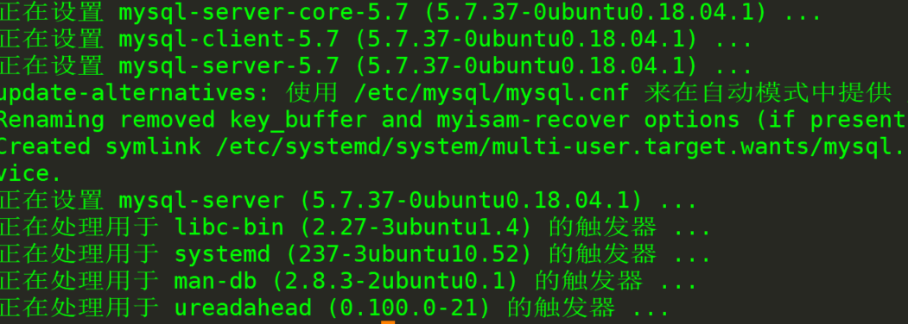
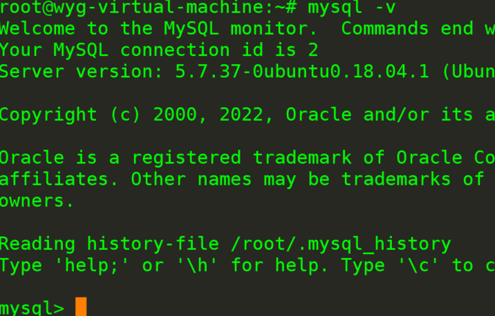
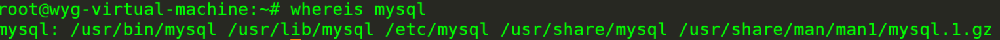
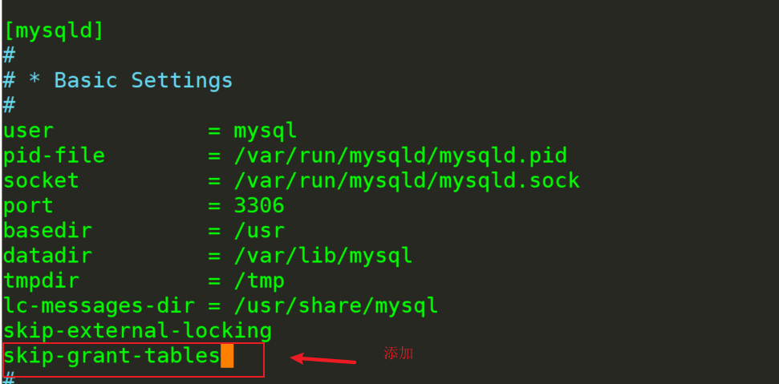
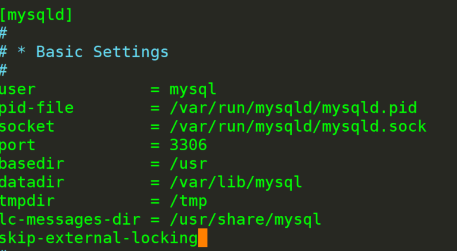
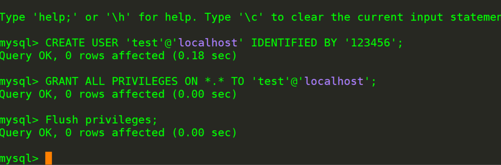

ubantu安装mysql5.7、

1、直接安装mysql服务端 

```
apt install mysql-server
```



2、检查版本

```
mysql -v
```



3、找到自己的mysql安装目录

```
whereis mysql
```



4、编辑配置文件（cd不进去就切进去）

```
cd /etc/mysql/mysqld.conf.d
```

```
vim mysqld.cnf
```



5、重启mysql

```
systemctl restart mysql
```

6、进入mysql

```
mysql -u root -p 
```


直接enter

7、进入以后，修改密码

```
update mysql.user set authentication_string="123456" where user='root';
```

8、刷新权限

```
Flush privileges;
```

9、退出mysql，恢复my.cnf或者mysqld.cnf文件(如果进不去就一步一步切换进去)

```
cd /etc/mysql/mysqld.conf.d/
```



10、再次重启

```
systemctl restart mysql
```

11、进入mysql并创建一个mysql用户，用于webase使用 

```
CREATE USER '用户名'@'localhost' IDENTIFIED BY '密码';
GRANT ALL PRIVILEGES ON *.* TO 'test'@'localhost';
Flush privileges;
```



