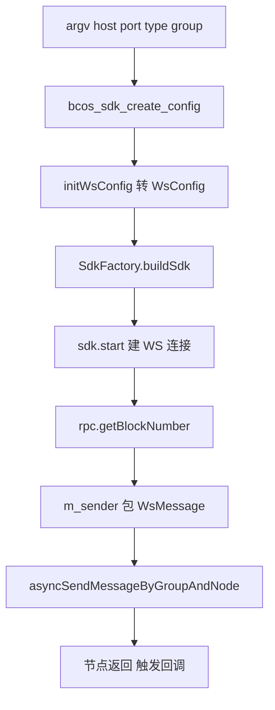
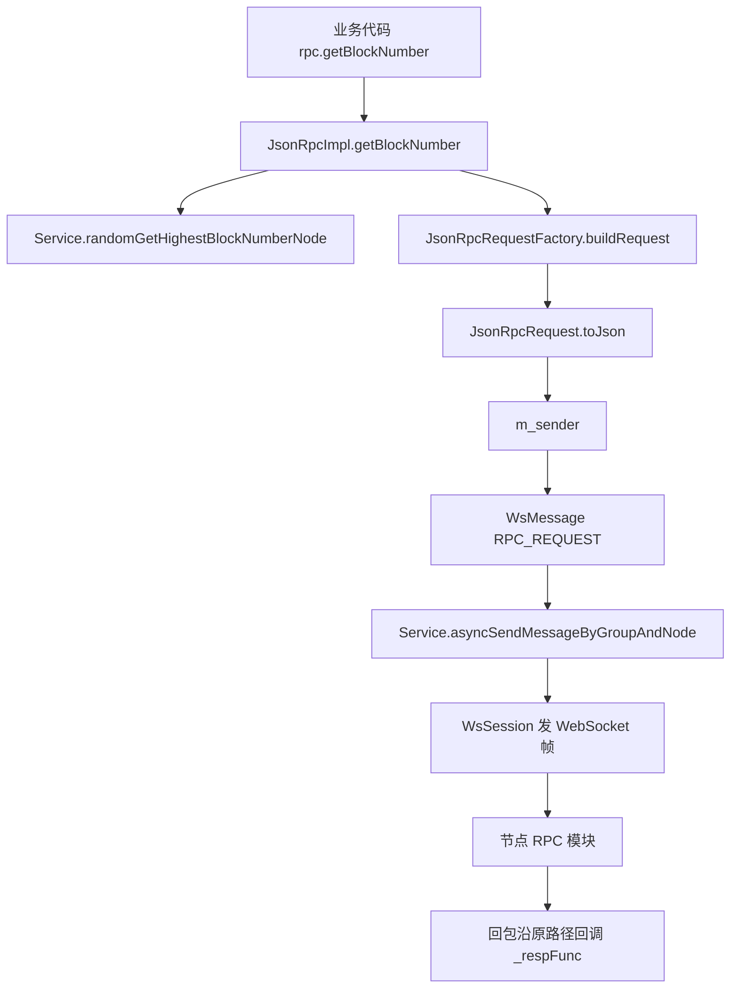

# 一次 RPC 调用是如何发起的

FISCO BCOS C++ SDK 给出的最小可运行示例藏在 `bcos-sdk/sample/rpc/rpc_test.cpp`。这个文件只有 200 多行，但完整地走完了「敲一行命令 → 建立 WebSocket 连接 → 发出 JSON-RPC 请求 → 收到响应」全过程。本文把它拆成三段：命令行参数怎么落到配置里、`WsConfig` 究竟初始化了哪些字段、`getBlockNumber` 这一行底下是什么。

跨越的源码文件：

- 示例入口：[`rpc_test.cpp`](file:///Users/ljz/fs/FISCO-BCOS/bcos-sdk/sample/rpc/rpc_test.cpp)
- SDK 装配：[`SdkFactory.cpp`](file:///Users/ljz/fs/FISCO-BCOS/bcos-sdk/bcos-cpp-sdk/SdkFactory.cpp) / [`Sdk.h`](file:///Users/ljz/fs/FISCO-BCOS/bcos-sdk/bcos-cpp-sdk/Sdk.h)
- JSON-RPC 协议层：[`JsonRpcImpl.cpp`](file:///Users/ljz/fs/FISCO-BCOS/bcos-sdk/bcos-cpp-sdk/rpc/JsonRpcImpl.cpp) / [`JsonRpcRequest.cpp`](file:///Users/ljz/fs/FISCO-BCOS/bcos-sdk/bcos-cpp-sdk/rpc/JsonRpcRequest.cpp)
- WebSocket 传输层：`bcos-boostssl/websocket/WsConfig.h`

整条链路如下：



图里从左到右刚好对应文件里的执行顺序，下面分节展开。

---

## 一、命令行参数

示例的 `main` 没有用 `getopt`、`boost::program_options` 这类参数解析库，直接按位置取 `argv`。这种写法的优点是没有外部依赖、可读性最高；缺点是顺序写错就只能靠 `usage()` 提示。

```cpp
if (argc < 5) { usage(); }
const char* host  = argv[1];
int         port  = atoi(argv[2]);
const char* type  = argv[3];   // ssl 或 sm_ssl
const char* group = argv[4];   // 示例固定使用 group0
```

`usage()` 里给出的两种调用方式：

```text
./rpc 127.0.0.1 20200 ssl group0
./rpc 127.0.0.1 20200 sm_ssl group0
```

第一个参数是节点的 IP 或域名，第二个是 RPC 端口（节点 `config.ini` 里 `[rpc] listen_port` 配置的值），第三个区分国密链和普通链，第四个是要查询的群组 ID。FISCO BCOS 3.x 默认会创建 `group0`，所以示例里写死了这个值。

国密判断只看一个关键字：

```cpp
int is_sm_ssl = 1;
if (strstr(type, "sm_ssl") == NULL) is_sm_ssl = 0;

auto config = bcos_sdk_create_config(is_sm_ssl, (char*)host, port);
config->disable_ssl = 1;   // 示例在这里把 SSL 关掉了
```

这里有个一定要留意的点：示例在构造完 `config` 之后，紧跟着一行 `config->disable_ssl = 1`，把前面解析出来的 SSL 类型直接覆盖掉了。也就是说，即便你命令行里写了 `ssl/sm_ssl`，跑出来仍然是裸 WebSocket。这行存在的目的是让作者本地调试更方便（不用配证书），生产或者联调环境一定要删掉，否则会出现「证书都配好了却连不上」的尴尬。

四个参数最终的去向如下：

| argv | 填入字段 | 后续被谁使用 |
| --- | --- | --- |
| `host` | `bcos_sdk_c_endpoint.host` | `WsConfig::setConnectPeers` |
| `port` | `bcos_sdk_c_endpoint.port` | 同上 |
| `type` | `ssl_type` | `ContextConfig::setSslType` |
| `group` | `getBlockNumber` 的 `_groupID` | JSON-RPC 请求体 `params[0]` |

可以看出参数只在两个地方真正起作用：一个是连接层（host/port/type 决定建什么样的 WebSocket），另一个是协议层（group 决定 JSON-RPC 请求发到哪个群组）。

---

## 二、`bcos_sdk_create_config`：先攒一份 C 风格配置

进入正题之前要先解释一下，为什么这里要有一个 C 结构体而不是直接用 `WsConfig`。

`bcos_sdk_c_config` 是 SDK 对外的「中间表示」。SDK 同时要服务 C 调用方、SWIG 自动生成的 Java/Python/Go 绑定，以及 C++ 调用方。如果直接暴露 `WsConfig`，C 用户和绑定层根本没办法用，因为里面会出现 `std::shared_ptr`、`std::vector`、智能指针构造函数等纯 C++ 特性。所以做法是先约定一份 POD 风格的结构体，所有调用方都先把参数填进它，再由 `initWsConfig` 这一层适配器翻译成 C++ 配置类。

示例里实际填的字段：

```cpp
config->thread_pool_size    = 8;
config->message_timeout_ms  = 10000;
config->peers.push_back({host, port});
config->peers_count         = 1;
config->ssl_type            = sm_ssl ? "sm_ssl" : "ssl";
config->is_cert_path        = 1;
config->cert_config = {
    .ca_cert   = "./conf/ca.crt",
    .node_key  = "./conf/sdk.key",
    .node_cert = "./conf/sdk.crt"
};
```

下面几个字段值得展开讲：

- **`thread_pool_size = 8`**：这是 boost.asio 的 io_context 工作线程数。SDK 内部所有的网络回调、超时检查、消息序列化都跑在这个线程池里。线程数过小，高并发场景下回调会堆积；过大则会增加上下文切换开销。8 是个对单连接客户端比较保险的默认值。
- **`message_timeout_ms = 10000`**：单条 RPC 请求等待响应的上限。超时之后 SDK 会用 `Error` 回调通知调用方，而不是无限阻塞。
- **`send_rpc_request_to_highest_block_node`**：FISCO BCOS 是多节点架构，不同节点之间块高可能有几毫秒到几百毫秒的差距。如果业务对「读到最新数据」敏感，这个开关让 SDK 在每次发起 RPC 前自动挑一个块高最高的节点。第五节会看到这个开关在 `getBlockNumber` 里被读取。
- **`is_cert_path`**：决定 `ca_cert / node_cert / node_key` 三个字段填的是路径还是直接的 PEM 字符串。对于容器化、Secret 注入或者只读 rootfs 的部署场景，可以把 `is_cert_path = 0`，把证书内容直接塞进结构体。
- **`peers` 和 `peers_count` 成对出现**：纯 C++ 里 `peers.size()` 就够了，之所以单独放一个 `peers_count`，也是为了 C 侧调用方便。

至于 `disable_ssl`，前面已经说过：示例里在构造完 config 之后强制改成 1。在真正使用 SDK 的项目里，这个字段应当跟随命令行参数或者配置文件，而不是写死。

---

## 三、`initWsConfig`：把 C 配置喂给 `WsConfig`

`bcos::boostssl::ws::WsConfig` 才是 boostssl 模块实际使用的配置类。`initWsConfig` 的工作就是字段对字段地搬运一次：

```cpp
auto wsConfig = std::make_shared<bcos::boostssl::ws::WsConfig>();
wsConfig->setModel(bcos::boostssl::ws::WsModel::Client);     // 客户端模式

auto peers = std::make_shared<bcos::boostssl::ws::EndPoints>();
for (size_t i = 0; i < config->peers_count; i++) {
    peers->insert(bcos::boostssl::NodeIPEndpoint(
        config->peers[i].host, config->peers[i].port));
}
wsConfig->setConnectPeers(peers);

wsConfig->setDisableSsl(config->disable_ssl);
wsConfig->setThreadPoolSize(config->thread_pool_size);
wsConfig->setReconnectPeriod(config->reconnect_period_ms);
wsConfig->setHeartbeatPeriod(config->heartbeat_period_ms);
wsConfig->setSendMsgTimeout(config->message_timeout_ms);

if (!config->disable_ssl) {
    auto contextConfig = std::make_shared<bcos::boostssl::context::ContextConfig>();
    contextConfig->setSslType(config->ssl_type);
    contextConfig->setIsCertPath(config->is_cert_path);
    bcos::boostssl::context::ContextConfig::CertConfig certConfig;
    certConfig.caCert   = config->cert_config.ca_cert;
    certConfig.nodeCert = config->cert_config.node_cert;
    certConfig.nodeKey  = config->cert_config.node_key;
    contextConfig->setCertConfig(certConfig);
    wsConfig->setContextConfig(contextConfig);
}
```

这段代码看起来枯燥，但里面藏了几件值得展开的事情：

**`WsModel::Client`**。`WsConfig` 实际上既可以描述服务端也可以描述客户端，区别就在这个枚举。设成 `Client` 之后，后续 `WsService::start` 会跳过 `listen/accept` 流程，直接对 `peers` 里的每个端点发 `connect`。如果错设成 `Server`，进程会试图监听一个端口而不发起任何外连，表现上就是「程序起来了但永远连不上」。

**`EndPoints` 是一个集合而不是单个端点**。SDK 支持配置多个节点同时连接，连接成功后 `Service` 会维护一个会话池。发起 RPC 时，可以由 SDK 自动负载均衡，也可以由调用方指定具体某个节点（参考第五节里 `_nodeName` 参数的含义）。这种设计让一份配置可以横跨开发环境、测试环境的不同节点编排。

**重连和心跳**。`reconnect_period_ms` 控制断线后多久重试一次，`heartbeat_period_ms` 控制空闲连接发心跳的间隔。链上交易峰值过去后，连接可能长时间没消息，没有心跳的话 NAT、负载均衡器会把空连接踢掉，后果就是「半个小时没动静，下一次 RPC 直接超时」。生产环境建议显式设置这两个值。

**SSL 分支按需构造**。如果 `disable_ssl == 1`，`ContextConfig` 根本不会被创建，传输是裸 WebSocket（`ws://`），不会有任何加密或者证书校验。SSL 启用后，`setSslType("sm_ssl")` 会让 SDK 走国密栈：底层不再用 OpenSSL 默认套件，而是切到国密 TLS 实现，证书也必须是 SM2 的双证书（签名 + 加密）。普通 `ssl` 走的是标准 TLS 1.2/1.3，证书是 RSA/ECDSA。两条路径不能混用，节点端的 SSL 类型必须和客户端一致。

---

## 四、`SdkFactory::buildSdk`：把配置变成可以工作的对象

到这里 `WsConfig` 已经准备好了，但它只是一份数据。真正能跑的 `Sdk` 对象由 `SdkFactory` 负责装配。`thread_function` 把整个生命周期压缩到几行：

```cpp
auto factory  = std::make_shared<bcos::cppsdk::SdkFactory>();
auto wsConfig = initWsConfig(arg);
auto sdk      = factory->buildSdk(wsConfig,
                                  arg->send_rpc_request_to_highest_block_node);
sdk->start();
auto rpc = sdk->jsonRpc();
rpc->getBlockNumber("group0", "",
    [](bcos::Error::Ptr error, std::shared_ptr<bcos::bytes> resp) {});
```

`buildSdk` 内部一次性构造出五个对象：

```cpp
auto service        = buildService(std::move(_config));
auto amop           = buildAMOP(service);
auto jsonRpc        = buildJsonRpc(service, _sendRequestToHighestBlockNode);
auto eventSub       = buildEventSub(service);
auto jsonRpcService = buildJsonRpcService(jsonRpc);
```

简单介绍下这五块各自的职责：

- `service`：基于 boostssl 的 WebSocket 服务管理器，掌管所有的连接、会话、消息收发与群组信息缓存。后面四个模块全部依赖它。
- `amop`：链上消息推送（Advanced Messages Onchain Protocol），用于节点之间或者节点和外部应用之间发主题消息。和本文主题无关，本文不展开。
- `jsonRpc`：JSON-RPC 协议层，提供 `getBlockNumber / sendTransaction / call` 等所有方法。
- `eventSub`：事件订阅，用于订阅合约日志（类似以太坊的 `eth_subscribe`）。
- `jsonRpcService`：在 `jsonRpc` 之上的同步封装，把异步 + 回调风格的接口包装成阻塞接口。

和这次主题相关的关键点在 `buildJsonRpc` 里。它给 `jsonRpc` 注入了一个发送器 `m_sender`，这个发送器才是 JSON-RPC 协议层和 WebSocket 传输层之间的胶水：

```cpp
jsonRpc->setSender([_service](const std::string& _group,
                              const std::string& _node,
                              const std::string& _request,
                              auto&& _respFunc) {
    auto data = std::make_shared<bytes>(_request.begin(), _request.end());
    auto msg  = _service->messageFactory()->buildMessage();
    msg->setSeq(_service->messageFactory()->newSeq());
    msg->setPacketType(bcos::protocol::MessageType::RPC_REQUEST);
    msg->setPayload(data);

    _service->asyncSendMessageByGroupAndNode(_group, _node, msg, Options(),
        [_respFunc](Error::Ptr _error, MessageFace::Ptr _msg, auto&&) {
            _respFunc(_error, _msg ? _msg->payload() : nullptr);
        });
});
```

这段闭包做了三件事：把 JSON 字符串包成字节数组、套上一个递增的 `seq`（用于异步请求和响应配对）并标记消息类型为 `RPC_REQUEST`、最后调用 `Service` 的异步发送接口。`Options()` 用默认值，等同于「按全局配置的超时和重试策略发送」。响应到达时，`Service` 会根据 `seq` 找到注册的 `_respFunc` 并回调。

之所以采用「注入 sender」而不是直接在 `JsonRpcImpl` 内部调用 `Service`，是为了把协议组装和传输方式解耦。把 sender 替换成 HTTP、TCP 或者本地内存队列，`JsonRpcImpl` 完全不需要改动。`tarsRPC` 那套实现走的正是另一种 sender。

`sdk->start()` 内部按顺序启动 `Service`、`JsonRpc`、`AMOP`、`EventSub`（在 [`Sdk.h`](file:///Users/ljz/fs/FISCO-BCOS/bcos-sdk/bcos-cpp-sdk/Sdk.h) 里），`Service::start` 才会真正读 `WsConfig` 去和每个 `peer` 建 WebSocket 长连接、完成 SDK 协议握手、拉取群组信息。换句话说，前面所有的「初始化」都只是在准备数据，到这一步才是真正的网络 IO 开始。

---

## 五、`getBlockNumber`：协议层只有三件事

铺垫这么多，最终的调用就一行：

```cpp
rpc->getBlockNumber("group0", "",
    [](bcos::Error::Ptr error, std::shared_ptr<bcos::bytes> resp) { /* ... */ });
```

第二个参数 `_nodeName` 传空字符串，意味着「不指定节点，让 SDK 帮我挑」。这是常规用法。如果业务上有「必须打到某台节点」的需求，传具体名字即可。

底层实现（[`JsonRpcImpl.cpp`](file:///Users/ljz/fs/FISCO-BCOS/bcos-sdk/bcos-cpp-sdk/rpc/JsonRpcImpl.cpp)）：

```cpp
void JsonRpcImpl::getBlockNumber(
    const std::string& _groupID, const std::string& _nodeName, RespFunc _respFunc)
{
    std::string name = _nodeName;
    if (m_sendRequestToHighestBlockNode && name.empty()) {
        m_service->randomGetHighestBlockNumberNode(_groupID, name);
    }

    Json::Value params = Json::Value(Json::arrayValue);
    params.append(_groupID);
    params.append(name);

    auto request = m_factory->buildRequest("getBlockNumber", params);
    auto json    = request->toJson();
    m_sender(_groupID, name, json, _respFunc);
}
```

只有三步：

**第一步：选节点。** 当 `_nodeName` 为空、并且开关 `m_sendRequestToHighestBlockNode` 打开时，调 `Service::randomGetHighestBlockNumberNode`。这里的「随机」不是从所有节点里随机，而是先筛出当前块高最高的一批节点，再在这批节点里随机挑一个。这样既能读到最新数据，又能在多节点之间分摊负载。如果开关关闭或者主动指定了节点，这一步会跳过。

**第二步：拼请求。** 把 `groupID` 和 `nodeName` 塞进 params 数组，交给 `JsonRpcRequestFactory` 构造请求对象，然后 `toJson()` 序列化成字符串。序列化结果是标准 JSON-RPC 2.0 报文：

```json
{
  "jsonrpc": "2.0",
  "method":  "getBlockNumber",
  "id":      42,
  "params":  ["group0", ""]
}
```

`id` 由工厂内部自增维护，用来在响应回来时匹配请求。`params` 是个数组，顺序对应方法签名（这里就是 `groupID` 和 `nodeName`）。如果直接用 `curl` 给节点的 RPC 端口打这段 JSON，效果和 SDK 调用是等价的。

**第三步：交给 `m_sender`。** 也就是第四节里那个 lambda。从这里之后就回到了 WebSocket 传输层：包装成 `WsMessage`、走 `asyncSendMessageByGroupAndNode`、由 `WsSession` 写到 socket。响应回来时反向走完整条链路，最终触发示例里那个空的 lambda。

合在一起看，调用链是这样的：



看懂这张图以后再回去看 `getCode`、`sendTransaction`、`call` 之类的方法，会发现实现结构完全一致——只是 `method` 字符串和 `params` 内容不同。SDK 把「怎么把 JSON 送出去」抽象到了 sender 一层，业务方法本身只剩下「拼参数」这点工作。

---

## 常见问题

| 现象 | 可能原因 |
| --- | --- |
| 连不上节点 | 节点开了 SSL，但示例代码里 `disable_ssl = 1` 把加密关掉了 |
| 找不到证书 | `is_cert_path = 1` 但传的是相对路径，可执行文件不在 `./conf` 同级 |
| `getBlockNumber` 没回调 | 没调用 `sdk->start()`，或 `peers` 列表为空，或目标群组不存在 |
| 国密节点调用失败 | 命令行第三个参数仍是 `ssl`，没切到 `sm_ssl`，加密套件不匹配 |
| 连接经常断开 | 没设 `heartbeat_period_ms`，中间链路把空闲连接踢掉了 |
| 多线程下性能上不去 | `thread_pool_size` 设得太小，回调全在排队 |

---

## 额外说明

`thread_function` 把 `start/stop` 放在 `while(1)` 里反复跑，是为了做压力测试和内存泄漏检测，不是推荐用法。实际项目里 SDK 通常是构造一次、长期持有，不要每次 RPC 都新建一次。每次 `buildSdk` 都会重新建立 WebSocket 连接、完成 SDK 握手、拉群组信息，开销不小，把它放进热路径会让 RPC 的实际延迟翻好几倍。

整篇示例的核心信息其实可以浓缩成一句话：命令行参数被翻译成 `bcos_sdk_c_config`，`bcos_sdk_c_config` 被翻译成 `WsConfig`，`WsConfig` 被 `SdkFactory` 用来构造 `Service` 和 `JsonRpcImpl`，`JsonRpcImpl` 又通过一个注入式的 `m_sender` 把请求送回 `Service` 走 WebSocket 发出去。理解了这条链，再去看 SDK 的其它接口就只剩参数差异了。
