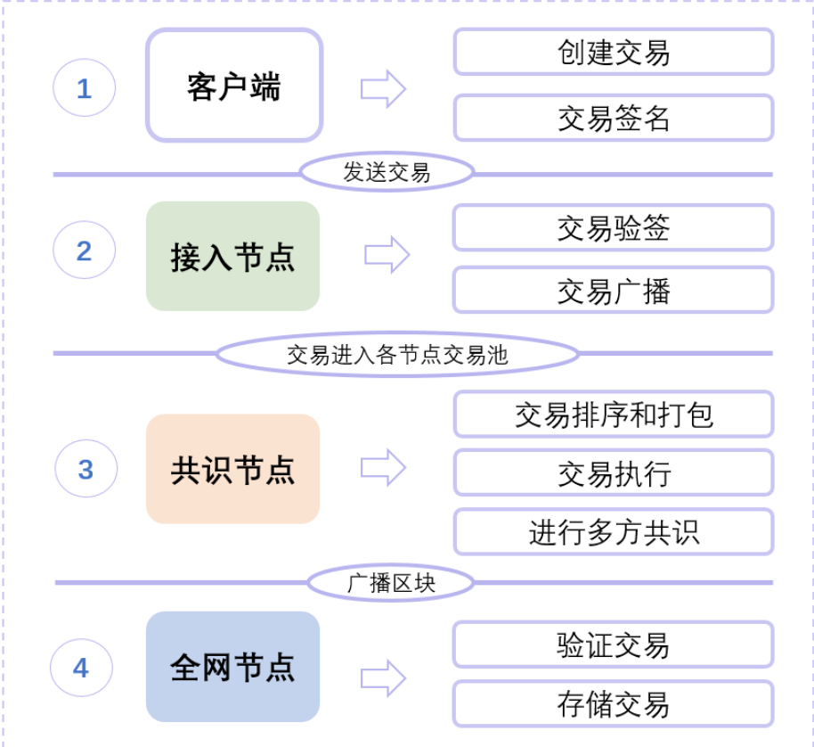
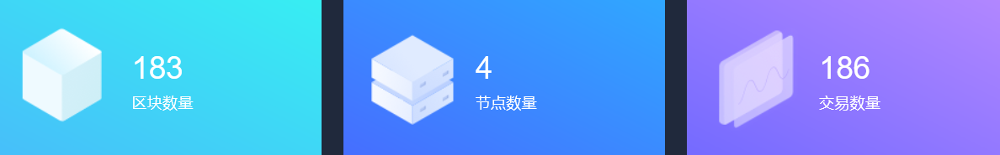
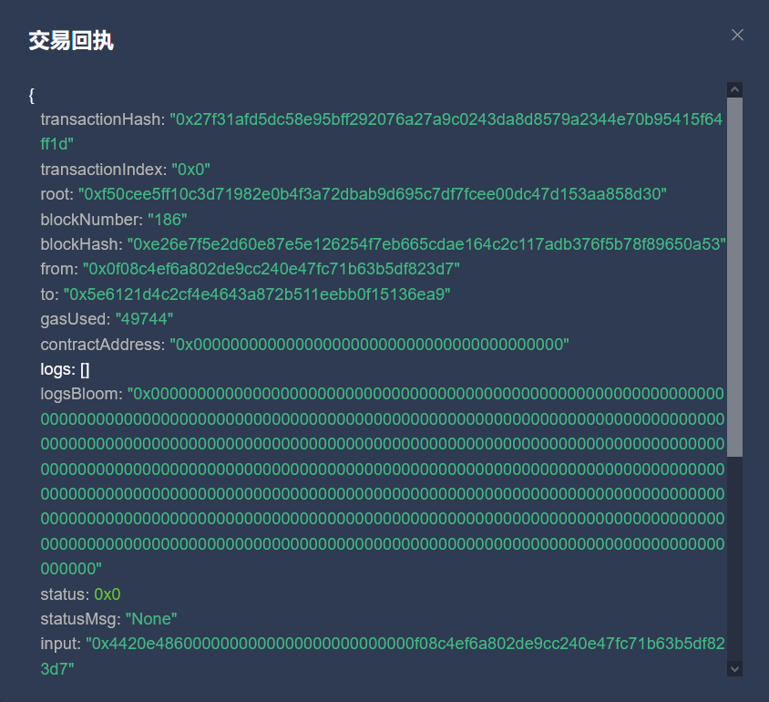
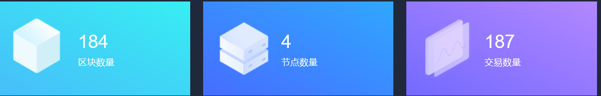
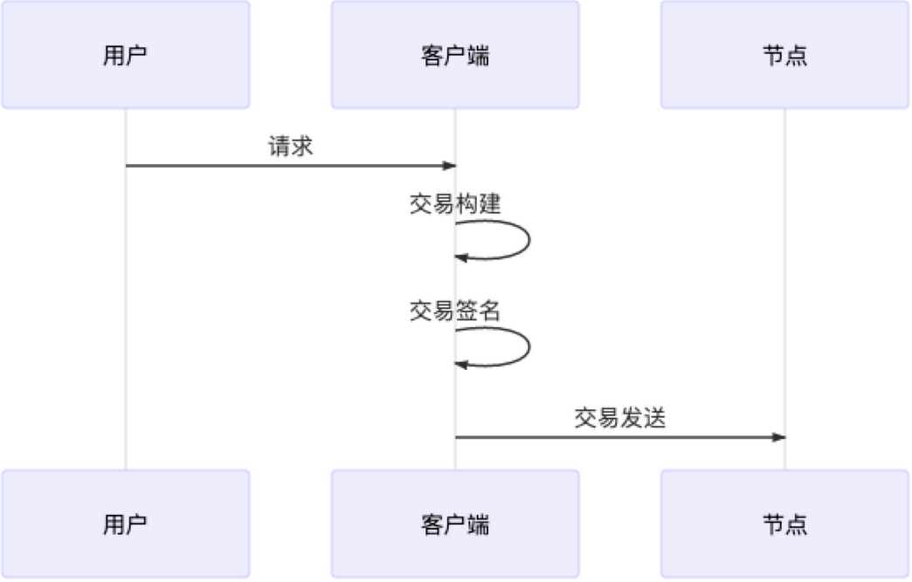
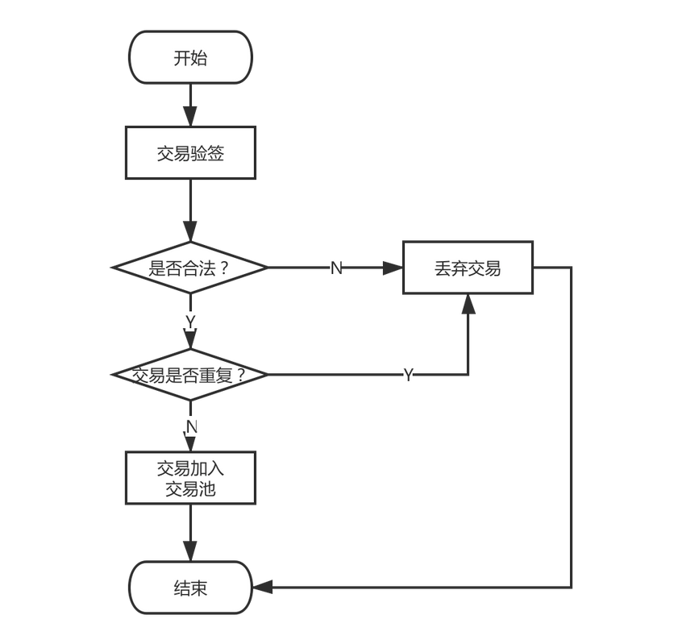
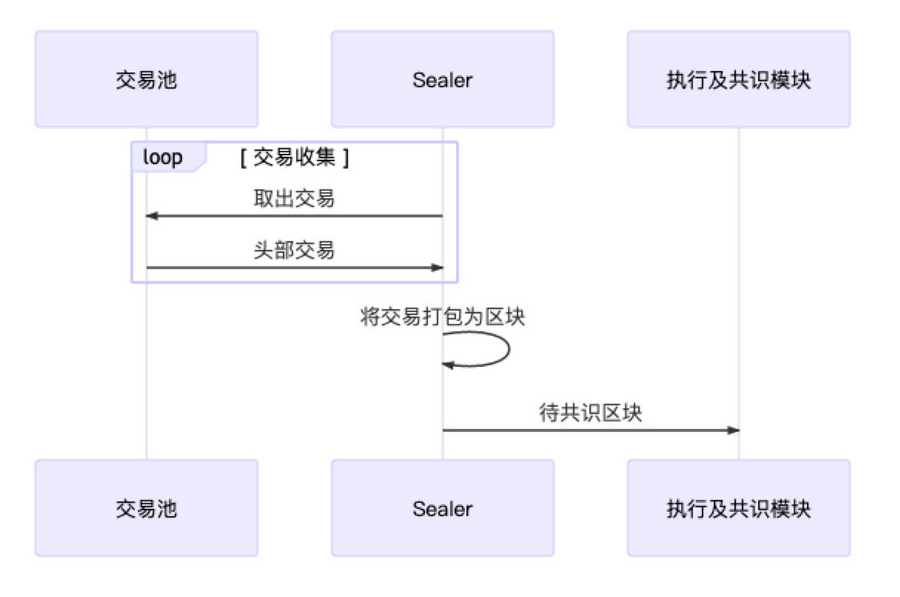
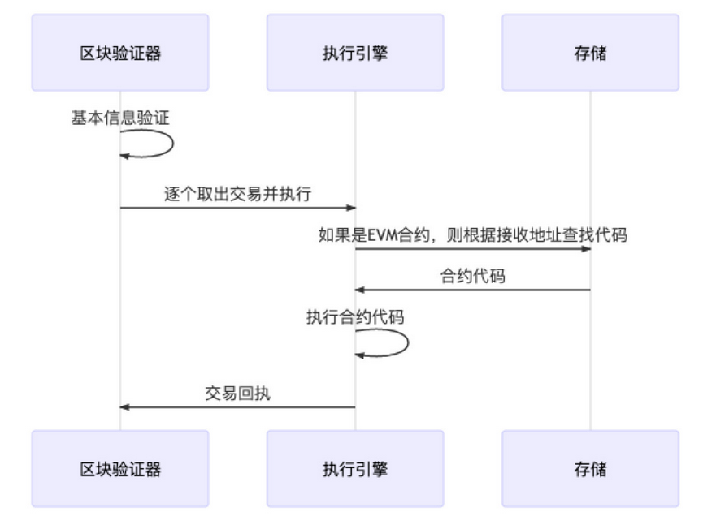

# FISCO BCOS（十八）——— 区块链交易流程

FISCO BCOS交易完整生命周期

## 1、交易生成

- 发送地址：即用户自己的账户，用于表明交易来自何处

- 接收地址：FISCO BCOS中的交易分为两类

  - 一类是部署合约的交易

    - 由于交易并没有特定的接收对象，因此规定这类交易的接收地址固定为0x0

      - 未部署

        

      - 部署后

      

      

  - 一类是调用合约的交易

    - 需要将交易的接收地址置为链上合约的地址

    

- 交易相关的数据：也就是增删改操作（官方解释：一笔交易往往需要一些用户提供的输入来执行用户期望的操作）

- 交易签名：为了表明交易确实是由自己发送，用户会向SDK提供私钥来让客户端对交易进行签名，其中私钥和用户账户是一一对应的关系

- 区块链客户端会再向交易填充一些必要的字段（这里最重要的就是区块哈希）用于防交易重放的交易ID及blockLimit，交易构造完成后，客户端随后便通过Channel或RPC信道将交易发送给节点。

## 2、交易池

区块链交易被发送到节点后，节点会通过验证交易签名的方式来验证一笔交易是否合法，合法则进入交易池缓存起来，等待交易，不合法或者存在重复交易则丢弃。

## 3、交易广播

节点在收到交易后会通知其他已知的节点。

为了能让交易尽可能到达所有节点，会根据一些精巧的策略选择一些节点，将交易再一次进行广播。对于从其他节点转发过来的交易，节点只会随机选择25%的节点再次广播，缩减广播的规模有助于避免因网络中冗余和广播风暴问题。

## 4、交易打包

为了提高交易处理效率和确定交易的执行顺序，当有交易时，Sealer线程负责从交易池中按照先进先出的顺序取出一定数量的交易，组装成待共识区块，随后待共识区块会被发往各个节点进行处理。

## 5、交易执行

节点在收到区块后，会调用区块验证器把交易从区块中逐一拿出来执行。如果是预编译合约代码，验证器中的执行引擎会直接调用相应的C++功能，否则执行引擎就会把交易交给EVM（以太坊虚拟机）执行。

## 6、交易共识

区块链要求节点间就区块的执行结果达成一致才能出块。FISCO  BCOS中一般采用PBFT算法保证整个系统的一致性，其大概流程是：各个节点先独立执行相同的区块，随后节点间交换各自的执行结果，如果发现超过2/3的节点都得出了相同的执行结果，那说明这个区块在大多数节点上取得了一致，节点便会开始出块。

## 7、交易落盘

在共识出块后，节点将交易及执行结果写入硬盘永久保存，更新区块高度与区块哈希的映射表等内容，节点从交易池中剔除已落盘的交易开始新一轮的出块流程。

