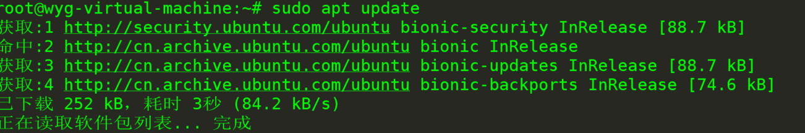
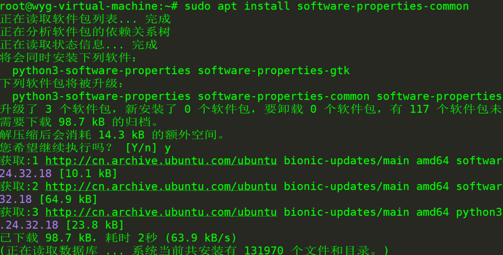
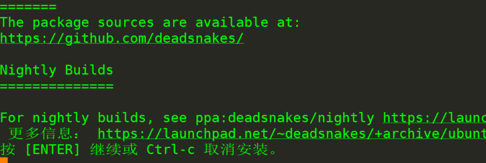
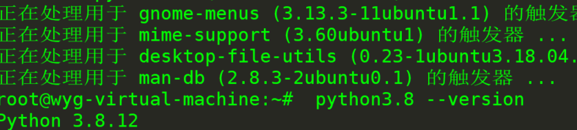

FISCO BCOS（六）——— 在Ubantu上安装python

1、以root用户或具有sudo访问权限的用户身份运行以下命令，以更新软件包列表并安装必备组件：

```
sudo apt update
sudo apt install software-properties-common
```





2、将deadsnakes PPA添加到系统的来源列表中：

```
sudo add-apt-repository ppa:deadsnakes/ppa
```



出现提示 按enter继续

3、启用存储库后，请使用以下命令安装Python 3.8：

```
sudo apt install python3.8
```


4、通过键入以下命令验证安装是否成功：

```
python3.8 --version
```

