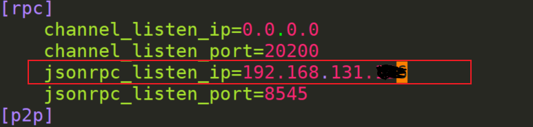
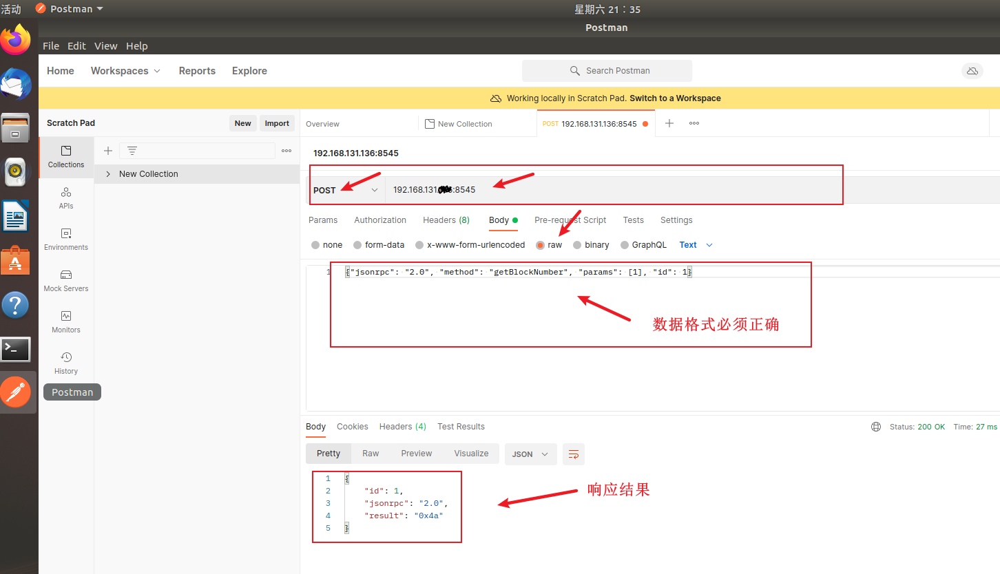
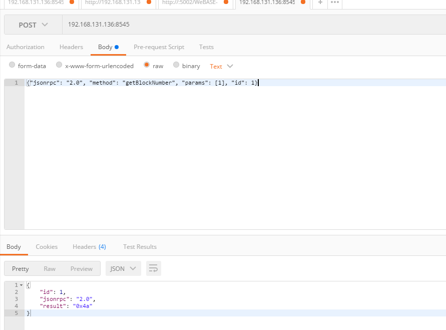

# 

官方文档

RPC：https://fisco-bcos-documentation.readthedocs.io/zh_CN/latest/docs/design/rpc.html

接口说明：https://webasedoc.readthedocs.io/zh_CN/latest/docs/WeBASE-Front/interface.html

1、调用接口的前提（可能影响接口无法请求的原因）

- windows 与ubuntu的防火墙是否关闭
-  请求ip地址与端口是否正确
- 是否添加了请求参数
- 请求参数格式是否正确
- 节点是否开启，8545端口是否在线

2、修改配置文件

```
cd nodes/127.0.0.1/node0
vim config.ini

修改为虚拟机的本机ip
```



3、连接测试（首先在ubuntu上看看能否请求）




4、在Windows上是否请求正常



