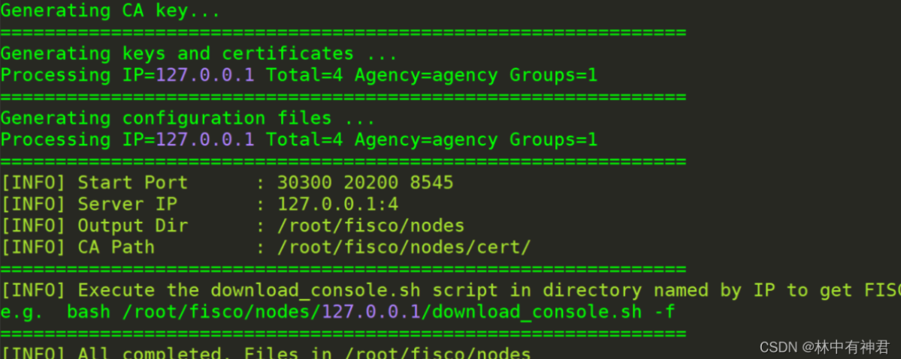

1、安装ubuntu依赖

```
sudo apt install -y openssl curl
```


2、创建操作目录, 下载安装脚本

    创建操作目录
    cd ~ && mkdir -p fisco && cd fisco

    下载脚本
    curl -#LO https://github.com/FISCO-BCOS/FISCO-BCOS/releases/download/v2.8.0/build_chain.sh && chmod u+x build_chain.sh

```
如果网络问题产生报错导致无法下载，请尝试
curl -#LO https://osp-1257653870.cos.ap-guangzhou.myqcloud.com/FISCO-BCOS/FISCO-BCOS/releases/v2.8.0/build_chain.sh && chmod u+x build_chain.sh
```

3、搭建单群组4节点联盟链

    bash build_chain.sh -l 127.0.0.1:4 -p 30300,20200,8545

如果命令执行成功：



如果执行出错，请检查nodes/build.log文件中的错误信息。


4、启动FISCO BCOS链

    bash nodes/127.0.0.1/start_all.sh

启动成功会输出类似下面内容的响应。否则请使用netstat -an | grep tcp检查机器的30300~30303，20200~20203，8545~8548端口是否被占用。


​		5、检查进程

    ps -ef | grep -v grep | grep fisco-bcos

正常情况会有类似下面的输出； 如果进程数不为4，则进程没有启动（一般是端口被占用导致的）


6、检查日志输出

    查看节点node0链接的节点数

    tail -f nodes/127.0.0.1/node0/log/log*  | grep connected

正常情况会不停地输出连接信息，从输出可以看出node0与另外3个节点有连接 执行下面指令，检查是否在共识


    1tail -f nodes/127.0.0.1/node0/log/log*  | grep +++

正常情况会不停输出++++Generating seal，表示共识正常。

如果上述过程都没错的话，单群组FISCO BCOS联盟链就已经搭建成功。
