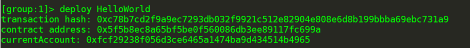
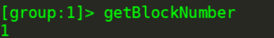
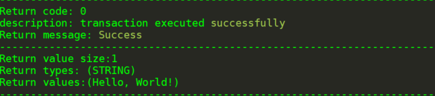
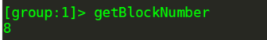
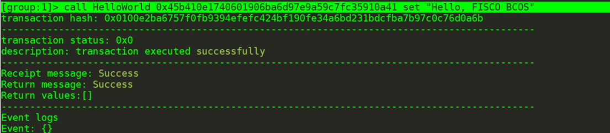
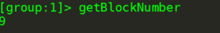
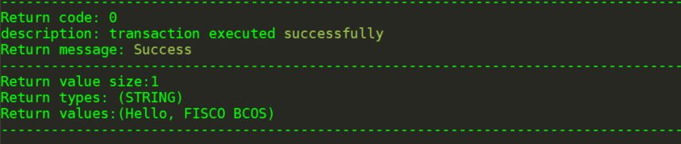
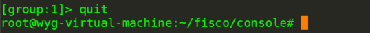

# FISCO BCOS（三）——— 部署及调用HelloWorld合约

1、编写HelloWorld合约

HelloWorld合约提供两个接口，分别是`get()`和`set()`，用于获取/设置合约变量`name`。合约内容如下:

```solidity
pragma solidity ^0.4.24;

contract HelloWorld {
    string name;

    function HelloWorld() {
        name = "Hello, World!";
    }

    function get()constant returns(string) {
        return name;
    }

    function set(string n) {
        name = n;
    }
}
```

2、部署HelloWorld合约

为了方便用户快速体验，HelloWorld合约已经内置于控制台中，位于控制台目录下`contracts/solidity/HelloWorld.sol`，参考下面命令部署即可。

```
# 在控制台输入以下指令 部署成功则返回合约地址
[group:1]> deploy HelloWorld
```



3、 调用HelloWorld合约

```
# 查看当前块高
[group:1]> getBlockNumber
```



```
# 调用get接口获取name变量 此处的合约地址是deploy指令返回的地址
call HelloWorld 0x45b410e1740601906ba6d97e9a59c7fc35910a41 get
```



```
# 查看当前块高，块高不变，因为get接口不更改账本状态
[group:1]> getBlockNumber
```



```
# 调用set设置name
[group:1]> call HelloWorld 0x45b410e1740601906ba6d97e9a59c7fc35910a41 set "Hello, FISCO BCOS"
```



```
# 再次查看当前块高，块高增加表示已出块，账本状态已更改
[group:1]> getBlockNumber
```



```
# 调用get接口获取name变量，检查设置是否生效
call HelloWorld 0x45b410e1740601906ba6d97e9a59c7fc35910a41 get
```



```
# 退出控制台
quit
```



