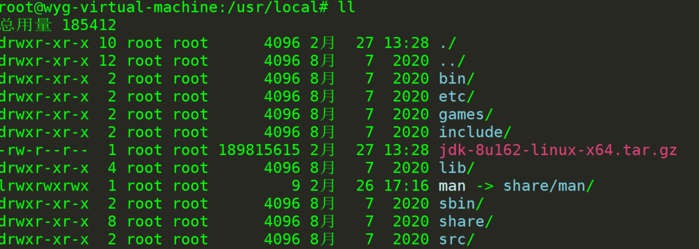
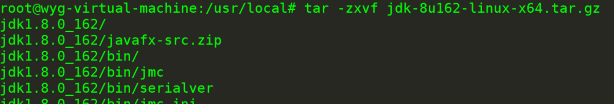
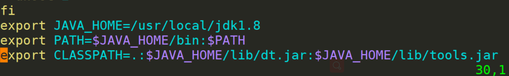
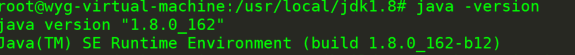

FISCO BCOS（三）———部署安装jdk1.8

1、将下载的jdk1.8.0_162-linux-x64.tar.gz通过远程连接工具, 放入/usr/local/目录, 然后解压



2、解压

```
tar -zxvf jdk1.8.0_162-linux-x64.tar.gz
```



3、切换到jdk1.8 目录下配置环境变量（**全局安装, 所有用户均生效**）

```
vim /etc/profile
```

```
export JAVA_HOME=/usr/local/jdk1.8
export PATH=$JAVA_HOME/bin:$PATH
export CLASSPATH=.:$JAVA_HOME/lib/dt.jar:$JAVA_HOME/lib/tools.jar
```



4、使环境变量生效

```
source /etc/profile
```

5、检查java版本

```
java -version
```



