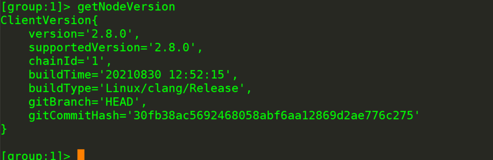
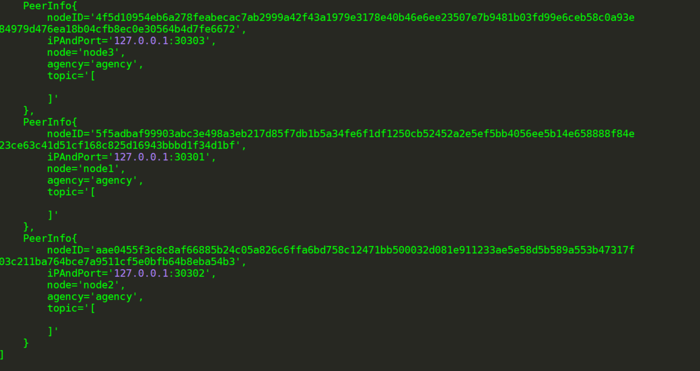

# FISCO BCOS（二）———配置及使用控制台

1、准备依赖

- 安装java （推荐使用java 14）

  ```
  	sudo apt install -y default-jdk
  ```

- 获取控制台并回到fisco目录

  ```
  cd ~/fisco && curl -LO https://github.com/FISCO-BCOS/console/releases/download/v2.8.0/download_console.sh && bash download_console.sh
  ```

  

如果因为网络问题导致长时间无法下载，请尝试

```
cd ~/fisco && curl -#LO https://gitee.com/FISCO-BCOS/console/raw/master-2.0/tools/download_console.sh
```

- 拷贝控制台配置文件

若节点未采用默认端口，请将文件中的20200替换成节点对应的channel端口

```
cp -n console/conf/config-example.toml console/conf/config.toml
```

- 配置控制台证书

```
cp -r nodes/127.0.0.1/sdk/* console/conf/
```

2、启动并使用控制台

```
cd ~/fisco/console && bash start.sh
```

输出下述信息表明启动成功 否则请检查conf/config.toml中节点端口配置是否正确


若1.x控制台启动失败，参考 [Web3SDK启动失败场景](https://fisco-bcos-documentation.readthedocs.io/zh_CN/latest/docs/faq/connect.html)

- 用控制台获取信息

```
#获取客户端版本信息
getNodeVersion
```



```
# 获取节点信息
getPeers
```



