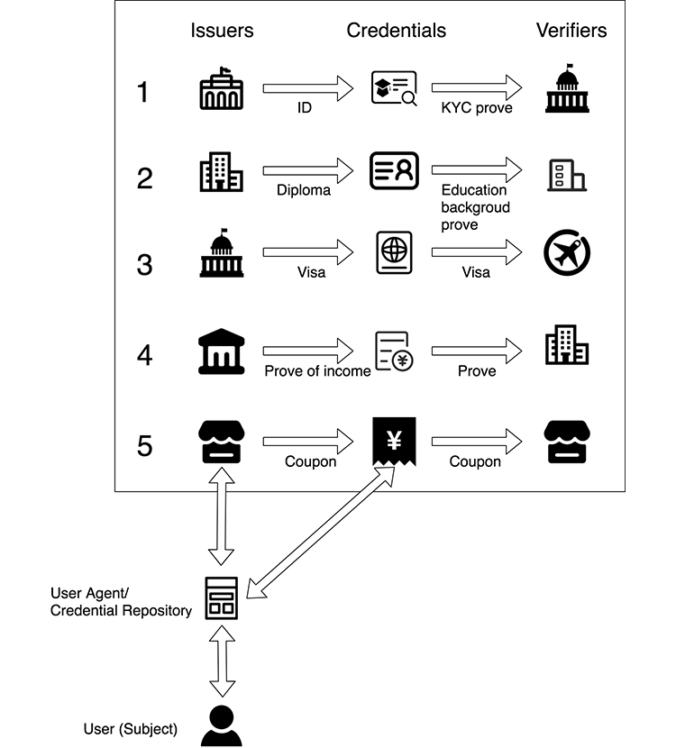

## 数字社会身份体系

互联网的出现和普及使得传统身份有了另一种表现形式，即数字身份，除自然人以外，机构组织、智能设备、虚拟网络都可以作为实体并拥有数字身份，这些实体作为数字化社会的重要组成部分，共同构建了数字生态，数字社会身份体系如下图所示。


## 什么是DID分布式数字身份

在政策、技术、市场因素的共同驱动下，产生了一种新的数字身份形态——分布式数字身份，它用分布式基础设施改变应用厂商控制数字身份的模式，让用户控制和管理数字身份，通过将数据所有权归还用户从根本上解决隐私问题。

DID，即分布式身份标识(Decentralized Identifiers, DID)，是一种去中心化的可验证的数字标识符，相对于传统的基于PKI（Public Key Infrastructure, 公钥基础设施）的⾝份体系，基于区块链建⽴的DID数字⾝份系统具有分布式、自主可控、保证数据真实可信、保护⽤户隐私安全、可移植性强等特点。

国际标准化组织/国际电子技术委员会将“身份”定义为“一组与实体关联的属性”，其中“实体”定义为“操作某个特定域的相关项，具有物理或逻辑形态，包括自然人、组织、设备、SIM卡、护照、网卡、应用软件、服务或网站”。

数字身份通常由代表实体的身份标识符及与之关联的属性声明来表示，分布式数字身份包括分布式数字身份标识符和数字身份凭证（声明集合）两部分。
- 分布式数字身份标识符（DID）是由字符串组成的标识符，用来代表一个数字身份 ，它是一种去中心化可验证的标识符，实体可自主完成 DID的注册、解析、更新或者撤销操作，不需要中央注册机构就可以实现全球唯一性。通常，一个实体可以拥有多个身份，由实体自己进行管理、维护，不同的身份之间没有关联信息，可有效避免身份信息被第三方归集。
- 数字身份凭证中一般包含一个或多个“声明（claims） ”。声明信息是与身份关联的属性信息，通常包括：姓名，年龄、学历、职业等等。凭证由发行者签名，可通过密码学证明是否由凭证中声称的实体签发且未被篡改，因此被称为可验证凭证。

实体可自主完成DID的注册、解析、更新或者撤销操作。DID具体解析为DID Document，DID Document包括DID的唯一标识码，公钥列表和公钥的详细信息(持有者、加密算法、密钥状态等)，以及DID持有者的其他属性描述。


并且，一个实体可对应多个DID。

 


“声明（claims）”是指与身份关联的属性信息，这个术语起源于基于声明的数字身份，一种断言（assert）数字身份的方式，独立于任何需要依赖它的特定系统。声明信息通常包括：诸如姓名，电子邮件地址、年龄、职业等。

声明可以是一个身份所有者（如个人或组织）自己发出的，也可以是由其他声明发行人发出的，当声明由发行人签出时被称为可验证声明。用户将声明提交给相关的应用，应用程序对其进行检查，应用服务商可以像信任发行人般信任其签署的可验证声明。多项声明的集合称为凭证（credentials）。

DID和一个DID文档（DID Document）关联。DID文档上记录的数据是由用户自己决定的，不必要的信息可以完全不记录在DID文档上。在DID系统中，有身份颁布者，身份持有人和验证者三类角色。持有人向颁布者申请身份，验证者在需要时验证持有人的身份。DID数据存放在区块链上，链上不存储隐私数据。而他们三者直接的相互交互使用非对称加密算法、零知识证明等密码算法。


## DID分布式数字身份优势

W3C 提出了基于区块链的分布式数字身份 DID 的概念，分布式数字身份具有以下

优势：

1）安全性：身份所有者身份信息不被无意泄露，身份可以由身份持有者持久保存，身份信息提供可符合最小披露原则；

2）身份自主可控：用户可以自主管理身份，而非依赖可信第三方；身份所有者可以控制其身份数据的分享，基于DPKI （分布式公钥基础设施），每个⽤户的⾝份不是由可信第三⽅控制，⽽是由其所有者控制，个⼈能⾃主管理⾃⼰的⾝份。

3）身份的可移植性：身份所有者能够在任何他们需要的地方使用其身份数据，而不需依赖特定的身份服务提供商，基于区块链，避免了⾝份数据被单⼀的中⼼化权威机构所控制。

4）可信数据交换：⾝份相关数据锚定在区块链上，认证的过程不需要依赖于提供⾝份的应⽤⽅。

一个用户的DID数字身份包含三个部分：DID标识、DID文档和可验证凭证。每一个DID都必须拥有唯一的DID文档，但可拥有不定数量的可验证凭证。

DID标识：数字身份由DID进行标识，因此该DID标识应具有应用内唯一性、跨应用自发现性的特性。DID标识符合W3C规范，主要包含3个部分：固定前缀“did : hpc”、分区标识“chain_id”、唯一号码标识“account_address”。


## 发展历程

我们一般认为，数字身份的演进可分为三个阶段：

第一阶段是由单一权威机构进行管理和控制的中心化身份，不同机构之间身份数据互不相通；

第二阶段是由多机构或者联盟进行管理和控制的联盟身份，在该体系下，用户的身份数据具备了一定的可移植性

第三阶段以用户为中心，身份信息由用户自主掌控授权，身份管理走向去中心化。可以预见，在未来的数字化社会中，分布式数字身份体系带来的全新观念必将催生新的商业模式\[1\]，本篇文章将聚焦分布式数字身份(DID)，探索其广阔应用场景。


## 分布式数字身份基本概念和模型

**1.1可验证凭证模型**

数字身份系统的主要目的是认证数字身份所有者的身份属性，基于其身份信息提供应用系统的授权访问和服务。

基于上节中分布式数字身份的设计，可以很好地实现基于可验证凭证模型的工作流程：

1. 凭证发行方根据身份所有者请求签署发布可验证凭证；

2. 身份所有者将可验证声明以加密方式保存，并在需要的时候自主提交给凭证验证方进行验证；

3. 凭证验证方在无需对接凭证发行方的情况下，通过检索身份注册表，即可确认凭证与提交者之间的所属关系，并验证属性声明的真实来源。


 

在分布式数字身份的模型中，将身份标识符的生成/维护，与身份属性声明的生成/存储/使用分离开来，有助于构建一个模块化的、灵活的、具有竞争力的身份服务生态系统。


**1.2体系架构**

如前所述，分布式数字身份的核心模型是分布式数字身份标识符和可验证凭证流转，核心技术是分布式账本和密码学技术，这二者的结合用以创建不可抵赖、且不可篡改的身份记录。

从实现的角度而言，分布式账本基础设施、基于 DID的交互、可验证凭证应用、治理框架组成了分布式数字身份的四层体系架构。

 


**1.2.1分布式账本**

具有分布式 key-value数据存储能力的分布式账本，用作分布式数字身份标识符的注册表，只要确保身份所有者保持对其私钥的控制权，则任何第三方都无法拥有该标识符的使用权，也就无法冒充身份持有者意愿，危害其利益。

分布式账本不可篡改的特点，让它既适合用于分布式数字身份数据（标识符、公钥、通讯地址等）的发布和维护，也适合用于被多方信任的公开信息的公示和验证（如凭证发行方的真实身份信息、凭证模板信息需要被多个凭证验证方进行验证）。

**1.2.2基于 DID的交互**

分布式数字身份主张用户管理和控制数字身份，不同用户之间不依赖于第三方进行安全通信。通过用户自己管理的 DID标识符和密钥、注册到分布式账本的分布式数字身份数据，满足基于 DID的点对点相互认证和安全通信需要。

就两点间通信而言，其安全通信的工作原理依然是基于传统 PKI挑战响应机制和协商数据加密方式。这种安全通信的底层协议可使用 HTTP、RPC、蓝牙、NFC或其它协议，成为不同解决方案之间端到端互联互通的标准通信方式；

就全网所有节点而言，通过部署在去中心化服务器及个人客户端的身份密钥钱包，以及全网共享的 DID分布式账本，代表任意不同实体身份的节点之间都可以实现基于非对称密钥方式的认证交互，并最终通过这种实体间的信任传递实现全网信任。

**1.2.3可验证凭证应用**

可验证凭证应用层包括各类基于 DID交互的上层应用。数字身份应用的主要目的是认证身份属性，和基于其身份信息提供应用系统的授权访问。可验证凭证提供了一种以身份持有方为主导，连接凭证发行方和凭证验证方（应用系统），凭证发行方和凭证验证方不需要通信的凭证流转方式。

除可验证凭证流转外，将来在这层也能实现其它点对点的典型应用，如加密社交、股份转移，等等。

**1.2.4治理框架**

要在分布式网络中建立人类信任，需要建立业务和法律协议，这是治理框架的工作。

治理框架指管理分布式数字身份生态系统的一套决策体系。它对于在没有权利中心进行决策的生态中，有效发挥生态的作用非常重要。治理框架的主要元素包括治理角色、决策范围、决策程序，通俗的说即人、事、规则。


## 分布式数字身份生命周期

从身份发展的全生命周期看，身份从诞生到使用包含四个阶段：注册、签发、认证和管理，以及三个参与方：身份所有方（用户）、身份提供方（签发机构）、身份依赖方（有身份验证需求）。

 

(1)**注册：**用户向身份所有方发起身份认证请求；注册和签发都是获取身份的过程，需要有另一个人或机构来承认你的身份。注册即为你向你希望获得身份的承认机构发起请求。这是身份所有者自己发起的行为。

(2)**签发：**身份提供方接收到用户发起的身份认证请求，成功记录并承认用户身份，给用户签发可识别的身份标识；

即上述你申请注册的这家机构能够记录并承认你的身份，给予你一个在他的系统中能够被识别的身份标识。比如公民的身份证是政府机构签发的身份标识，网站的数字证书是 CA 中心签发的身份标识，我们在各类网站门户上的账号是由这些网站门户签发的身份标识。对于大部分签发机构来说，签发身份需要获得对方的信任，比如确认有你的存在，或者是确认你符合他们签发身份的要求。而有些签发则不需要知道你在现实生活中是谁，只需要保证他们承认的那个数字身份即可，比如一个虚拟账号。签发机构即是你的身份提供者。

(3)**验证：**身份所有方在信赖身份提供机构的依赖方使用身份时，通过技术手段，验证身份的真实性、有效性；主要用于身份的使用。当我们拥有身份之后，可以通过在身份的签发机构以及对该签发机构信任的依赖方处使用身份。验证则是使用各类的身份认证技术，让这些签发机构和依赖方，相信你是身份所有者，而不是别人冒充的。

(4)**管理：**对数字身份的管理，包括但不限于：身份的存储、更新、撤销、授权等一系列的事项。


## DID技术规范

主要有5个技术规范，这些技术规范的主要领导组织是W3C（World Wide Web Consortium）和DIF（Decentralized Identity Foundation）。

1. DID标识符（Decentralized Identifier） ：身份标识符的格式；

2. DID文档（DID Document）：身份信息的格式；

3. DID解析器（DID resolver） ：身份信息的获取，为身份认证（Authentication）提供了保障；

4. 可验证声明（Verifiable Credential） ：隐私数据披露的方式，为数据授权（Authorization）提供了保障；

5. 身份存储库（Identity Hub）：隐私数据的管理。


## DID标识符

根据Zcash创始人提出的标识符系统“Zooko三角理论”，标识符无法同时实现实现安全、去中心化、对人类有意义（易记忆）三者，W3C DID标识符主要考虑了安全、去中心化两者。

 

此处的ALPHA 和DIGIT在ABNF（Augmented Backus Normal Form）中有定义，而未在此ABNF中定义的其他语法在RFC3986中有定义，值得一提的是W3C DID标识符是符合W3C URI的规范的。

举个例子：did:ethr:0xE6Fe788d8ca214A080b0f6aC7F48480b2AEfa9a6

即为一个DID标识，其中ethr是method-name，指明了身份所在的域（此处ethr所指的域就是以太坊）；0xE6Fe788d8ca214A080b0f6aC7F48480b2AEfa9a6是method-specific-id，表明了这个身份在域中的地址。


## DID文档

DID标识符只是表示一个身份的标识符，不包含身份的信息。而DID文档就是用于描述身份详细信息的文档，一个DID标识符关联到一个DID文档。

DID文档一般包含以下内容：

- DID标识符（必需）；

- 一个加密材料的集合，比如公钥；

- 验证方法集合；

- 一个服务端点的集合；

- 时间，包括创建时间和更新时间。


DID文档的示例：

```undefined
{ 
"@context": "v1", 
"id": "did:ethr:0xE6Fe788d8ca214A080b0f6aC7F48480b2AEfa9a6",
"publicKey": [ { "id": "did:ethr:0xE6Fe788d8ca214A080b0f6aC7F48480b2AEfa9a6#controller", 
                "type": "Secp256k1VerificationKey2018", 
                "controller": "did:ethr:0xE6Fe788d8ca214A080b0f6aC7F48480b2AEfa9a6", 
                "ethereumAddress": "0xe6fe788d8ca214a080b0f6ac7f48480b2aefa9a6" } ], 
"authentication": [ { "type": "Secp256k1SignatureAuthentication2018", 
                                        "publicKey":"did:ethr:0xE6Fe788d8ca214A080b0f6aC7F48480b2AEfa9a6#controller" } ]
}
```

其中:

- @context字段指明了该文档的版本；

- id字段指明了该文档关联到的DID；

- publicKey字段指明了相关的公钥；

- authentication字段则引用了publicKey字段里存储的公钥，并组成了验证该DID用户身份的方式。


DID文档其实和传统PKI系统里的证书有点类似。

DID文档实际格式可以是JSON，也可以是JSON-LD或者YAML、XML等。其存储需要上链，或者至少哈希上链。


## DID解析器

解析器的作用是通过DID标识符来获取DID文档，这样，当DID用户登录某个服务时，该服务提供商调用解析器来获取DID文档，从而知道了如何来验证DID用户。

DID解析器的规范主要是DIF主导的。

DIF Universal Resolver的架构如下图。其先通过DID标识得到该DID标识的method，然后去调用该method对应的Driver来完成最终的解析，这些Driver的具体实现不做限定，但是要遵循接口的规范。

DIF Universal Resolver可以认为是一个Driver聚合器。

之所以这么设计架构，是因为不同DID的存储是位于不同区块链上，而且可能也是在不同的智能合约里存储的。用户要使用DID，首先需要完成DID的注册，而DID的注册肯定是和某条区块链（或者其它类型的去中心化系统）关联的，比如以太坊。

而且一般用户也是使用一些DID Registry服务来完成注册，比如以太坊上有uPort，uPort可以帮助以太坊上的用户完成DID的注册，如果是在其他链上可能有其他提供DID Registry的服务。

因此每个提供DID注册的Registry服务可能是不同的。使用这种聚合器架构能最大限度地兼容所有的DID Registry。

 


## 可验证声明

接下来介绍DID的第四个技术规范：可验证声明，其可能是目前DID生态里最重要的规范。可验证声明Verifiable Credential，简称VC。

VC的目的前面说过，就是数据授权，而且是尽可能细粒度的授权，从而尽量降低隐私数据的泄露。

 

对某个东西的证明可以通过披露不同程度的隐私来实现，如图3-2从左到右，隐私泄露程度逐渐降低。来看一个例子。

假设你今年24岁，如何证明你大于21岁？如果有三种选择：

1. 出示身份证

2. 出示出生年月日

3. 开一个大于21岁的证明


你会选择哪种？

很明显，这三种方案对你个人隐私的披露程度是不同的。第一种对你隐私信息的泄露最大，而第二种其次，而第三种几乎没有泄露任何多余的信息。

 

VC运行需要有一套机制，需要有很多角色。可以看到图3-3里有很多角色，这些角色的功能如下：

- 发行者（Issuer） ：能开具VC（能访问用户数据），如政府、银行、大学等机构和组织。

- 验证者（Verifier）：能验证VC，由此可以提供给出示VC者某种类型的服务，如游戏网站、香烟店。

- 持有者（Holder） ：即用户，能向Issuer请求&接收、持有VC，向Verifier出示VC，开具的VC可以存放在钱包里，方便以后再次证明时使用。

- 标识符注册机构（Registry） ：维护DID标识符及密钥（DID文档）的数据库，如区块链、可信数据库、分布式账本等。


VC的数据格式是什么样的呢？其大致会包含以下字段：

- VC的ID（必须）；

- VC的发行者；

- 声明的主体内容；

- 声明的证明。

- 时间，如发行时间。


下面看一个实例：

{ “@context”: \[ “v1”, “v1” \], “id”: “credentials/1872”, “type”: \[“VerifiableCredential”, “AlumniCredential”\], “issuer”: { “id”: “did:example:76e12ec712ebc6f1c221ebfeb1f”, “name”: “Example University” }, “issuanceDate”: “2020-01-01T19:73:24Z”, “credentialSubject”: { “id”: “did:example:ebfeb1f712ebc6f1c276e12ec21”, “alumniOf”: { “id”: “did:example:c276e12ec21ebfeb1f712ebc6f1”, “name”: \[{ “value”: “Example University”, “lang”: “en” }\]}}, “proof”: { “type”: “RsaSignature2018”, “created”: “2017-06-18T21:19:10Z”, “proofPurpose”: “assertionMethod”, “verificationMethod”: “1”, “jws”: “eyJhbGciOiJSUzI1NiIsImI2NCI6ZmFsc2UsImNyaXQiOlsiYjY0Il19…TCYt5XsITJX1CxPCT8yAV-TVkIEq_PbChOMqsLfRoPsnsgw5WEuts01mq-pQy7UJiN5mgRxD-WUcX16dUEMGlv50aqzpqh4Qktb3rk-uQy72IFLOqV0G_zS245-kronKb78cPN25DGlcTwLtjPAYuNzVBAh4vGHSrQyHUdBBPM” } }

在这个VC中:

@context字段指明了这个VC的格式；

- id字段指明了VC的id；

- type字段指明了VC的类型；

- issuer字段指明了VC的发行者；

- issuanceDate字段指明了发行日期；

- credentialSubject字段指明了VC的主体内容；

- proof字段指明了VC的证明部分，可以被Verfier验证。


这里最重要的内容当然是credentialSubject和proof。


## 身份存储库

接下来介绍DID的第五个技术规范，Identity Hub。

首先我们要明确身份数据和隐私数据是不同的。身份数据是指公钥这种只和这个账户相关的数据，而隐私数据是和用户自己真实信息相关的数据，如性别年龄等。

DID文档里只存储和身份相关的数据；而Identity Hub就是用来存储用户的隐私数据的。Identity Hub，虽然是身份的Hub，但是存储的是数据，可以理解为数据银行。

我们习惯将资产放到银行，为什么？因为安全，银行保证了我们资产的安全。同样地，未来我们将数据存储到数据银行，可以保证数据的安全。

其有如下特点：

- Identity Hub是去中心化的、链下的个人数据存储，可将对个人数据的控制权交给用户。它们允许用户以安全而隐私的方式存储其敏感数据，无用户的显式授权就无法获取用户数据。

- Identity Hub实际在哪由用户决定，可以是本地（手机、PC），也可以是云端。


在未来，用户将会把隐私数据存储到Identity Hub，然后当应用服务调用用户数据时必须请求用户的同意才能获取这些数据。


## 简单示例

最后来看一个简例，将上面的内容都串起来。

假设小明有一个以太坊上的账户0x96f…3d4，小明想使用DID来登录支持DID的游戏网站A。

1. 小明找一个DID Registry服务（如uPort）帮其在以太坊上注册一个DID ：did:eth: 0x96f…3d4；

2. DID Registry服务将与该DID相关的DID 文档（包含了公钥等信息）存储到以太坊链上；

3. 小明在游戏网站A上使用注册的DID登录（游戏网站A可以通过DID解析器得到DID 文档，从而知道该DID的验证方式）；

4. 小明将其个人隐私数据存储在多个身份存储库（Identity Hub），其中居民身份证上的隐私数据存在政府机构G，政府机构G也需要注册好自己的DID身份的；

5. 在游戏网站A上，小明想证明自己年龄>16岁，从而获得游戏时间；

6. 小明向政府机构G（Issuer）请求开具一个自己年龄>16岁的可验证声明（Verifiable Credential，VC）；

7. 政府机构G通过查询小明的居民相关隐私数据发现小明确实>16岁，因此开出了这个VC（带着G的签名）给小明；

8. 游戏网站A验证这个VC的签名，发现确实是政府机构G开具的，选择信任，从而发放游戏时间；

9. 假如某一天，游戏网站A倒闭了。此时小明的DID依旧存在，还可以用于其他应用（如游戏网站B）的登录。


## 工作流程

 

**(0)** 用户使用DID小程序创建自己的DID

**(1)** 用户在小程序内获取发证方列表

**(2)** 用户向指定的发证方提交可验证声明申请，并提供相关材料

**(3)** 发证方审核完材料后，给用户颁发可验证声明

**(4)** 用户使用DID登入第三方应用，并获知应用需要用户提供某可验证声明

**(5)** 用户授权第三方应用去Identity-Hub中去获取可验证声明

**(6)** 第三方应用获取已授权的可验证声明

**(7)** 用户登入第三方应用成功


## 微众区块链WeIdentity

官方介绍链接： https://weidentity.readthedocs.io/zh_CN/latest/docs/weidentity-spec.html


**主要应用场景**

 

上图展示了五个WeIdentity生态下Credential在不同角色间流转的场景：

1. 身份证明机构作为Issuer向用户发行「实名认证Credential」，政府机构作为Verifier在办理公共事务时对其进行验证。

2. 学校作为Issuer向用户发行「学历证明Credential」，公司作为Verifier在对候选人进行背景调查时对其进行验证。

3. 出入境机构作为Issuer向用户发行「签证Credential」，海关作为Verifier在出入境时对其进行验证。

4. 公司作为Issuer向用户发行「收入证明Credential」，银行作为Verifier在发放贷款时对其进行验证。

5. 商户作为Issuer向用户发行「优惠券Credential」，商户自己作为Verifier在对优惠券核销时对其进行验证。


## 系统界面截图

 


## 主要功能模块

WeID管理、权威凭证发行者、凭证模板CPT管理、披露策略管理、存证异步上链管理、智能合约管理。
