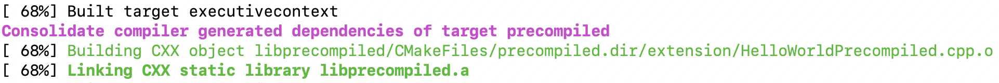
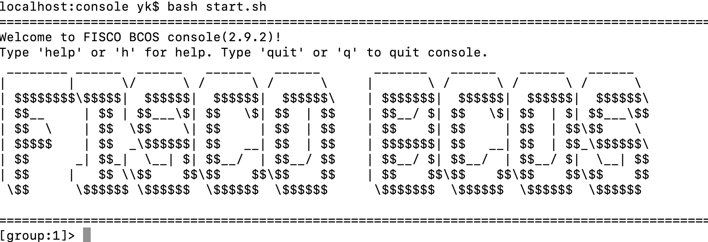
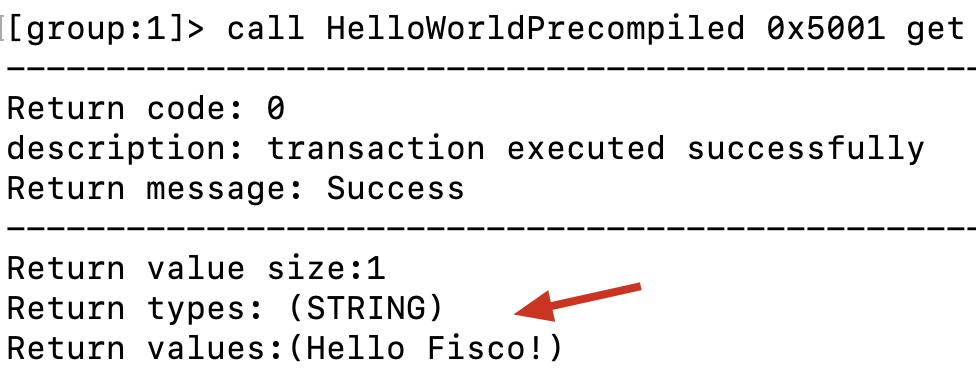
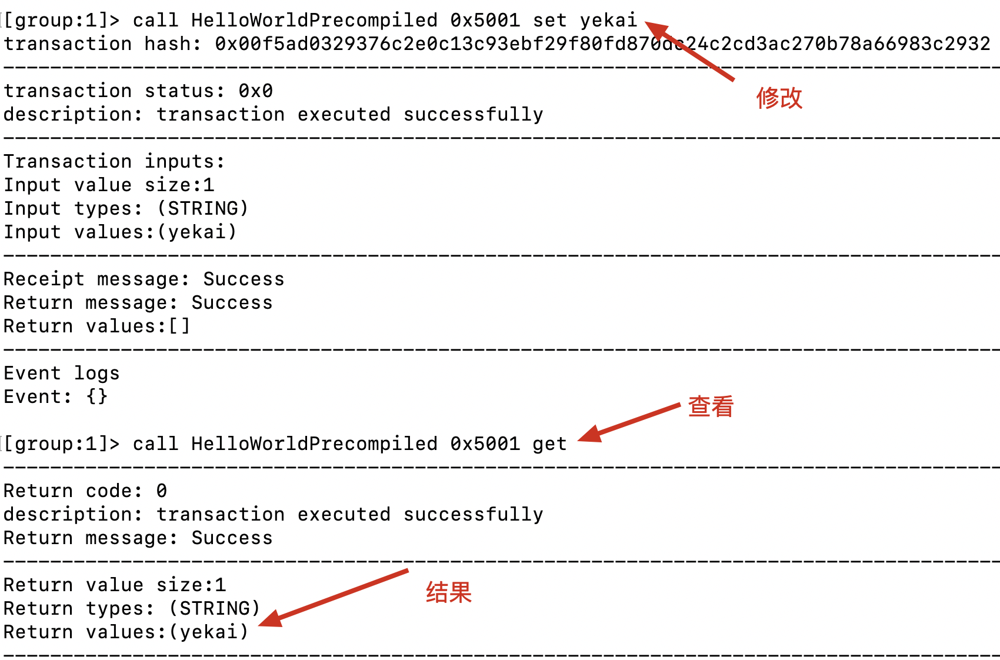
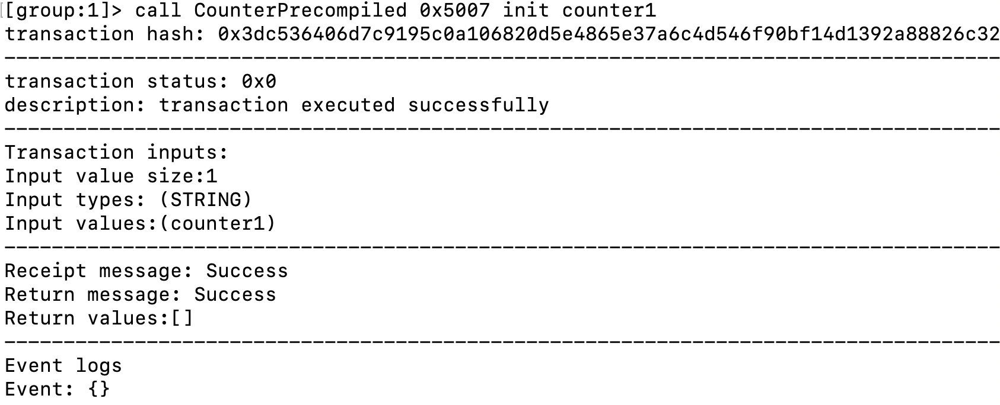
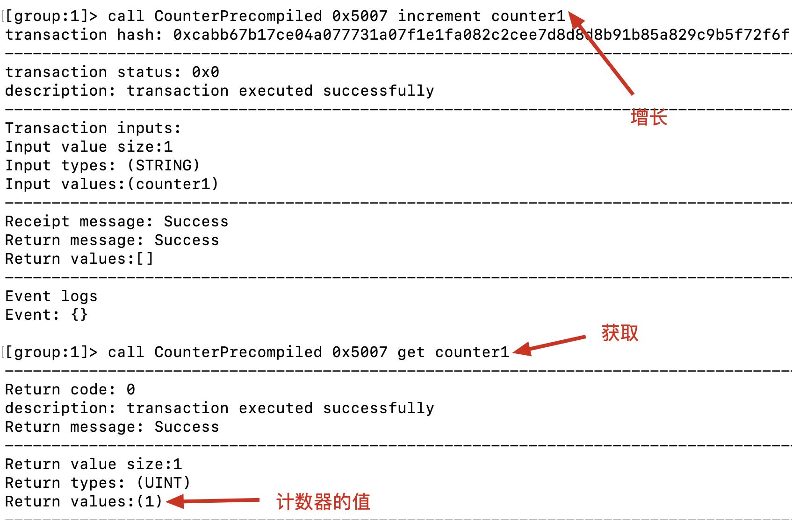

# 基于FISCO-BCOS架构实现一个Counter预编译合约

> FISCO BCOS 2.0自开始提出了一套**预编译合约**框架，允许用户使用C++来写智能合约。由于不进入EVM执行，预编译合约可以获得更高的性能，适用于合约逻辑简单但调用频繁，或者合约逻辑固定而计算量大的场景。

上述内容引自FISCO-BCOS官方文档，对于预编译合约的原理论述大家可以基于官方文档展开学习，链接[**预编译合约**架构设计](https://fisco-bcos-documentation.readthedocs.io/zh_CN/latest/docs/articles/3_features/35_contract/pre-compiled_contract_architecture_design.html?highlight=%E9%A2%84%E7%BC%96%E8%AF%91%E5%90%88%E7%BA%A6#id1)。

本文主要介绍如何基于FISCO-BCOS 2.0架构实现一个Counter预编译合约，所谓Counter，就是一个计数器。在很多合约中，可能都会有使用计数器的需求，通过预编译合约的方式实现计数器，可以提升执行效率。当然，更多的是，开发者可以通过这个过程去了解，如何实现一个个性化的预编译合约。

在这里，笔者大概梳理了一个四步走的学习路径，具体如下：

- 编译FISCO-BCOS源码
- 解除HelloWorldPrecompiled封印
- HelloWorldPrecompiled代码解析
- CounterPrecompiled实现

接下来，我们分步骤介绍。（如果对视频教程感兴趣，也可以点击链接观看[预编译合约原理与实践](https://www.bilibili.com/video/BV13e4y1W7R7/?vd_source=6874e63006b329860f78832e8a773416)）

## 0x01 编译FISCO-BCOS源码

由于预编译合约是内置于节点程序中的，因此能够编译FISCO-BCOS的源码将是此项学习能否成功的关键一步。如果编译都没法搞定，后面的内容就只能是纸上谈兵了。若要研究编译，大家可以参考官方的[源码编译](https://fisco-bcos-documentation.readthedocs.io/zh_CN/latest/docs/manual/get_executable.html#id2)文档。

源码编译的第一件事情，是需要准备一个类unix系统主机，可以是macOS，也可以是Linux。笔者分别在macOS、ubuntu16.04、centOS7.2等系统上进行了编译尝试，发现编译过程对系统环境依赖确实较高，版本较为旧的系统在编译时可能会遇到各种问题，所以也建议大家按照官方建议，如果使用Linux，尽量选择ubuntu18.04或centOS7以上的版本。

以ubuntu系统操作举例，简单介绍一下步骤。

**安装依赖**

```sh
sudo apt install -y g++ libssl-dev openssl cmake git build-essential autoconf texinfo flex patch bison libgmp-dev zlib1g-dev
```

**克隆代码**

```sh
git clone https://github.com/FISCO-BCOS/FISCO-BCOS.git

# 若因为网络问题导致长时间无法执行上面的命令，请尝试下面的命令：
git clone https://gitee.com/FISCO-BCOS/FISCO-BCOS.git
```

**编译二进制代码**

```sh
$ cd FISCO-BCOS
$ git checkout master-2.0
$ mkdir -p build && cd build
$ cmake ..
# 高性能机器可添加-j4使用4核加速编译
# macOS 编译出现 "ld: warning: direct access" 提示时，可以忽略
$ make -j4
```

这个编译的过程比较漫长，毕竟是C++源码编译。好在整个编译过程是可以断点继续的，当编译进度完成到100%时，就算是大功告成了。编译后的可执行程序位于：`FISCO-BCOS/build/bin/fisco-bcos`。

其他系统的用户，可以参考前面的官方教程链接进行编译尝试。


## 0x02 解除HelloWordPrecompiled封印

能够顺利编译完源码后，后面的工作障碍就不大了。尝试使用HelloWordPrecompiled这个预编译合约其实也需要知道一些原理，我的经验的是先按照流程跑一遍，然后再去梳理总结相关的知识点。

由于预编译合约是需要指定一个默认地址的，FISCO-BCOS的预编译合约地址范围在0x5001～0xffff之间，每个预编译合约的地址必须是唯一的。代码中默认给HelloWorldPrecompiled预编译合约的地址是0x5001，只是源码默认状态下并未开启该地址的使用。接下来，我们介绍一下，如何操作来开启它。

### 0x0201 **解除注释**

将文件**FISCO-BCOS/cmake/templates/UserPrecompiled.h.in**中的下述代码注释打开，可以看到这里将0x5001和HelloWorldPrecompiled进行了绑定。

```c++
void
    dev::blockverifier::ExecutiveContextFactory::registerUserPrecompiled(
        dev::blockverifier::ExecutiveContext::Ptr context)
{
    // Address should in [0x5001,0xffff]
    context->setAddress2Precompiled(Address(0x5001),
        std::make_shared<dev::precompiled::HelloWorldPrecompiled>());
    ...
    ...

```

### 0x0202 **选做：修改HelloWorldPrecompiled.cpp**

可以尝试在FISCO-BCOS/libprecompiled/extension/HelloWorldPrecompiled.cpp文件中，变化一些内容，例如将“Hello World”变化为“Hello Fisco”。可以找到该文件中的下述代码位置，参考如下。

```c++
if (func == name2Selector[HELLO_WORLD_METHOD_GET])
    {  // get() function call
        // default retMsg
        std::string retValue = "Hello Fisco!";
```

### 0x0203 **重新编译工程**

重新编译时，工作量会比原来小很多，直接进入到build目录，直接编译即可。

```sh
cd FISCO-BCOS/build
make -j4
```

由于只改动了HelloWorldPrecompiled.cpp文件，所以编译过程很快，可以看到libprecompiled.a文件会被重新编译。如下图所示。



其他与之相关的文件也会受到影响，重新编译，最终会得到fisco-bcos的可执行文件。

### 0x0204 **运行节点&console**

是时候拿出你们以前部署过fisco-bcos节点的笔记或教程了，将编译后的fisco-bcos程序拷贝到节点运行目录，替换原来的fisco-bcos可执行文件。替换前记得要先停掉节点，替换后启动节点。

接下来可以运行console管理台。如果之前的管理台已经部署过，那么直接启动即可。如果没有配置过，可以全新安装一个，教程如下。（如果之前已经安装好了console，本步骤可以直接跳过）。

先下载文件。

```sh
# 下载文件
wget https://github.com/FISCO-BCOS/console/releases/download/v2.9.2/console-0.6.tar.gz
# 解压缩文件
tar zxvf console-0.6.tar.gz
```

复制配置文件。

```sh
cp console/conf/config-example.toml console/conf/config.toml
```

修改配置文件内容，主要是去掉3行的注释，修改后结果如下。

```toml
caCert = "conf/ca.crt"                    # CA cert file path
                                            # If connect to the GM node, default CA cert path is ${certPath}/gm/gmca.crt

sslCert = "conf/sdk.crt"                  # SSL cert file path
                                            # If connect to the GM node, the default SDK cert path is ${certPath}/gm/gmsdk.crt

sslKey = "conf/sdk.key"                   # SSL key file path
```

这3行注释代表需要3个文件，将节点目录sdk中的密钥文件拷贝至console/conf目录即可。

```sh
cp nodes/127.0.0.1/sdk/* console/conf/
```

之后就可以启动console了。

```sh
cd console
bash start.sh
```

看到如下效果，console就顺利启动了。



实际上本步骤和预编译合约没有关系，但为了测试，这也是必须操作的步骤。

### 0x0205 测试HelloWorldPrecompiled

接下来就可以在console中测试HelloWorldPrecompiled了。为了测试，需要提前准备一个与Hello预编译合约的Solidity接口文件，代码如下。

```js
//SPDX-License-Identifier: Apache2.0
pragma solidity ^0.6.10;

interface HelloWorldPrecompiled{
    function get() external  view returns (string memory);
    function set(string memory n) external;
}
```

将**上述代码**保存到**console/contracts/solidity/HelloWorldPrecompiled.sol**文件中。之后就可以在console中执行下面的命令了，如下图所示将看到期望的输出结果。



也可以尝试调用set方法，它会修改get方法返回的内容。测试效果如下图所示。



## 0x03 HelloWorldPrecompiled代码解析

在搞定了HelloWorldPrecompiled之后，我们收获了信心，这个时候需要总结一下。这部分内容需要对C++语言有所了解。

创建一个新的预编译合约需要继承`dev::precompiled::Precompiled`，在HelloWorldPrecompiled.h文件中可以找到如下的定义。这个定义基本上是一个通用的，个性化的部分也就是HelloWorldPrecompiled这个类名。call方法是整个预编译合约的关键。

```C++
class HelloWorldPrecompiled : public dev::precompiled::Precompiled
{
public:
    typedef std::shared_ptr<HelloWorldPrecompiled> Ptr;
    HelloWorldPrecompiled();
    virtual ~HelloWorldPrecompiled(){};

    std::string toString() override;

    PrecompiledExecResult::Ptr call(std::shared_ptr<dev::blockverifier::ExecutiveContext> _context,
        bytesConstRef _param, Address const& _origin = Address(),
        Address const& _sender = Address()) override;
};
```

头文件的部分比较简单，接下来主要关注cpp源码文件。


### 0x0301 数据存储

预编译合约涉及存储操作时，需要确定存储的表信息(表名与表结构，存储数据在FISCO BCOS中会统一抽象为表结构)。对于HelloWorldPrecompiled合约，同样需要一个表来存储那个字符串。该表只存储一对键值对，key字段为hello_key，value字段为“hello Fisco！” 这样的组合。直观一点，可以把数据存储理解为下表的结构。

| key       | value         |
| --------- | ------------- |
| hello_key | hello Fisco！ |

按照键值对的方式，可以理解为("hello_key","hello Fisco!")组成了键值对的组合，hello_key也是这条数据的查询条件。在**HelloWorldPrecompiled.cpp**文件中的如下代码体现了表数据的设计，如果按照关系型表去理解的话，表名是hello_world，表有2个字段分别是key和value。

```c++
// HelloWorldPrecompiled table name
const std::string HELLO_WORLD_TABLE_NAME = "hello_world";
// key field
const std::string HELLOWORLD_KEY_FIELD = "key";
const std::string HELLOWORLD_KEY_FIELD_NAME = "hello_key";
// value field
const std::string HELLOWORLD_VALUE_FIELD = "value";
```

### 0x0302 合约接口

即使是预编译合约，调用时也与EVM中运行的合约类似，需要合约地址、合约接口（或ABI）才能完成调用。在前文，我们定义了合约接口内容。

```js
//SPDX-License-Identifier: Apache2.0
pragma solidity ^0.6.10;

interface HelloWorldPrecompiled{
    function get() external  view returns (string memory);
    function set(string memory n) external;
}
```

这个定义与**HelloWorldPrecompiled.cpp**文件也是对应的，在代码里同样需要通过函数签名（selector）来区分不同的函数。函数签名的字符串定义如下。

```c++
// get interface
const char* const HELLO_WORLD_METHOD_GET = "get()";
// set interface
const char* const HELLO_WORLD_METHOD_SET = "set(string)";
```

在HelloWorldPrecompiled构造函数中设置了函数签名。

```c++
HelloWorldPrecompiled::HelloWorldPrecompiled()
{
    name2Selector[HELLO_WORLD_METHOD_GET] = getFuncSelector(HELLO_WORLD_METHOD_GET);
    name2Selector[HELLO_WORLD_METHOD_SET] = getFuncSelector(HELLO_WORLD_METHOD_SET);
}
```

整个预编译合约最关键的实现是call方法，它的原型如下。

```c++
PrecompiledExecResult::Ptr HelloWorldPrecompiled::call(
    dev::blockverifier::ExecutiveContext::Ptr _context, bytesConstRef _param,
    Address const& _origin, Address const&)
```

在call方法中，需要根据函数签名的不同，来执行不同的处理逻辑。把代码抽象一下，大概是这样的代码架构。

```C++
if (func == name2Selector[HELLO_WORLD_METHOD_GET])
    {  // get() function call
       // do sth ...
    }
    else if (func == name2Selector[HELLO_WORLD_METHOD_SET])
    {  // set(string) function call
			 // do sth ...
    }
    else
    {  // 错误处理
    }
```

### 0x0303 call方法分析

接下来，我们详细介绍一下call方法，它是合约调用的入口，在call中根据不同的函数签名来执行不同的处理逻辑。

call最开始需要解析输入的参数，getParamFunc用来获取参数的函数名，getParamData用来获取数据，callResult是创建的返回结果，在 callResult中也要设置数据消耗的情况。abi变量用来在后面解析参数数据。

```c++
// parse function name
    uint32_t func = getParamFunc(_param);
    bytesConstRef data = getParamData(_param);
    auto callResult = m_precompiledExecResultFactory->createPrecompiledResult();
    callResult->gasPricer()->setMemUsed(_param.size());
    dev::eth::ContractABI abi;
```

因为该合约有数据存储，因此先打开判断一下表是否存在，该操作也需要登记到gas消耗中。如果表不存在，则使用createTable方法来创建一个新表。创建新表时，需要指定字段的名称，也就是“key”和“value”。

```c++
Table::Ptr table = openTable(_context, precompiled::getTableName(HELLO_WORLD_TABLE_NAME));
    callResult->gasPricer()->appendOperation(InterfaceOpcode::OpenTable);
    if (!table)
    {
        // table is not exist, create it.
        table = createTable(_context, precompiled::getTableName(HELLO_WORLD_TABLE_NAME),
            HELLOWORLD_KEY_FIELD, HELLOWORLD_VALUE_FIELD, _origin);
        callResult->gasPricer()->appendOperation(InterfaceOpcode::CreateTable);
        if (!table)
        {
            PRECOMPILED_LOG(ERROR) << LOG_BADGE("HelloWorldPrecompiled") << LOG_DESC("set")
                                   << LOG_DESC("open table failed.");
            getErrorCodeOut(callResult->mutableExecResult(), storage::CODE_NO_AUTHORIZED);
            return callResult;
        }
    }
```

接下来是根据函数签名的不同，来决定执行不同的逻辑，先看看get部分。table->select方法可以拿出之前表中存放的数据，需要注意key值与存储时保持一致。一个表中可能存在多条记录，但对于Hello来说只有一个结果，所以，在结果集中判断一下是否有结果，如果有的话取第一条记录作为返回就可以了。一个entry可以理解为一条记录，返回值的内容通过entry->getField可以拿到。在结果处理方面，需要使用`callResult->setExecResult(abi.abiIn("", retValue))`来设置。对于get来说属于查询动作，需要设置内存消耗updateMemUsed和gas消耗gasPricer()->appendOperation。

```c++
if (func == name2Selector[HELLO_WORLD_METHOD_GET])
    {  // get() function call
        // default retMsg
        std::string retValue = "Hello Fisco!";

        auto entries = table->select(HELLOWORLD_KEY_FIELD_NAME, table->newCondition());
        if (0u != entries->size())
        {
            callResult->gasPricer()->updateMemUsed(getEntriesCapacity(entries));
            callResult->gasPricer()->appendOperation(InterfaceOpcode::Select, entries->size());
            auto entry = entries->get(0);
            retValue = entry->getField(HELLOWORLD_VALUE_FIELD);
            PRECOMPILED_LOG(ERROR) << LOG_BADGE("HelloWorldPrecompiled") << LOG_DESC("get")
                                   << LOG_KV("value", retValue);
        }
        callResult->setExecResult(abi.abiIn("", retValue));
    }
```

set方法会更为复杂一些。先通过语句abi.abiOut(data, strValue)将输入参数解析为strValue。然后查询该key值的数据。

```c++
else if (func == name2Selector[HELLO_WORLD_METHOD_SET])
    {  // set(string) function call

        std::string strValue;
        abi.abiOut(data, strValue);
        auto entries = table->select(HELLOWORLD_KEY_FIELD_NAME, table->newCondition());
        callResult->gasPricer()->updateMemUsed(getEntriesCapacity(entries));
        callResult->gasPricer()->appendOperation(InterfaceOpcode::Select, entries->size());

        
    }
```

不管数据是否存在，都需要先构建一个新的entry，分别设置key和val。

```C++
auto entry = table->newEntry();
        entry->setField(HELLOWORLD_KEY_FIELD, HELLOWORLD_KEY_FIELD_NAME);
        entry->setField(HELLOWORLD_VALUE_FIELD, strValue);
```

如果数据已经存在，那就是更新操作。

```c++
int count = 0;
        if (0u != entries->size())
        {  // update
            count = table->update(HELLOWORLD_KEY_FIELD_NAME, entry, table->newCondition(),
                std::make_shared<AccessOptions>(_origin));
            if (count > 0)
            {
                callResult->gasPricer()->appendOperation(InterfaceOpcode::Update, count);
                callResult->gasPricer()->updateMemUsed(entry->capacity() * count);
            }
        }
```

如果数据不存在，那就是第一次操作，此时是插入操作。

```c++
else
        {  // insert
            count = table->insert(
                HELLOWORLD_KEY_FIELD_NAME, entry, std::make_shared<AccessOptions>(_origin));
            if (count > 0)
            {
                callResult->gasPricer()->updateMemUsed(entry->capacity() * count);
                callResult->gasPricer()->appendOperation(InterfaceOpcode::Insert, count);
            }
        }
```

更新和插入操作，都需要根据数据内容设置内存使用，以及根据操作指令不同设置gas消耗。最后还需要针对count返回值的情况做一下异常检测处理。

## 0x04 实现自定义的预编译合约

做事情之前，可以大概先说一下需求。Counter合约主要是提供计数器功能，计数器功能需要简单考虑一下数据结构和接口设计问题，然后就可以编码实现了。

计数器要提供初始化、增长、获取、指定步长的增长、重置等几个功能，有了这些需求描述，后面在接口设计方面就清晰了。

### 0x0401 合约名字确定

按照惯例，如果合约目的是实现Counter的话，那么合约名字可以定义为CounterPrecompiled。在名字确定后，就可以先动手编写头文件。可以先把HelloWorldPrecompiled.h文件复制一份命名为CounterPrecompiled.h。接下来，再修改CounterPrecompiled.h中的类名以及与类名有关的定义修改。

```C++
#pragma once
#include <libprecompiled/Common.h>

namespace dev
{
namespace precompiled
{
class CounterPrecompiled : public dev::precompiled::Precompiled
{
public:
    typedef std::shared_ptr<CounterPrecompiled> Ptr;
    CounterPrecompiled();
    virtual ~CounterPrecompiled(){};

    std::string toString() override;

    PrecompiledExecResult::Ptr call(std::shared_ptr<dev::blockverifier::ExecutiveContext> _context,
        bytesConstRef _param, Address const& _origin = Address(),
        Address const& _sender = Address()) override;
};

}  // namespace precompiled

}  // namespace dev
```


### 0x0402 数据存储设计

按照传统的C++开发，头文件和类声明完成后，就要编写cpp源码文件了。在写之前，我们需要先考虑函数签名的问题，这个问题的核心在于函数原型。而函数原型的确定除了与需求有关外，还和我们的数据存储设计有关。

在Hello预编译合约中，表中只有一条数据。对于一个计数器来说，我们希望能够支持多个计数器，类似于oracle数据库中的sequence。在数据结构设计时，可以考虑一条记录作为一个计数器，于是这个表结构仍然使用2个字段（key-val）就可以满足条件。其中的key可以用来区分不同的计数器。设计后的表数据可能是下面这样。

| key      | value |
| -------- | ----- |
| counter1 | 8     |
| counter2 | 0     |
| counter3 | 998   |


### 0x0403 接口设计

在数据存储结构设计完成后，针对该合约的接口也就可以确定了。大的思路上，每一个方法都应该包含一个string类型的参数作为key值。可以直接把solidity代码的接口定义出来。

```js
//SPDX-License-Identifier: Apache2.0
pragma solidity^0.6.10;

interface  CounterPrecompiled {
    function init(string memory _keyAddr) external;
    function increment(string memory _keyAddr) external;
    function incrementBy(string memory _keyAddr, uint256 _value) external;
    function reset(string memory _keyAddr) external;
    function get(string memory _keyAddr) external view returns(uint256);
}
```

再把HelloWorldPrecompiled.cpp文件复制一个，并命名为CounterPrecompiled.cpp。注意仍然要把全部的HelloWorldPrecompiled替换为CounterPrecompiled。

接下来把cpp文件中表名和接口定义部分代码实现。

```C++
// CounterPrecompiled table name
const std::string COUNTER_TABLE_NAME = "counter";
// key field
const std::string COUNTER_KEY_FIELD = "key";
// value field
const std::string COUNTER_VALUE_FIELD = "value";

// get interface
const char* const COUNTER_METHOD_GET = "get(string)";
// init interface
const char* const COUNTER_METHOD_INIT = "init(string)";
// reset interface
const char* const COUNTER_METHOD_RESET = "reset(string)";
// increment interface
const char* const COUNTER_METHOD_INRC = "increment(string)";
// incrementBy interface
const char* const COUNTER_METHOD_INRC_BY = "incrementBy(string,uint256)";
```

顺便实现构造函数和toString方法。

```C++
CounterPrecompiled::CounterPrecompiled()
{
    name2Selector[COUNTER_METHOD_GET] = getFuncSelector(COUNTER_METHOD_GET);
    name2Selector[COUNTER_METHOD_INIT] = getFuncSelector(COUNTER_METHOD_INIT);
    name2Selector[COUNTER_METHOD_RESET] = getFuncSelector(COUNTER_METHOD_RESET);
    name2Selector[COUNTER_METHOD_INRC] = getFuncSelector(COUNTER_METHOD_INRC);
    name2Selector[COUNTER_METHOD_INRC_BY] = getFuncSelector(COUNTER_METHOD_INRC_BY);
}

std::string CounterPrecompiled::toString()
{
    return "Counter";
}
```


### 0x0404 call实现

call方法的实现始终是重头戏。一开始的部分仍然是先打开表，如果表不存在则创建它。

```C++
// parse function name
    uint32_t func = getParamFunc(_param);
    bytesConstRef data = getParamData(_param);
    auto callResult = m_precompiledExecResultFactory->createPrecompiledResult();
    callResult->gasPricer()->setMemUsed(_param.size());
    dev::eth::ContractABI abi;

    Table::Ptr table = openTable(_context, precompiled::getTableName(COUNTER_TABLE_NAME));
    callResult->gasPricer()->appendOperation(InterfaceOpcode::OpenTable);
    if (!table)
    {
        // table is not exist, create it.
        table = createTable(_context, precompiled::getTableName(COUNTER_TABLE_NAME),
            COUNTER_KEY_FIELD, COUNTER_VALUE_FIELD, _origin);
        callResult->gasPricer()->appendOperation(InterfaceOpcode::CreateTable);
        if (!table)
        {
            PRECOMPILED_LOG(ERROR) << LOG_BADGE("CounterPrecompiled") << LOG_DESC("set")
                                   << LOG_DESC("open table failed.");
            getErrorCodeOut(callResult->mutableExecResult(), storage::CODE_NO_AUTHORIZED);
            return callResult;
        }
    }
```

接下来就是处理各个函数签名的分支。先处理最为简单的get方法，它的输入参数是key，返回的是计数器的当前值。这里需要注意的是，表中存储的数据是字符串，而接口定义的返回值是uint256，所以取出来 的数据需要转换为uint256类型。boost库的`boost::lexical_cast<u256>(entry->getField(COUNTER_VALUE_FIELD))`方法提供了这样的转换方式。`callResult->setExecResult(abi.abiIn("", retValue))`最终设置了get的返回结果。

```C++
if (func == name2Selector[COUNTER_METHOD_GET])
    {  // get(string) func
        std::string strKey;
        abi.abiOut(data, strKey);
        //std::string retValue;
        u256 retValue = 0;
        
        auto entries = table->select(strKey, table->newCondition());
        if (0u != entries->size())
        {
            callResult->gasPricer()->updateMemUsed(getEntriesCapacity(entries));
            callResult->gasPricer()->appendOperation(InterfaceOpcode::Select, entries->size());
            auto entry = entries->get(0);
            //retValue = entry->getField(COUNTER_VALUE_FIELD);
            retValue = boost::lexical_cast<u256>(entry->getField(COUNTER_VALUE_FIELD));
            PRECOMPILED_LOG(ERROR) << LOG_BADGE("CounterPrecompiled") << LOG_DESC("get")
                                   << LOG_KV("value", retValue);
        }

        callResult->setExecResult(abi.abiIn("", retValue));
    }
```

接下来是init部分，它的输入参数也是key。init负责初始化一个新的计数器，也就是向表中插入输入key的一条新纪录。如果该key已经存在了，那么会报错。

```C++
else if (func == name2Selector[COUNTER_METHOD_INIT])
    {
        std::string strKey;
        std::string strValue = "0";
        abi.abiOut(data, strKey);
        auto entries = table->select(strKey, table->newCondition());
        if(0u != entries->size()) {
            PRECOMPILED_LOG(ERROR) << LOG_BADGE("CounterPrecompiled") << LOG_DESC("set")
                                   << LOG_DESC("key already exists.");
            getErrorCodeOut(callResult->mutableExecResult(), storage::CODE_NO_AUTHORIZED);
            return callResult;
        }
        // init要增加一条
        auto entry = table->newEntry();
        entry->setField(COUNTER_KEY_FIELD, strKey);
        entry->setField(COUNTER_VALUE_FIELD, strValue);
        int count = 0;
        count = table->insert(
                strKey, entry, std::make_shared<AccessOptions>(_origin));
        if (count > 0)
        {
            callResult->gasPricer()->updateMemUsed(entry->capacity() * count);
            callResult->gasPricer()->appendOperation(InterfaceOpcode::Insert, count);
        }

        if (count == storage::CODE_NO_AUTHORIZED)
        {  //  permission denied
            PRECOMPILED_LOG(ERROR) << LOG_BADGE("CounterPrecompiled") << LOG_DESC("set")
                                   << LOG_DESC("permission denied");
        }
        getErrorCodeOut(callResult->mutableExecResult(), count);

    }
```

increment将计数器执行+1操作。它的编码思路是先把计数器当前值取出来，如果不存在会报错。将取出的值转换为uint256类型，然后+1，再转换为string类型，更新到原表中。

```C++
else if (func == name2Selector[COUNTER_METHOD_INRC])
    {  // inrc(string) function call

        std::string strKey;
        abi.abiOut(data, strKey);
        auto entries = table->select(strKey, table->newCondition());
        if(0u == entries->size()) 
        {
            PRECOMPILED_LOG(ERROR) << LOG_BADGE("CounterPrecompiled") << LOG_DESC("set")
                                   << LOG_DESC("key does' not exists.");
            getErrorCodeOut(callResult->mutableExecResult(), storage::CODE_NO_AUTHORIZED);
            return callResult;
        }
        callResult->gasPricer()->updateMemUsed(getEntriesCapacity(entries));
        callResult->gasPricer()->appendOperation(InterfaceOpcode::Select, entries->size());

         int count = 0;
         auto entryOrg = entries->get(0);
         auto num = boost::lexical_cast<u256>(entryOrg->getField(COUNTER_VALUE_FIELD));
         num ++;
         auto strValue = boost::lexical_cast<std::string>(num);
         auto entry = table->newEntry();
        entry->setField(COUNTER_KEY_FIELD, strKey);
        entry->setField(COUNTER_VALUE_FIELD, strValue);

         count = table->update(strKey, entry, table->newCondition(),
                std::make_shared<AccessOptions>(_origin));
         if (count > 0)
         {
               callResult->gasPricer()->appendOperation(InterfaceOpcode::Update, count);
               callResult->gasPricer()->updateMemUsed(entry->capacity() * count);
         }

        if (count == storage::CODE_NO_AUTHORIZED)
        {  //  permission denied
            PRECOMPILED_LOG(ERROR) << LOG_BADGE("CounterPrecompiled") << LOG_DESC("set")
                                   << LOG_DESC("permission denied");
        }
        getErrorCodeOut(callResult->mutableExecResult(), count);
    }
```

incrementBy将计数器执行+n操作。它的编码思路是先把计数器当前值取出来，如果不存在会报错。将取出的值转换为uint256类型，然后+n，再转换为string类型，更新到原表中。

```C++
else if (func == name2Selector[COUNTER_METHOD_INRC_BY])
    { //incrementBy(string,uint256)
         std::string strKey;
         u256 incVal = 0;
        abi.abiOut(data, strKey, incVal);
        auto entries = table->select(strKey, table->newCondition());
        if(0u == entries->size()) 
        {
            PRECOMPILED_LOG(ERROR) << LOG_BADGE("CounterPrecompiled") << LOG_DESC("set")
                                   << LOG_DESC("key does' not exists.");
            getErrorCodeOut(callResult->mutableExecResult(), storage::CODE_NO_AUTHORIZED);
            return callResult;
        }
        callResult->gasPricer()->updateMemUsed(getEntriesCapacity(entries));
        callResult->gasPricer()->appendOperation(InterfaceOpcode::Select, entries->size());

         int count = 0;
         auto entryOrg = entries->get(0);
         auto num = boost::lexical_cast<s256>(entryOrg->getField(COUNTER_VALUE_FIELD));
         num += incVal;
         auto strValue = boost::lexical_cast<std::string>(num);
         auto entry = table->newEntry();
        entry->setField(COUNTER_KEY_FIELD, strKey);
        entry->setField(COUNTER_VALUE_FIELD, strValue);

         count = table->update(strKey, entry, table->newCondition(),
                std::make_shared<AccessOptions>(_origin));
         if (count > 0)
         {
               callResult->gasPricer()->appendOperation(InterfaceOpcode::Update, count);
               callResult->gasPricer()->updateMemUsed(entry->capacity() * count);
         }

        if (count == storage::CODE_NO_AUTHORIZED)
        {  //  permission denied
            PRECOMPILED_LOG(ERROR) << LOG_BADGE("CounterPrecompiled") << LOG_DESC("set")
                                   << LOG_DESC("permission denied");
        }
        getErrorCodeOut(callResult->mutableExecResult(), count);
    }
```

reset则是把计数器清0。它的思路也就是把计数器取出，然后置为0。它与init不同的地方在于它属于更新操作，原数据不存在则会报错。

```C++
else if (func == name2Selector[COUNTER_METHOD_RESET])
    {
        std::string strKey;
        std::string strValue = "0";
        abi.abiOut(data, strKey);
        auto entries = table->select(strKey, table->newCondition());
        if(0u == entries->size()) 
        {
            PRECOMPILED_LOG(ERROR) << LOG_BADGE("CounterPrecompiled") << LOG_DESC("set")
                                   << LOG_DESC("key does' not exists.");
            getErrorCodeOut(callResult->mutableExecResult(), storage::CODE_NO_AUTHORIZED);
            return callResult;
        }
        auto entry = table->newEntry();
        entry->setField(COUNTER_KEY_FIELD, strKey);
        entry->setField(COUNTER_VALUE_FIELD, strValue);
        auto count = table->update(strKey, entry, table->newCondition(),
                std::make_shared<AccessOptions>(_origin));
         if (count > 0)
         {
               callResult->gasPricer()->appendOperation(InterfaceOpcode::Update, count);
               callResult->gasPricer()->updateMemUsed(entry->capacity() * count);
         }

        if (count == storage::CODE_NO_AUTHORIZED)
        {  //  permission denied
            PRECOMPILED_LOG(ERROR) << LOG_BADGE("CounterPrecompiled") << LOG_DESC("set")
                                   << LOG_DESC("permission denied");
        }
        getErrorCodeOut(callResult->mutableExecResult(), count);

    }
```

在call的最后，增加默认处理和返回值就可以了。

```C++
else
    {  // unknown function call
        PRECOMPILED_LOG(ERROR) << LOG_BADGE("CounterPrecompiled") << LOG_DESC(" unknown func ")
                               << LOG_KV("func", func);
        callResult->setExecResult(abi.abiIn("", u256(int32_t(CODE_UNKNOW_FUNCTION_CALL))));
    }

    return callResult;
```

### 0x0405 预编译合约地址绑定

头文件和cpp文件修改完成后，别忘了在文件**FISCO-BCOS/cmake/templates/UserPrecompiled.h.in**中添加地址和CounterPrecompiled的绑定。在这里笔者使用了0x5007这个地址。和之前的Hello合约放在一起，显得更清楚一些。

```C++
// Address should in [0x5001,0xffff]
    context->setAddress2Precompiled(Address(0x5001),
       std::make_shared<dev::precompiled::HelloWorldPrecompiled>());
    context->setAddress2Precompiled(Address(0x5007),
        std::make_shared<dev::precompiled::CounterPrecompiled>());
```

修改完成后，就可以重新编译fisco-bcos工程了。然后，重复之前fisco-bcos节点启动的过程以及console启动的过程。

### 0x0406 测试效果

测试前，别忘了把之前定义的solidity接口放到console/contracts/solidity目录下，命名为CounterPrecompiled.sol。

```js
//SPDX-License-Identifier: Apache2.0
pragma solidity^0.6.10;

interface  CounterPrecompiled {
    function init(string memory _key) external;
    function increment(string memory _key) external;
    function incrementBy(string memory _key, uint256 _value) external;
    function reset(string memory _key) external;
    function get(string memory _key) external view returns(uint256);
}
```

接下来，通过console调用init来创建一个新的计数器counter1。



再通过increment来递增该计数器，然后再get查看一次。



其他功能，在这里就不再测试了，感兴趣的读者可以完成上述实验后自己来试试。