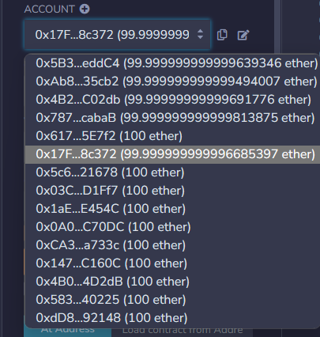

# 共享单车合约实现

## 1、简单介绍

共享单车合约主要由UserStorage实现用户的新增存储，SharedBike实现主要的业务逻辑，包括对单车的新增，借出，修理等一些业务。
***
本文章对整体代码逻辑进行了基础的介绍，对业务进行了简单使用，作为对solidity业务的简单快速入门。

## 2、代码逻辑

UserStorage中储存用户信息，作为用户管理合约，需要先进行部署

#### 基本属性
  
```solidity
    //其中mapping对象储存用户信息，用户信息主要封装在这里
    mapping(address=>User) public registeredUsers;

    address public admin;//部署人地址
    
    struct User {
        string name;            //姓名
        string contact;         //联系方式
        uint32 creditPoints;    //信誉分
        uint32 status;          //用户状态
    }//结构体，相当于User模板

    User public users;//用户信息对象
```

<!-- ```java
private int age;
``` -->
#### 封装的方法

```solidity
//注册
registerUser(string memory name, string memory contact) 

//查询信誉分
getCredits(address user)

//用户是否注册过
exists(address user)

//加分
addCredits(address user, uint32 credits) 

//扣分
subCredits(address user, uint32 credits) 
```

***
SharedBike中封装了主要的业务实现，通过UserStorage的地址进行部署

#### 初始化

```solidity
    //使用合约地址构造，指定要获取的UserStorage对象
    constructor(address _address) public{
        admin = msg.sender;
        address addr=address(_address);
        userStorage =UserStorage(addr);
    }  
```

#### 基本属性

```solidity
    //信誉阈值
    uint32 public userCreditThreshold = 60;

    //管理员地址，部署时自动赋值
    address public admin;

    //用户管理对象，部署时自动赋值
    UserStorage public userStorage;
    
    //定义单车状态结构体
    struct Bike {
        BikeStatus status;
    }

    /**
     * 定义一个枚举，以便可以使用数字代表单车的状态
     * 不存在 0 ,可使用 1 ,已借出 2 ,修理中 3
     */
    enum BikeStatus {
        NotExist,   //0
        Available,  //1
        InBorrow,   //2
        InRepair    //3
    }

    //单车Id，一个Id代表一辆单车
    uint256 private _bikeCount;

    //存储不同单车的状态
    mapping(uint256=>Bike) private _bikes;

    //存储用户借用情况
    mapping(address=>uint256) private _borrows;

```
#### 封装的方法

```solidity
//删
revokeBike(uint256 bikeId)

//借
borrowBike(uint256 bikeId) 

//还
returnBike(uint256 bikeId) 

//报告故障
reportDamge(uint256 bikeId) 

//故障修理
fixDamge(uint256 bikeId) 

//用户信誉奖励
reward(address user, uint32 credits) 

//用户信誉惩罚
punish(address user, uint32 credits) 

//设置信誉阈值
setCreditThreshold(uint32 newThreshold) 

//转让管理员   
transferAdmin(address newAdmin)
```
## 3、合约测试
___此处使用Remix在线编译器运行合约___  

部署UserStorage  

  

复制UserStorage地址，部署SharedBike  

  
  

当前调用者账户  

  

注册xiaoming用户，联系方式为13012345678  

  

registerBike点击注册一辆车，id自增，当前为1  
借，还，报损，修复，移除，依次测试方法均无问题  

  

当前用户为0X17F...,调用奖励方法，变更管理员均无错误  

  
  
